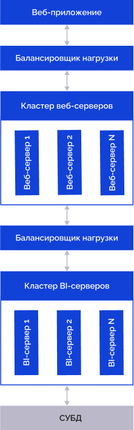
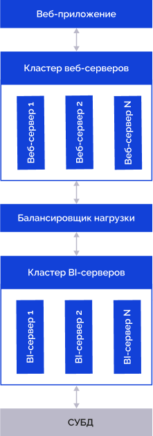

# Настройка протоколирования IP-адреса в ОС Linux

Настройка протоколирования IP-адреса в ОС Linux
-

# Настройка протоколирования IP-адреса в ОС Linux

Настройки для записи IP-адреса рабочей станции, с которой осуществляется
 доступ к объекту, в [протокол
 доступа](Admin.chm::/05_AccessProtocol/Admin_AccessProtocol.htm) зависят от наличия балансировщика между кластером
 веб-серверов и веб-приложением.

	С
	 балансировщиком nginx Без балансировщика

		При использовании конфигурации, которая включает балансировщик,
		 расположенный между кластером веб-серверов и веб-приложением:

		

		Задайте настройки:

			- На балансировщике в директиве
			 [location](../01_BIServer/Cluster/Cluster_Of_BI_Server.htm#nginx_config)
			 закомментируйте строки:

		proxy_set_header
		 X-Real-IP $remote_addr;

		proxy_set_header
		 X-Forwarded-For $proxy_add_x_forwarded_for;

		Добавьте вместо них строку:

		proxy_set_header
		 userhostaddress $proxy_add_x_forwarded_for;

			- На веб-серверах в файле конфигурации:

				- /etc/apache2/apache2.conf
				 для Debian-подобных дистрибутивов;

				- /etc/httpd/conf/httpd.conf
				 для RedHat-подобных дистрибутивов;

				- /etc/httpd2/conf/httpd2.conf
				 для ALT Linux;

		Закомментируйте строки:

		SetEnvIf REMOTE_ADDR
		 "^(.+)$" USER_CLIENT_ADDR=$1

		RequestHeader
		 merge userhostaddress "%{USER_CLIENT_ADDR}e"

		При использовании конфигурации, которая не включает балансировщик,
		 расположенный между кластером веб-серверов и веб-приложением:

		

		На веб-серверах в файле конфигурации:

			- /etc/apache2/apache2.conf
			 для Debian-подобных дистрибутивов;

			- /etc/httpd/conf/httpd.conf
			 для RedHat-подобных дистрибутивов;

			- /etc/httpd2/conf/httpd2.conf
			 для ALT Linux;

		Проверьте наличие строк:

		SetEnvIf REMOTE_ADDR
		 "^(.+)$" USER_CLIENT_ADDR=$1

		RequestHeader
		 merge userhostaddress "%{USER_CLIENT_ADDR}e"

См. также:

[Вопросы
 и ответы](Setup_FAQ.htm) | [Создание
 кластера BI-серверов](../01_BIServer/Cluster/Cluster_Of_BI_Server.htm)

		Справочная
		 система на версию 10.9
		 от 18/08/2025,
		 © ООО «ФОРСАЙТ»,
