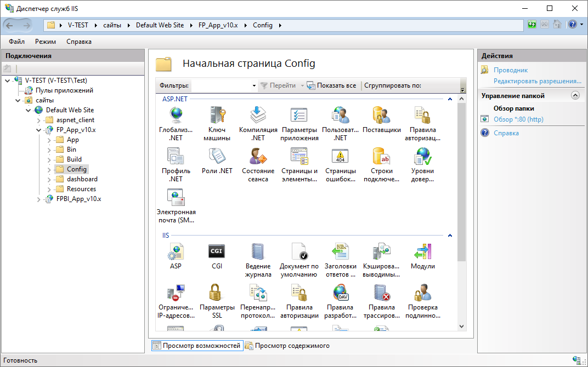
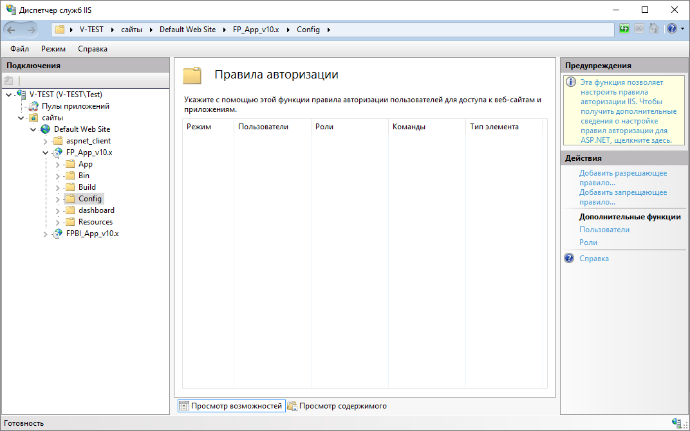
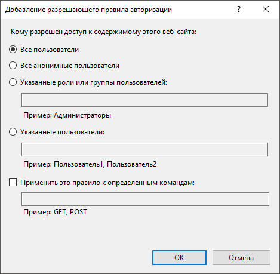
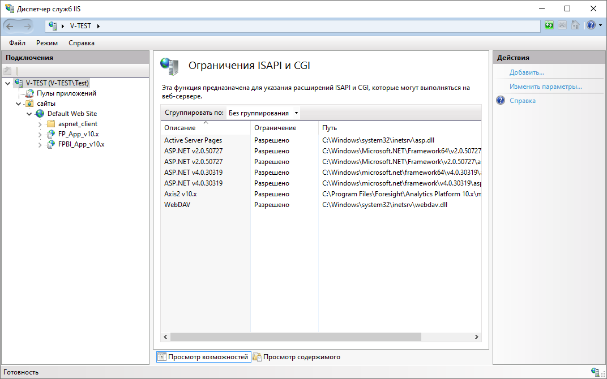

# Создание правила авторизации для пользователей веб-приложения

Создание правила авторизации для пользователей веб-приложения
-

# Создание правила авторизации для пользователей веб-приложения

Если при подключении [служб
 IIS](../03_Setup_Web/IIS_turn_on.htm) в компонентах ОС Windows установлен флажок «Авторизация
 URL-адреса» в разделе «Безопасность»,
 то для авторизации пользователей в веб-приложении создайте разрешающее
 правило в диспетчере служб IIS.

Для создания правила авторизации:

	- Раскройте содержимое виртуального каталога «FP_App_v10.x» в дереве «Подключения»
	 двойным щелчком мыши и выберите папку «Config»:

	- Откройте функцию  «Правила
	 авторизации» в разделе «IIS»
	 двойным щелчком мыши или с помощью команды контекстного меню «Открытие функции»:

	- Выполните команду «Добавить
	 разрешающее правило» на панели «Действия».

	- Установите переключатель «Все
	 пользователи» в открывшемся окне «Добавление
	 разрешающего правила авторизации» и нажмите кнопку «ОК»:

	- Перезапустите веб-сервер с помощью команды «Перезапустить»
	 на панели «Действия»:

После выполнения действий будет создано разрешающее правило для авторизации
 пользователей в веб-приложении.

См. также:

[Вопросы
 и ответы](Setup_FAQ.htm)

		Справочная
		 система на версию 10.9
		 от 18/08/2025,
		 © ООО «ФОРСАЙТ»,
