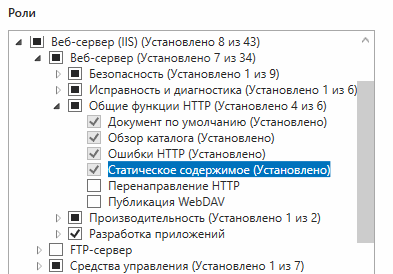
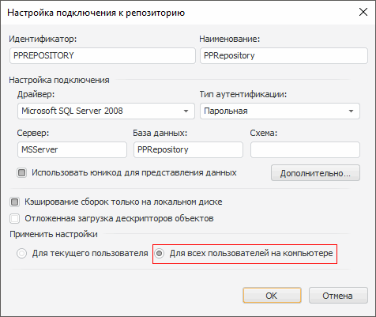
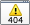
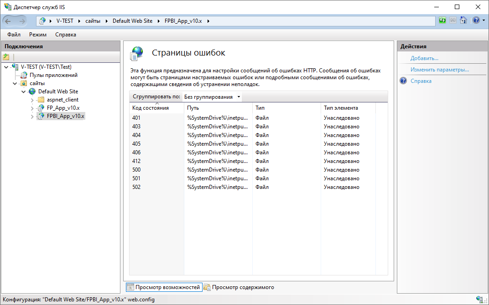
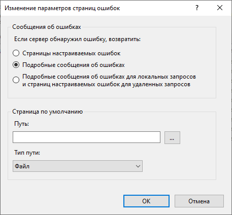

# Проблемы при настройке веб-приложения «Форсайт.&#160;Аналитическая платформа» на ASP.NET

Проблемы при настройке веб-приложения «Форсайт. Аналитическая платформа» на ASP.NET
-

# Проблемы при настройке веб-приложения «Форсайт. Аналитическая платформа»
 на ASP.NET

При возникновении проблем в работе веб-приложения «Форсайт. Аналитическая платформа»
 проверьте
 установку
 флажка «Для всех пользователей на компьютере»
 в [настройках
 подключения к репозиторию](../../06_AK_Client_Config/UiNav_RepoConfig_repo1.htm) в настольном приложении.

## Возможные проблемы и решения при настройке приложений под IIS

[При работе с
 приложением не отображаются HTML-страницы и изображения](javascript:TextPopup(this))

	Установите поддержку статического содержания в IIS.

	Для этого откройте «Диспетчер сервера»,
	 перейдите в раздел «Роли - Веб-сервер
	 (IIS)» и нажмите на ссылку «Добавить
	 службы роли». В открывшемся окне установите флажок «Статическое
	 содержимое»:

	

	Нажмите кнопку «Установить».

[В IIS отсутствует
 вкладка ASP.NET](javascript:TextPopup(this))

	Для отображения вкладки ASP.NET в IIS установите дополнительные
	 опции в [мастере добавления
	 ролей](../03_Setup_Web/Add_WebServer_Role.htm):

		- Откройте «Диспетчер сервера»,
		 перейдите в раздел «Веб-сервер
		 (IIS)» и нажмите на ссылку «Добавить
		 роли и компоненты».

		- Установите флажки напротив компонентов на странице «Роли сервера» как указано ниже:

		

	После отметки необходимых компонентов в конце мастера установки
	 нажмите кнопку «Установить»
	 и дождитесь окончания установки компонентов.

[Не удается подключиться
 к репозиторию при условии, что сервисы работают корректно](javascript:TextPopup(this))

	При открытии веб-приложения ответ содержит «Значение не может быть
	 пустым» при условии, что BI-сервер работает корректно.

	Решения:

		- в настройках подключения к серверному репозиторию установите
		 переключатель «Для всех пользователей
		 на компьютере»:

		

		- IIS подтягивает информацию о существующих репозиториях только
		 при старте процесса. Если параметры подключения были прописаны
		 позже, то перезапустите процесс IIS;

		- если первые два варианта не помогают, то проверьте, прописаны
		 ли настройки в ветке реестра: [HKEY_LOCAL_MACHINE\SOFTWARE\Foresight\Foresight Analytics Platform\10.0\Metabases].

[При работе
 с веб-приложением, установленным на IIS, возникает ошибка «The page cannot
 be displayed because an internal server error has occurred»](javascript:TextPopup(this))

	Если работа с веб-приложением ведется на удалённом от BI-сервера
	 компьютере, то вместо текста ошибки BI-сервера в веб-приложении может
	 отображаться ошибка «The page cannot
	 be displayed because an internal server error has occurred».
	 Для отображения текста ошибки BI-сервера, выполните следующие настройки
	 в диспетчере служб IIS:

		- Выберите виртуальный каталог «FPBI_App_v10.x» в дереве «Подключения».

		- Откройте функцию  «Страницы
		 ошибок» в разделе «IIS»
		 двойным щелчком мыши или с помощью команды контекстного меню «Открытие функции»:

	

		- Выполните команду «Изменить
		 параметры» на панели «Действия».
		 После чего будет открыто окно «Изменение
		 параметров страниц ошибок»:

	

		- Установите переключатель «Подробные сообщения об ошибках»
		 и нажмите кнопку «ОК».

[Не проходит
 парольная авторизация на СУБД Oracle](javascript:TextPopup(this))

	В процессе авторизации в веб-приложении возвращается сообщение об
	 ошибке «Доступ запрещен»,
	 при этом авторизация в настольном приложении проходит без ошибок.

	Решение: при использовании парольной авторизации необходимо в конфигурационном
	 файле SQLNET.ORA, расположенном по пути S\oracle\ora92\network\admin\,
	 где S - путь до места установки Oracle, заменить SQLNET.AUTHENTICATION_SERVICES
	 = (NTS) на SQLNET.AUTHENTICATION_SERVICES = (NONE).

[При
 обращении к серверной части веб-приложения или конструктора бизнес-приложений
 возникает ошибка](javascript:TextPopup(this))

	Если BI-сервер и серверная часть веб-приложения или конструктора
	 бизнес-приложений расположены в одном домене, а обращение к серверной
	 части осуществляется из другого домена, то может возникнуть ошибка:
	 «Response to preflight request doesn't
	 pass access control check: No 'Access-Control-Allow-Origin' header
	 is present on the requested resource.»

	Для исправления ошибки на веб-сервере IIS выполните следующие действия:

		- Откройте «Диспетчер служб
		 IIS» и в дереве подключений выберите приложение, соответствующее
		 BI-серверу - FPBI_App_v10.x.

		- Среди доступных функций выберите «Заголовки
		 ответов HTTP».

		- Добавьте следующие заголовки:

			- «Access-Control-Allow-Headers»
			 со значением «content-type,
			 accept-language, get-ppbi-time, cache-control, soapaction»;

			- «Access-Control-Allow-Origin»
			 со значением «*».
			 Для предоставления доступа только из определённых доменов
			 вместо «*» можно указать наименования необходимых доменов:
			 «http://www.a.com http://www.b.com».

		- Перезагрузите веб-сервер IIS.

## Служба технической поддержки

По вопросам использования «Форсайт. Аналитическая платформа»
 обращайтесь в техническую поддержку по адресу [support@fsight.ru](mailto:support@fsight.ru)
 или через [сервисы
 технической поддержки](https://www.fsight.ru/support/), которые доступны после регистрации на сайте.

См. также:

[Вопросы
 и ответы](Setup_FAQ.htm)

		Справочная
		 система на версию 10.9
		 от 18/08/2025,
		 © ООО «ФОРСАЙТ»,
