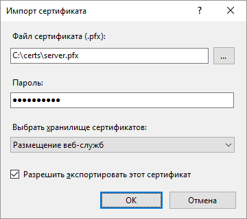
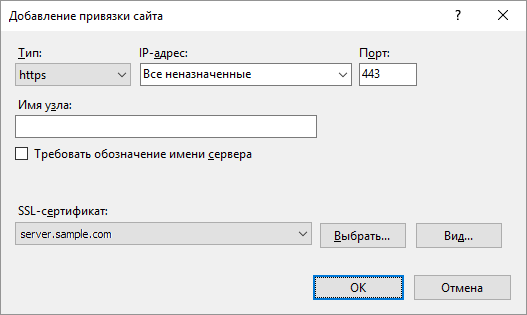

# Настройка веб-приложения для работы через HTTPS

Настройка веб-приложения для работы через HTTPS
-

# Настройка веб-приложения для работы через HTTPS

	Hypertext Transfer Protocol Secure (HTTPS) – это расширение протокола
	 Hypertext Transfer Protocol (HTTP), в котором применяется шифрование
	 с использованием протокола Transport Layer Security (TLS). Протокол
	 TLS является криптографическим и используется для создания безопасного
	 канала связи между компьютерами в сети. Криптографические методы обеспечивают
	 конфиденциальность и целостность передаваемых данных, одностороннюю
	 или двухстороннюю аутентификацию.

	Для обеспечения доверия между сервером и клиентом, взаимодействующими
	 по протоколу HTTPS, используются сертификаты безопасности. Сертификаты
	 безопасности включают в себя набор информации о владельце сертификата,
	 открытом ключе владельца сертификата, субъекте, который выпустил и
	 подписал сертификат, а также информацию для проверки сертификата.

	При взаимодействии сервера с клиентом по протоколу HTTPS требуются
	 следующие типы сертификатов безопасности:

		- Корневой сертификат.
		 Принадлежит центру сертификации (Certification Authority, CA).
		 За счёт доверия сервера и клиента к корневому сертификату выстраивается
		 цепочка доверия для остальных сертификатов. Таким образом формируется
		 единое пространство доверия;

		- Промежуточный сертификат.
		 Принадлежит промежуточному центру сертификации и подписан корневым
		 центром сертификации или другим промежуточным центром сертификации.
		 Иерархия центров сертификации используется для решения различных
		 частных задач по выпуску и обслуживанию выпущенных сертификатов;

		- Сертификат сервера.
		 Используется для аутентификации веб-сервера Apache2 в ОС Linux
		 или IIS в ОС Windows.

	Также «Форсайт. Аналитическая платформа»
	 поддерживает работу веб-приложения по протоколу HTTPS с использованием
	 шифрования ГОСТ. Шифрование ГОСТ требует использования средств криптографической
	 защиты информации (СКЗИ): КриптоПро CSP, ViPNet CSP, Крипто-КОМ, МагПро
	 КриптоПакет и других. СКЗИ должны быть совместимы со средой функционирования
	 «Форсайт. Аналитическая платформа»
	 и установлены как на [сервере
	 веб-приложения](../../03_DB_Server_Config/Setup_DB_ServerSysReq.htm#web), так и на [клиентском
	 устройстве](../../03_DB_Server_Config/Setup_DB_ServerSysReq.htm#client). СКЗИ не входят в [комплект
	 поставки продукта](../../02_AK_Install/DistributionKit.htm). Настройка работы веб-приложения по протоколу
	 HTTPS c использованием шифрования ГОСТ осуществляется в соответствии
	 с документацией на соответствующее СКЗИ.

	Для получения подробной информации о работе веб-приложения в браузере
	 Chromium-Gost на примере использования КриптоПро CSP обратитесь к
	 разделу «[Настройка веб-приложения
	 для работы в браузере Chromium-Gost](Setting_Web_ChromiumGost.htm)».

	Настройте один из вариантов взаимодействия элементов [конфигурации
	 веб-приложения](../../GeneralInfo.htm):

		- клиент > HTTPS
		 > веб-сервер > HTTPS
		 > BI-сервер;

		- клиент > HTTPS
		 > веб-сервер > HTTP
		 > BI-сервер.

	При работе веб-приложения по протоколу HTTPS дополнительно настройте
	 работу [веб-форм](UiDevEnv.chm::/01_Development_Environment/02_Work_in_Development_Environment/DevEnv_Object/Web_Form.htm),
	 использующих протокол WebSocket. Для получения подробной информации
	 обратитесь к разделу «[Настройка
	 веб-форм при работе через HTTPS](webforms_work_by_https.htm)».

## Настройка взаимодействия клиента с веб-сервером и веб-сервера с
	 BI-сервером по протоколу HTTPS

	Рассмотрим настройку взаимодействия клиента с веб-сервером и веб-сервера
	 с BI-сервером по протоколу HTTPS в ОС Linux. Веб-сервер и BI-сервер
	 могут располагаться на одном физическом сервере или на разных.

	Для настройки взаимодействия клиента с веб-сервером и веб-сервера
	 с BI-сервером по протоколу HTTPS:

		- Убедитесь, что в системе содержатся следующие каталоги:

			- для BI-cервера:

				- /opt/foresight/fp10.x-biserver.
				 Основные файлы BI-сервера;

				- /etc/apache2-fp10.x.
				 Конфигурационные файлы экземпляра Apache2 с
				 BI-сервером при использовании Debian-подобных дистрибутивов;

				- /etc/httpd-fp10.x.
				 Конфигурационные файлы экземпляра Apache2 с
				 BI-сервером при использовании RedHat-подобных дистрибутивов;

				- /etc/httpd2-fp10.x.
				 Конфигурационные файлы экземпляра Apache2 с
				 BI-сервером при использовании ALT Linux;

			- для веб-сервера:

				- /opt/foresight/fp10.x-webserver.
				 Основные файлы веб-сервера;

				- /etc/opt/foresight/fp10.x-webserver.
				 Дополнительный конфигурационный файл экземпляра веб-сервера
				 envvars для задания переменных окружения Apache2;

				- /etc/apache2-fp10.x-web. Конфигурационные
				 файлы экземпляра Apache2 с веб-сервером при
				 использовании Debian-подобных дистрибутивов;

				- /etc/httpd-fp10.x-web.
				 Конфигурационные файлы экземпляра Apache2 с
				 веб-сервером при использовании RedHat-подобных дистрибутивов;

				- /etc/httpd2-fp10.x-web.
				 Конфигурационные файлы экземпляра Apache2 с
				 веб-сервером при использовании ALT Linux.

	Примечание.
	 Указанные каталоги создаются по умолчанию при [установке
	 веб-приложения](../Web_Application_Installation.htm).

		- Определите DNS-имя сервера:

	sudo hostnamectl
	 set-hostname <DNS-имя сервера>

		- Скачайте и распакуйте архив [enable_https.zip](enable_https.zip).
		 После чего разместите скрипт enable_https.sh в домашней директории
		 /home/<имя пользователя>.

		- Откройте на редактирование скрипт enable_https.sh и измените
		 значения преднастроенных параметров, если в системе содержится
		 набор готовых сертификатов безопасности:

	CERT_DIR=./fp-certs

	SERVER_CRT_NAME="fp_server.crt"

	SERVER_KEY_NAME="fp_server.key"

	Описание переменных:

			- CERT_DIR. Путь
			 до папки с сертификатами безопасности. По умолчанию: ./fp-certs;

			- SERVER_CRT_NAME.
			 Наименование файла сертификата сервера с расширением *.crt.
			 По умолчанию: fp_server.crt;

			- SERVER_KEY_NAME.
			 Наименование файла закрытого ключа сертификата сервера с расширением
			 *.key. По умолчанию: fp_server.key.

	Примечание.
	 Пропустите шаг для автоматической генерации самоподписанных сертификатов
	 безопасности. Самоподписанные сертификаты завязываются на DNS-имя
	 сервера, определённое в шаге 2.

		- Измените текущий каталог на папку со скриптом:

	cd /home/<имя пользователя>/enable_https.sh

		- Раздайте права доступа на выполнение скрипта:

	sudo chmod +x enable_https.sh

		- Запустите скрипт:

			- если в [файлах
			 конфигурации веб-приложения](../03_Setup_Web/PP_config_Java.htm) указан адрес веб-сервиса PPService.axd:

	sudo ./enable_https.sh

			- если в файлах конфигурации веб-приложения указан адрес
			 веб-сервиса PP.SOM.Som:

	sudo ./enable_https.sh
	 service

	Если веб-сервер и BI-сервер расположены
	 на разных физических серверах, то при выполнении скрипта будет запрошено
	 DNS-имя BI-сервера и веб-сервера соответственно.

	После выполнения действий веб-приложение будет настроено на работу
	 по протоколу HTTPS. Если до настройки работы веб-приложения по протоколу
	 HTTPS была установлена [серверная
	 часть конструктора бизнес-приложений](../../Extensions/Backend_Designer_of_Business_Applications.htm) с помощью архива DBA.war,
	 то работа конструктора бизнес-приложений также будет настроена по
	 протоколу HTTPS.

	В процессе выполнения скрипта:

		- изменён протокол HTTP на HTTPS в файлах конфигурации веб-приложения:

			- /opt/foresight/fp10.x-webserver/r/config/config.json;

			- /opt/foresight/fp10.x-webserver/config/PP.xml;

		- добавлен раздел <VirtualHost *:8810>
		 с настройками SSL и CORS для BI-сервера:

			- /etc/apache2-fp10.x/mods-available/fp10.x-biserver.conf
			 в Debian-подобных дистрибутивах;

			- /etc/httpd-fp10.x/conf.d/fp10.x-biserver.conf
			 в RedHat-подобных дистрибутивах;

			- /etc/httpd2-fp10.x/conf/mods-enabled/fp10.x-biserver.conf
			 в ALT Linux;

		- добавлены настройки SSL и пути до сертификатов безопасности
		 для веб-сервера:

			- /etc/apache2-fp10.x-web/sites-available/webserver.conf
			 в Debian-подобных дистрибутивах;

			- /etc/httpd-fp10.x-web/conf.d/00-virtualhost.conf
			 в RedHat-подобных дистрибутивах;

			- /etc/httpd2-fp10.x-web/conf/sites-enabled/000-default.conf
			 в ALT Linux;

		- изменена переменная PP_SOM в файле /etc/opt/foresight/fp10.x-webserver/envvars;

		- создана папка /home/<имя
		 пользователя>/fp-certs с самоподписанными сертификатами
		 безопасности, если шаг 4 был пропущен: сертификат сервера fp_server.crt;
		 закрытый ключ сертификата сервера fp_server.key; корневой сертификат
		 fp_ca.crt; закрытый ключ корневого сертификата fp_ca.key. Срок
		 действия самоподписанных сертификатов 1024 дня;

		- скопированы сертификат сервера и его закрытый ключ из папки,
		 указанной в переменной CERT_DIR,
		 в папку /opt/foresight/ssl/;

		- добавлены файлы с расширением *.bak для сохранения резервной
		 копии изменённых файлов. Каждый файл создаётся в папке с изменённым
		 файлом. Например, файл /opt/foresight/fp10.x-webserver/r/config/config.json.bak,
		 содержащий настройки до запуска скрипта.

## Настройка взаимодействия клиента с веб-сервером по протоколу HTTPS

	Рассмотрим настройку взаимодействия клиента с веб-сервером по протоколу
	 HTTPS. При этом взаимодействие веб-сервера с BI-сервером будет выполняться
	 по протоколу HTTP. Предполагается, что веб-сервер и BI-сервер располагаются
	 на одном физическом сервере.

### Шаг 1. Размещение и установка сертификатов безопасности

	Примечание.
	 Перед выполнением шага обратитесь к руководству поставщика услуг удостоверяющего
	 центра и документации на используемую операционную систему.

	Для размещения и установки сертификатов безопасности:

		- Сгенерируйте и сохраните закрытый ключ сертификата сервера
		 server.key.

		- Создайте запрос на сертификат сервера domain_name.csr.

		- Получите сертификат сервера server.cer для ОС Linux или
		 server.pfx для ОС Windows, подписанный доверенным для всех пользователей
		 системы центром сертификации.

		- Получите корневой сертификат ca.сer и промежуточные сертификаты
		 subca.cer, если они содержатся в цепочке доверия.

		- Разместите сертификаты и ключи для установки:

			- на локальном компьютере пользователя - файл корневого
			 сертификата ca.cer;

			- на сервере - файл сертификата сервера server.cer, файл
			 закрытого ключа сертификата сервера server.key для веб-сервера
			 Apache2 в ОС Linux или server.pfx для веб-сервера IIS в ОС
			 Windows.

	Совет. Рекомендуется
	 включать сертификаты промежуточных центров сертификации в файл сертификата
	 сервера и исключать корневой сертификат из него. При необходимости
	 измените файл сертификата сервера в текстовом редакторе.

	Указанные файлы сертификатов и ключей приведены в качестве примера
	 и могут отличаться.

### Шаг 2. Импорт корневого сертификата в хранилище

	Для импорта корневого сертификата в хранилище доверенных корневых
	 центров сертификации используйте [поддерживаемый](../../03_DB_Server_Config/Setup_DB_ServerSysReq.htm#client)
	 браузер или средства операционной системы. Средствами операционной
	 системы можно импортировать сертификат в хранилище только в ОС Windows.

	Рассмотрим импорт сертификата на примере Mozilla Firefox:

		- Откройте настройки браузера по адресу:

	about:preferences

		- Перейдите в раздел «Приватность
		 и Защита».

		- Нажмите кнопку «Просмотр
		 сертификатов» в подразделе «Сертификаты».
		 После чего будет открыто окно «Управление
		 сертификатами».

		- Нажмите кнопку «Импортировать»
		 на вкладке «Центры сертификации».
		 После чего будет выдан стандартный диалог выбора файла.

		- Выберите корневой сертификат ca.cer. После чего будет открыто
		 окно «Загрузка сертификата».

		- Установите флажок «Доверять
		 при идентификации веб-сайтов».

	После выполнения действий корневой сертификат будет импортирован
	 в хранилище доверенных корневых центров сертификации.

	Для импорта корневого сертификата в хранилище доверенных корневых
	 центров сертификации средствами ОС Windows:

		- Дважды щёлкните по корневому сертификату ca.cer. После чего
		 будет открыто окно «Сертификат».

		- Нажмите кнопку «Установить
		 сертификат». После чего будет открыт мастер импорта сертификатов.

		- Выберите расположение хранилища «Текущий
		 пользователь» и нажмите кнопку «Далее».

		- Установите переключатель «Поместить
		 все сертификаты в следующее хранилище», выберите хранилище
		 сертификатов «Доверенные корневые
		 центры сертификации» и нажмите кнопку «Далее».

	После выполнения действий корневой сертификат будет импортирован
	 в хранилище доверенных корневых центров сертификации.

	Другие варианты установки и импорта сертификата на различных операционных
	 системах и браузерах приведены на [портале государственных
	 услуг](https://www.gosuslugi.ru/crt).

### Шаг 3. Настройка веб-сервера

	Шаги по настройке отличаются в зависимости от используемого веб-сервера
	 и операционной системы.

		ОС
		 Linux ОС Windows

			Для настройки веб-сервера Apache2 в ОС Linux:

				- Подключите модуль mod_ssl:

					- Debian-подобные дистрибутивы:

			sudo a2enmod-fp10.x-web
			 ssl

			sudo a2ensite-fp10.x-web default-ssl

					- RedHat-подобные дистрибутивы:

			sudo yum
			 install -y mod_ssl

			sudo cp /etc/httpd/conf.modules.d/00-ssl.conf /etc/httpd-fp10.x-web/conf.modules.d/

			sudo systemctl restart httpd-fp10.x-web

					- ALT Linux:

			sudo apt-get
			 install -y apache2-mod_ssl

			sudo cp /etc/httpd2/conf/mods-available/ssl.load /etc/httpd2-fp10.x-web/conf/mods-available/

			sudo /usr/sbin/a2enmod-fp10.x-web ssl

			sudo systemctl condreload httpd2-fp10.x-web.service

			После выполнения действий будет
			 подключен модуль mod_ssl. Для получения подробной информации
			 о модуле обратитесь к [документации Apache2](https://httpd.apache.org/docs/current/mod/mod_ssl.html).

			Для RedHat-подобных дистрибутивов
			 будет создан файл конфигурации /etc/httpd-fp10.x-web/conf.d/ssl.conf
			 со строкой подключения модуля:

			LoadModule
			 ssl_module modules/mod_ssl.so

			Для ALT Linux будет создан файл
			 конфигурации /etc/httpd2-fp10.x-web/conf/mods-enabled/ssl.load
			 со строкой подключения модуля:

			LoadModule
			 ssl_module /usr/lib64/apache2/modules/mod_ssl.so

				- Добавьте параметры SSL в раздел <VirtualHost>
				 в файле конфигурации веб-сервера:

					- /etc/apache2-fp10.x-web/sites-available/webserver.conf
					 в Debian-подобных дистрибутивах;

					- /etc/httpd-fp10.x-web/conf.d/00-virtualhost.conf
					 в RedHat-подобных дистрибутивах;

					- /etc/httpd2-fp10.x-web/conf/sites-enabled/000-default.conf
					 в ALT Linux.

			SSLEngine
			 On

			SSLCertificateFile <путь
			 до папки>/server.cer

			SSLCertificateKeyFile <путь
			 до папки>/server.key

			SSLProxyEngine On

			В подстановке <путь до папки> укажите папку, в которой
			 расположен сертификат сервера и его закрытый ключ.

			Примечание.
			 Дополнительно добавьте [параметры протокола
			 TLS](https://learn.microsoft.com/ru-ru/windows-server/security/tls/tls-registry-settings?tabs=diffie-hellman), сгенерированные с помощью инструмента [SSL Configuration Generator](https://ssl-config.mozilla.org/).

				- Измените протокол HTTP на HTTPS в [файлах
				 конфигурации веб-приложения](../03_Setup_Web/PP_config_Java.htm) /opt/foresight/fp10.x-webserver/r/config/config.json,
				 /opt/foresight/fp10.x-webserver/config/PP.xml
				 и убедитесь, что выполняются следующие условия:

					- в файле config.json указан адрес веб-сервиса
					 PPService.axd в поле [serviceUrl](../03_Setup_Web/PP_config_Java.htm#serviceurl);

					- в файле PP.xml указан раздел [<proxy>](../03_Setup_Web/PP_config_Java.htm#proxy).

			Пример файла config.json:

			{

			  "targetRepo": "",

			  "serviceUrl": "https://<DNS-имя сервера>:8110/fp10.x/app/PPService.axd",

			  "locale": "ru",

			  "locales": ["ru"],

			  "title": "FAP10",

			  "baseUrl": "https://<DNS-имя
			 сервера>:8110/fp10.x/",

			  "themes": ["fap10"]

			}

			Пример файла PP.xml:

			<?xml
			 version="1.0" encoding="utf-8"?>

			<pp>

			    <proxy url="" />

			    <metabase id="WAREHOUSE"
			 />

			    <serviceCM ParamsUrl="https://<DNS-имя сервера>:8110/fp10.x/r/#/settings"/>

			    <modules commonModulesUrl="https://<DNS-имя сервера>:8110/fp10.x/r/#">

			    </modules>

			</pp>

				- Перезапустите веб-сервер:

					- Debian-подобные дистрибутивы:

			sudo systemctl
			 restart apache2-fp10.x-web

					- RedHat-подобные дистрибутивы:

			sudo systemctl
			 restart httpd-fp10.x-web

					- ALT Linux:

			sudo systemctl
			 restart httpd2-fp10.x-web

			После выполнения действий будет настроен веб-сервер Apache2.

			Для настройки веб-сервера IIS в ОС Windows откройте диспетчер
			 служб IIS на начальной странице и выполните действия:

				- Откройте функцию 
				 «Сертификаты сервера»
				 в разделе «IIS»
				 двойным щелчком мыши или с помощью команды контекстного
				 меню «Открытие функции».

				- Выполните команду «Импортировать»
				 на панели «Действия».
				 После чего будет открыто окно «Импорт
				 сертификата»:

			

				- Задайте параметры:

					- Файл сертификата
					 (.pfx). Укажите путь до сертификата сервера
					 server.pfx;

					- Пароль.
					 Укажите пароль, который использовался при создании
					 сертификата сервера;

					- Выбрать хранилище
					 сертификатов. Выберите в раскрывающемся списке
					 «Размещение веб-служб».

				- Нажмите кнопку «ОК».

				- Выберите сайт в дереве «Подключения»
				 и выполните команду «Привязки»
				 на панели «Действия».
				 После чего будет открыто окно «Привязки
				 сайта».

				- Нажмите кнопку «Добавить».
				 После чего будет открыто окно «Добавление
				 привязки сайта»:

			

				- Задайте параметры:

					- Тип.
					 Выберите в раскрывающемся списке «https»;

					- SSL-сертификат.
					 Выберите в раскрывающемся списке сервер, соответствующий
					 импортированному сертификату сервера.

				- Добавьте [параметры протокола
				 TLS](https://learn.microsoft.com/ru-ru/windows-server/security/tls/tls-registry-settings?tabs=diffie-hellman) в реестр с помощью утилиты [IIS
				 Crypto](https://www.nartac.com/Products/IISCrypto).

				- Измените протокол HTTP на HTTPS и убедитесь, что
				 указано DNS-имя сервера, в файлах конфигурации веб-приложения
				 [PP.xml](../03_Setup_Web/PP_config_Java.htm#pp_xml),
				 [config.json](../03_Setup_Web/PP_config_Java.htm#config_json).

				- Выберите сервер в дереве «Подключения»
				 и выполните команду «Перезапустить»
				 на панели «Действия».

			После выполнения действий будет настроен веб-сервер IIS.

### Шаг 4. Открытие веб-приложения по протоколу HTTPS

	Для открытия веб-приложения по протоколу HTTPS используйте [поддерживаемый](../../03_DB_Server_Config/Setup_DB_ServerSysReq.htm#client)
	 браузер и укажите адрес в строке подключения:

		- в ОС Linux:

	https://<DNS-имя сервера>:8110/fp10.x/r/

		- в ОС Windows:

	https://<DNS-имя сервера>/FP_App_v10.x/r/

См. также:

[Настройка
 конфигурации веб-приложения](../03_Setup_Web/PP_config_Java.htm) | [Открытие веб-приложения](../03_Setup_Web/Opening_Web_Application.htm)

		Справочная
		 система на версию 10.9
		 от 18/08/2025,
		 © ООО «ФОРСАЙТ»,
