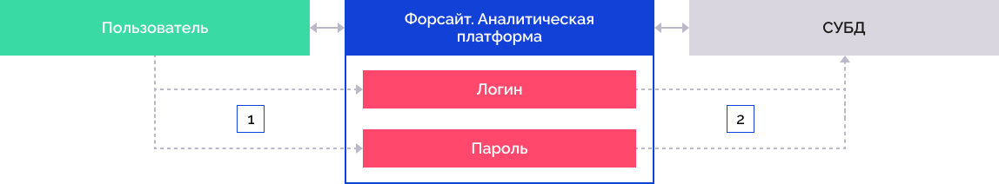
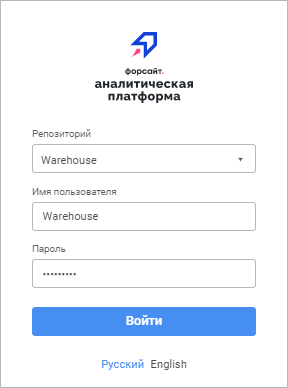
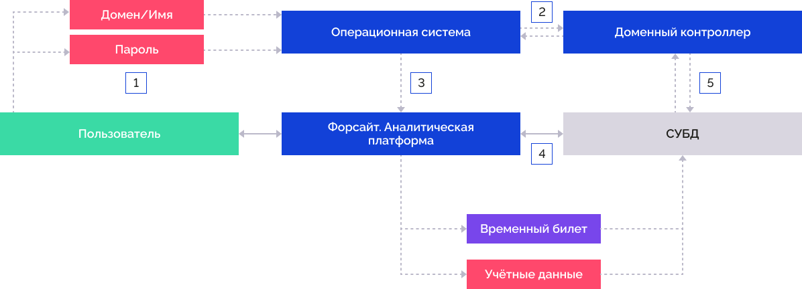
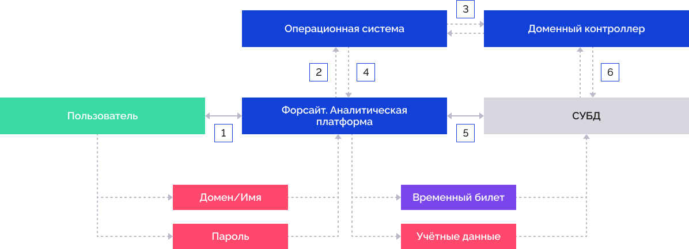
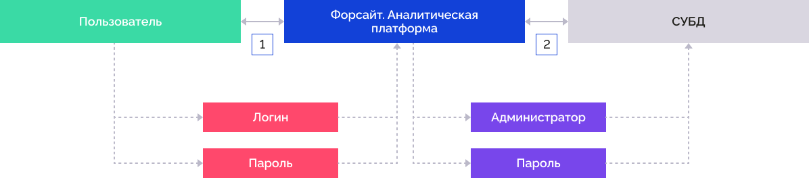
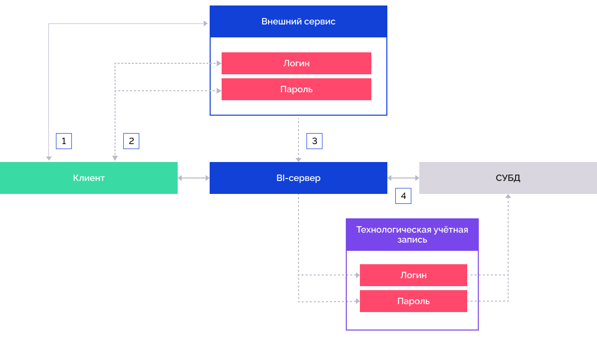
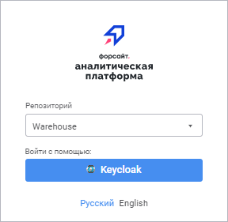
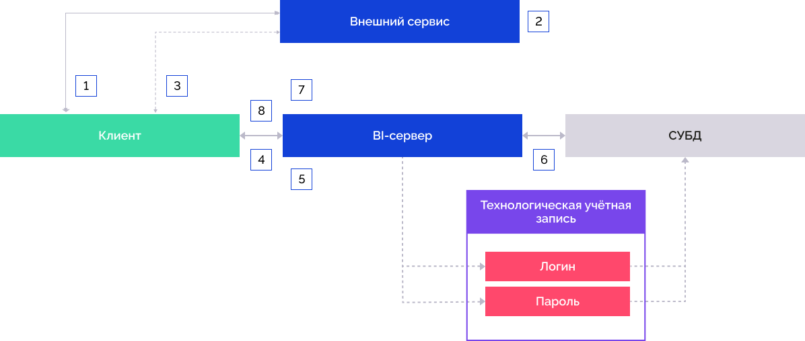
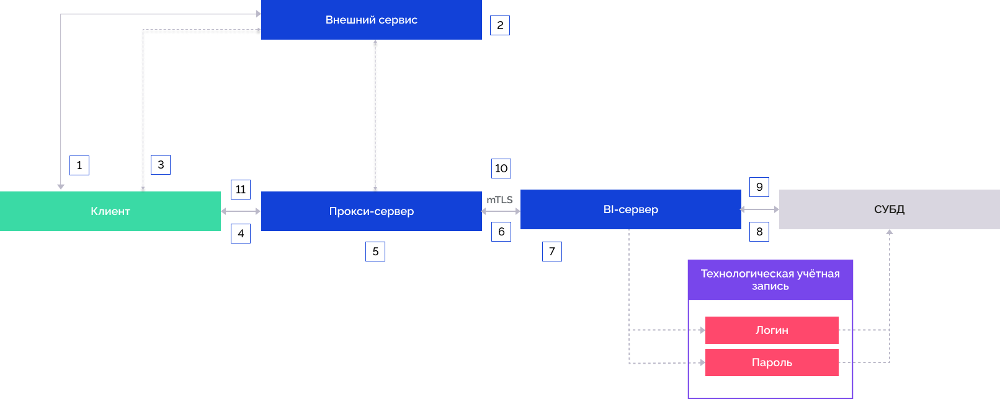
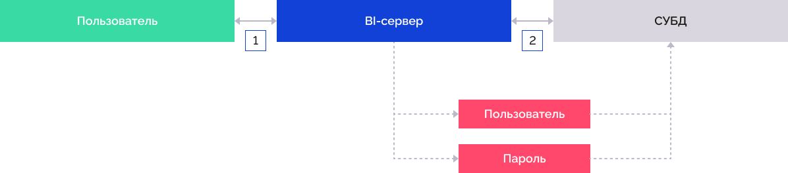

# Аутентификация в продукте

Аутентификация в продукте
-

# Аутентификация в продукте «Форсайт. Аналитическая платформа»

	В продукте «Форсайт. Аналитическая платформа»
	 доступно несколько методов аутентификации. Метод аутентификации выбирается
	 в зависимости от требуемых мер безопасности при [настройке
	 доступа к репозиторию](../../06_AK_Client_Config/UiNav_RepoConfig.htm).

	Проверка учётных данных может производиться на сервере СУБД и/или
	 в «Форсайт. Аналитическая платформа».

	Доступны следующие [базовые
	 типы аутентификации](../../06_AK_Client_Config/UiNav_RepoConfig_repo1.htm#authentication_type):

		- парольная. По умолчанию.
		 Аутентификация пользователя производится с использованием имени
		 пользователя и пароля в явном виде;

		- интегрированная доменная.
		 Аутентификация пользователя производится с использованием доменного
		 имени пользователя и пароля (текущей учётной записи ОС);

		- доменная. Аутентификация
		 пользователя производится с использованием домена, имени пользователя
		 и пароля в явном виде.

	Доступность базовых типов аутентификации зависит от используемой
	 [СУБД](../../01_SysReq/database_Support.htm):

			 Тип СУБД \ Тип аутентификации
			 Парольная
			 Интегрированная доменная
			 Доменная

			 Oracle
			 
			 
			 

			 Microsoft SQL Server
			 
			 
			 

			 Microsoft SQL Server (ODBC)
			 
			 
			 

			 PostgreSQL
			 
			 
			 

			 SQLite
			 
			 
			 

			 WEB Service
			 
			 
			 

	Условные обозначения:

	
	 - тип аутентификации доступен в ОС Linux и Windows;

	
	 - тип аутентификации доступен только в ОС Windows;

	
	 - тип аутентификации недоступен.

	Дополнительно к базовым типам аутентификации доступны:

		- двухфакторная аутентификация.
		 Используется совместно с любым базовым типом аутентификации;

		- встроенная авторизация.
		 Используется совместно с любым базовым типом аутентификации. Совместное
		 использование встроенной авторизации с доменной или интегрированной
		 доменной аутентификацией доступно только при работе с СУБД PostgreSQL.

	Помимо базовых типов аутентификации в веб-приложении
	 доступны следующие методы аутентификации:

		- внешние сервисы.
		 Поддерживаются сервисы, работающие по протоколу OAuth 2.0 и OpenID
		 Connect, сервисы, возвращающие JWT-токен или дополняющие запросы
		 HTTP-заголовками с информацией о пользователе;

		- гостевой вход. Используется
		 для ознакомительной работы с [веб-приложением](../UiWebSetup_TitlePage.htm).

## Парольная аутентификация

	Аутентификация пользователя производится с использованием имени
	 пользователя и пароля в явном виде.

	

		- Пользователь вводит имя пользователя и пароль в окне регистрации
		 «Форсайт. Аналитическая платформа»:

	

		- «Форсайт. Аналитическая платформа»
		 обращается к СУБД, используя предоставленные данные.

	Для использования парольной аутентификации настройте [парольную
	 политику](Admin.chm::/04_SecurityPolicy/Editor_of_Politicy/Security_EditorPoliticy_General_Parole.htm) в [менеджере безопасности](Admin.chm::/Admin_Title.htm).

## Интегрированная доменная аутентификация

	Интегрированная доменная аутентификация аналогична доменной аутентификации,
	 но для авторизации используется доменный пользователь, под которым
	 был совершён вход в операционную систему.

	Для СУБД PostrgreSQL интегрированная доменная аутентификация осуществляется
	 с использованием [механизма аутентификации Kerberos](https://web.mit.edu/kerberos/krb5-1.12/doc/index.html).
	 Данный механизм может быть включён опционально в [дополнительных
	 параметрах](../../06_AK_Client_Config/UiNav_RepoConfig_repo1.htm#more) подключения к репозиторию.

	Для работы по протоколу Kerberos на клиентском компьютере необходимо
	 установить MIT Kerberos (не входит в комплект поставки «Форсайт. Аналитическая платформа»).

	

		- Пользователь вводит доменное имя и пароль при входе в операционную
		 систему.

		- Операционная система обращается к доменному контроллеру,
		 доменный контроллер проверяет правильность указанных данных и
		 возвращает временный билет в операционную систему.

		- Операционная система передаёт указанные учётные данные и
		 временный билет в «Форсайт. Аналитическая платформа».
		 В окне регистрации не отображаются поля «Имя
		 пользователя» и «Пароль»:

	

		- «Форсайт. Аналитическая платформа»
		 передаёт учётные данные и временный билет на сервер СУБД.

		- СУБД обращается к доменному контроллеру, доменный контроллер
		 проверяет правильность указанных данных и делегирует «Форсайт. Аналитическая платформа»
		 право на подключение от имени доменного пользователя с использованием
		 временного билета.

	Для использования интегрированной доменной аутентификации должны
	 быть добавлены [доменные
	 пользователи](Admin.chm::/03_Admin/Users/Admin_UserCreate_Domain.htm) или [группы](Admin.chm::/03_Admin/Groups/Admin_GroupsCreateDomain.htm)
	 в [менеджере
	 безопасности](Admin.chm::/01_RunSecManager/Admin_Organizational_Starting.htm). При работе в веб-приложении настройте
	 интегрированную доменную аутентификацию в зависимости от веб-сервера:

		- если используется веб-сервер Apache2 обратитесь к разделу
		 «[Настройка доменной/интегрированной
		 доменной аутентификации на веб-сервере Apache2](Domain_Authentication_Apache.htm)»;

		- если используется веб-сервер IIS обратитесь к разделу «[Настройка доменной/интегрированной
		 доменной аутентификации на веб-сервере IIS](UiWebSetup_FAQ_1_DomainAuthorization.htm)»;

		- если используется веб-сервер Java обратитесь к разделу «[Настройка доменной/интегрированной
		 доменной аутентификации на веб-сервере Java](setting_domain_on_tomcat.htm)».

## Доменная аутентификация

	Аутентификация пользователя производится с использованием домена,
	 имени пользователя и пароля в явном виде. Поддерживается работа с
	 такими службами каталогов, как: Active Directory, OpenLDAP. Для получения
	 подробной информации о механизме взаимодействия «Форсайт. Аналитическая платформа»
	 со службами каталогов домена обратитесь к разделу «[Механизм работы
	 со службами каталогов](admin.chm::/03_admin/communication_with_ad.htm)». Доменная аутентификация
	 всегда осуществляется с использованием [механизма
	 аутентификации Kerberos](https://web.mit.edu/kerberos/krb5-1.12/doc/index.html) на стороне СУБД.

	Для конечного пользователя доменная аутентификация не отличается
	 от парольной, но упрощает администрирование пользователей при использовании
	 доменных контроллеров.

	

		- Пользователь вводит доменное имя пользователя в формате
		 «домен\имя» и пароль
		 в окне регистрации «Форсайт. Аналитическая платформа»:

	

		- «Форсайт. Аналитическая платформа»
		 передаёт указанные учётные данные в операционную систему.

		- Операционная система обращается к доменному контроллеру,
		 доменный контроллер проверяет правильность указанных данных и
		 возвращает временный билет в операционную систему.

		- Операционная система возвращает временный билет в «Форсайт. Аналитическая платформа».

		- «Форсайт. Аналитическая платформа»
		 передаёт указанные учётные данные и временный билет на сервер
		 СУБД.

		- СУБД обращается к доменному контроллеру, доменный контроллер
		 проверяет правильность указанных данных и делегирует «Форсайт. Аналитическая платформа»
		 право на подключение от имени доменного пользователя с использованием
		 временного билета.

	Для использования доменной аутентификации должны быть добавлены
	 [доменные
	 пользователи](Admin.chm::/03_Admin/Users/Admin_UserCreate_Domain.htm) или [группы](Admin.chm::/03_Admin/Groups/Admin_GroupsCreateDomain.htm)
	 в [менеджере
	 безопасности](Admin.chm::/01_RunSecManager/Admin_Organizational_Starting.htm). При работе в веб-приложении настройте
	 доменную аутентификацию в зависимости от веб-сервера:

		- если используется веб-сервер Apache2 обратитесь к разделу
		 «[Настройка доменной/интегрированной
		 доменной аутентификации на веб-сервере Apache2](Domain_Authentication_Apache.htm)»;

		- если используется веб-сервер IIS обратитесь к разделу «[Настройка доменной/интегрированной
		 доменной аутентификации на веб-сервере IIS](UiWebSetup_FAQ_1_DomainAuthorization.htm)»;

		- если используется веб-сервер Java обратитесь к разделу «[Настройка доменной/интегрированной
		 доменной аутентификации на веб-сервере Java](setting_domain_on_tomcat.htm)».

## Двухфакторная аутентификация

	Аутентификация пользователя производится с использованием любого
	 базового типа аутентификации и сертификата пользователя.

	

		- Пользователь выполняет базовую аутентификацию в «Форсайт. Аналитическая платформа».

		- «Форсайт. Аналитическая платформа»
		 обращается к СУБД, используя предоставленные данные.

		- Пользователь предоставляет «Форсайт. Аналитическая платформа»
		 сертификат после запроса и получает доступ к репозиторию при совпадении
		 сертификата.

	Для использования двухфакторной аутентификации обратитесь к разделу
	 «[Настройка двухфакторной аутентификации](double_auth.htm)».

## Встроенная авторизация

	Авторизация пользователя и доступ к данным СУБД производится под
	 встроенным администратором и используется совместно с парольным типом
	 аутентификации по умолчанию. Проверка прав пользователя осуществляется
	 на уровне «Форсайт. Аналитическая платформа».
	 Учётные данные администратора хранятся в зашифрованном виде.

	

		- Пользователь вводит логин и пароль в «Форсайт. Аналитическая платформа».

		- «Форсайт. Аналитическая платформа»
		 проверяет разрешения пользователя и обращается к СУБД, используя
		 учётные данные встроенного администратора.

	Доступно совместное использование встроенной авторизации с доменной
	 или интегрированной доменной аутентификацией при работе с СУБД PostgreSQL.
	 Схема взаимодействия элементов встроенной авторизации аналогична [схеме взаимодействия элементов
	 с внешним сервисом](Authentication.htm#external_services).

	Для использования встроенной авторизации обратитесь к разделу «[Настройка встроенной авторизации](Integrated_Authorization.htm)».

## Внешние сервисы

	Авторизация пользователя в репозитории осуществляется после его
	 аутентификации на внешнем сервисе. В данном типе авторизации подключение
	 к СУБД производится под технологической учётной записью. Технологическая
	 учётная запись - учётная запись, от имени которой происходит фактическое
	 подключение и взаимодействие с СУБД при аутентификации пользователя
	 через внешние сервисы. В [менеджере
	 безопасности](Admin.chm::/01_RunSecManager/Admin_Organizational_Starting.htm) должен быть создан один или несколько
	 пользователей, которые будут использоваться в качестве технологических
	 учётных записей. Учётные данные каждой технологической учётной записи
	 должны быть сохранены с помощью утилиты [PP.Util](../../05_RepoMngr/Service_Applications/PP_Util.htm#save_creds).

		 OAuth
		 2.0 или OpenID Connect

		 JWT-токен

		 HTTP-заголовки

			Аутентификация пользователя производится под учётной записью
			 сервисов, поддерживающих протокол OAuth 2.0 или OpenID Connect.

			

				- Пользователь выбирает репозиторий, настроенный на
				 работу с внешним сервисом:

			

				- Происходит перенаправление пользователя на внешний
				 сервис авторизации, где пользователь вводит логин и пароль.

				- Пользователь авторизуется на внешнем сервисе и BI-сервер
				 получает необходимую информацию о пользователе.

				- BI-сервер обращается к СУБД, используя предварительно
				 сохранённую технологическую учётную запись.

			При входе в репозиторий с использованием JWT-токена внешний
			 сервис аутентификации должен сформировать JWT-токен с информацией
			 о пользователе и выполнить перенаправление в платформу с указанием
			 этого токена в URL. При выполнении открытия соединения с репозиторием
			 будет происходить извлечение информации о пользователе из
			 полученного JWT-токена.

			Если учётная запись пользователя внешнего сервиса содержится
			 в менеджере безопасности, то будет выполнено подключение к
			 репозиторию и вход в навигатор объектов под этим пользователем.

			Если учётная запись пользователя внешнего сервиса не содержится
			 в менеджере безопасности, то будет создан временный пользователь
			 и добавлен в группы из списка атрибута, указанного в JWT-токене.
			 Если атрибут не задан, то временный пользователь добавляется
			 во встроенную группу «Пользователи».

			Примечание.
			 Временный пользователь не может быть включён во встроенную
			 группу АДМИНИСТРАТОРЫ.

			Данный тип подключения актуален для использования в тех
			 случаях, когда на стороне «Форсайт. Аналитическая платформа»
			 отсутствует информация о подключаемых пользователях.

			

				- Пользователь переходит на внешний сервис аутентификации.

				- Пользователь аутентифицируется на внешнем сервисе.
				 При успешной аутентификации внешний сервис формирует JWT-токен,
				 содержащий информацию о пользователе внешнего сервиса.

				- Происходит перенаправление пользователя на страницу
				 веб-приложения с указанием JWT-токена и идентификатора
				 репозитория в ссылке.

				- Веб-приложение формирует запрос к BI-серверу на
				 подключение к репозиторию с указанием JWT-токена.

				- BI-сервер выполняет проверку подписи JWT-токена,
				 извлекает из токена информацию о пользователе.

				- BI-сервер выполняет подключение к СУБД под технологической
				 учётной записью.

				- Если учётная запись пользователя внешнего сервиса
				 содержится в менеджере безопасности, то будет выполнено
				 подключение к репозиторию и вход в навигатор объектов
				 под пользователем, существующим в менеджере безопасности.

				Если учётная запись пользователя внешнего сервиса не содержится
				 в менеджере безопасности, то будет создан временный пользователь
				 и добавлен в группы из списка атрибута, указанного в JWT-токене.
				 Если атрибут не задан, временный пользователь добавляется
				 во встроенную группу «Пользователи».

				- Открывается соединение с репозиторием, отображается
				 страница веб-приложения по ссылке, на которую было произведено
				 перенаправление пользователя.

			При входе в репозиторий с использованием HTTP-заголовков
			 после аутентификации пользователя на внешнем сервисе запросы
			 к Bi-серверу должны дополняться HTTP-заголовками с информацией
			 о пользователе.

			Между прокси-сервером, который устанавливает соединение
			 с Bi-сервером и дополняет запросы заголовками, и Bi-сервером
			 должно быть настроено mTLS-соединение.

			Примечание.
			 Взаимодействие внешнего сервиса аутентификации и прокси-сервера
			 не определяется в данной документации и может быть реализовано
			 на усмотрение администратора.

			Доверие Bi-сервера к прокси-серверу обеспечивается путем
			 сравнения цифрового отпечатка сертификата, указанного в описании
			 настроек внешнего сервиса в разделе ExtService файла settings.xml/реестре,
			 и цифрового отпечатка сертификата, пришедшего от прокси-сервера
			 при установке mTLS-соединения с Bi-сервером.

			Если учётная запись пользователя внешнего сервиса содержится
			 в менеджере безопасности, то будет выполнено подключение к
			 репозиторию и вход в навигатор объектов под этим пользователем.

			Если учётная запись пользователя внешнего сервиса не содержится
			 в менеджере безопасности, то будет создан временный пользователь
			 и добавлен в группы из списка атрибута, указанного в HTTP-заголовках.
			 Если атрибут не задан, то временный пользователь добавляется
			 во встроенную группу «Пользователи».

			

				- Пользователь переходит на внешний сервис аутентификации.

				- Пользователь аутентифицируется на внешнем сервисе.

				- При успешной аутентификации внешний сервис производит
				 перенаправление пользователя на страницу веб-приложения
				 с указанием идентификатора репозитория в ссылке.

				- Веб-приложение перенаправляет запросы на прокси-сервер.

				- На прокси-сервере осуществляется дополнение запросов
				 HTTP-заголовками с информацией о пользователе.

				- Дополненный запрос отправляется на BI-сервер. Предварительно
				 между прокси-сервером и Bi-сервером должно быть настроено
				 mTLS-соединение.

				- Bi-сервер сравнивает цифровой отпечаток сертификата
				 прокси-сервера, указанного в описании настроек внешнего
				 сервиса в разделе ExtService файла settings.xml/реестра,
				 и цифровой отпечаток, пришедший от прокси-сервера при
				 установке mTLS-соединения с Bi-сервером. Если проверка
				 прошла успешно, происходит извлечение информации о пользователе
				 из HTTP-заголовков.

				- BI-сервер выполняет подключение к СУБД под технологической
				 учётной записью.

				- Если учётная запись пользователя внешнего сервиса
				 содержится в менеджере безопасности, то будет выполнено
				 подключение к репозиторию и вход в навигатор объектов
				 под пользователем, существующим в менеджере безопасности.

				Если учётная запись пользователя внешнего сервиса не содержится
				 в менеджере безопасности, то будет создан временный пользователь
				 и добавлен в группы из списка атрибута, указанного в HTTP-заголовках.
				 Если атрибут не задан, временный пользователь добавляется
				 во встроенную группу «Пользователи».

				- Открывается соединение с репозиторием.

				- Отображается страница веб-приложения, на которую
				 было произведено перенаправление пользователя.

	Использование внешних сервисов доступно только в веб-приложении.
	 Более подробное описание представлено в подразделе «[Настройка аутентификации
	 через внешние сервисы](login_settings_using_external_services.htm)».

## Гостевой вход

	Гостевой вход доступен только в веб-приложении и рекомендуется использовать:

		- для ознакомительной работы с веб-приложением. Пользователь
		 сможет войти под заранее созданной гостевой учётной записью, не
		 указывая учётных данных;

		- при интеграции с системами класса IDM (Identity Management,
		 управление учётными данными) для обеспечения взаимодействия асинхронным
		 обменом сообщений по HTTP:

			- если управление доступом в «Форсайт. Аналитическая платформа»
			 осуществляется внешней централизованной системой;

			- при интеграции с шиной данных (системами класса
			 ESB, Enterprise service bus) при построении архитектуры высоконагруженных
			 систем.

	При использовании гостевого входа рекомендуется ограничить права
	 для гостевой учётной записи. Запуск веб-приложения должен осуществляться
	 в изолированном контуре.

	

		- Пользователь переходит по гостевой ссылке.

		- BI-сервер обращается к СУБД, используя заранее введённые
		 имя пользователя и пароль гостевой учётной записи.

	Для использования гостевого входа обратитесь к разделу «[Настройка
	 гостевого входа](Guest_login.htm)».

См. также:

[Установка
 и настройка продукта «Форсайт. Аналитическая платформа»](../../Setup_TitlePage.htm)

		Справочная
		 система на версию 10.9
		 от 18/08/2025,
		 © ООО «ФОРСАЙТ»,
