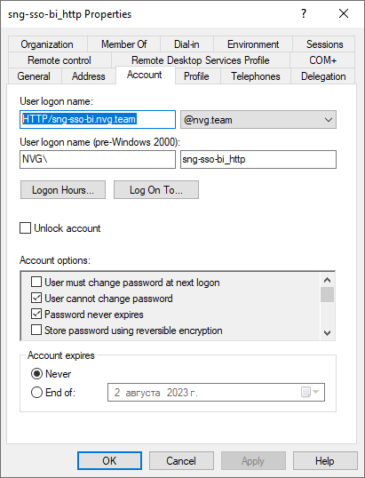

# Настройка доменной/интегрированной доменной аутентификации на веб-сервере Apache2

Настройка доменной/интегрированной доменной аутентификации на веб-сервере Apache2
-

# Настройка доменной/интегрированной доменной аутентификации на веб-сервере
	 Apache2

	Для настройки [доменной](Authentication.htm#domain) или
	 [интегрированной доменной](Authentication.htm#integrated_domain)
	 аутентификации на веб-сервере Apache2 с использованием СУБД PostgreSQL
	 выполните шаги, указанные ниже.

	Примечание.
	 Предполагается, что веб-приложение в ОС Linux уже [установлено](../Web_Application_Installation.htm).

## Шаг 1. Установка и настройка Kerberos на
	 сервере СУБД

	Для установки и настройки Kerberos на сервере СУБД PostgreSQL:

		- Убедитесь, что установлены пакеты для протокола Kerberos:

			- krb5-user, krb5-config в Debian-подобных дистрибутивах;

			- krb5-workstation в RedHat-подобных дистрибутивах;

			- krb5-kinit, libkrb5 в ALT Linux.

	Если пакеты не установлены, то установите
	 их:

			- Debian-подобные дистрибутивы:

sudo apt-get install krb5-user krb5-config

			- RedHat-подобные дистрибутивы:

sudo dnf install krb5-workstation

			- ALT Linux:

sudo apt-get install krb5-kinit libkrb5

		- Добавьте типы шифрования в файле /etc/krb5.conf.d/crypto-policies
		 в разделе [libdefaults]:

preferred_enctypes = RC4-HMAC DES-CBC-CRC DES3-CBC-SHA1 DES-CBC-MD5

	Примечание.
	 Актуально только при использовании Rocky Linux.

		- Убедитесь, что добавлена информация о домене в файле /etc/krb5.conf.
		 Если информация не добавлена, то добавьте её, например:

[libdefaults]
  default_realm = DOMAIN.RU
[realms]
  DOMAIN.RU = {
    kdc = domain.server.name
    admin_server = domain.server.name
  }
[domain_realm]
  .domain.ru = DOMAIN.RU
  domain.ru = DOMAIN.RU

	Для получения подробной информации обратитесь
	 к [документации Kerberos](https://web.mit.edu/kerberos/krb5-1.12/doc/admin/conf_files/krb5_conf.html).

		- Убедитесь, что доменный пользователь доступен:

kinit <имя доменного пользователя>
***Введите пароль пользователя***
klist

	При возникновении ошибки «kinit: Generic
	 preauthentication failure while getting initial credentials» откройте
	 файл /etc/krb5.conf и добавьте в разделе [libdefaults] следующие строки:

default_tkt_enctypes = rc4-hmac des-cbc-crc des-cbc-md5
default_tgs_enctypes = rc4-hmac des-cbc-crc des-cbc-md5

	После выполнения действий будет установлен и настроен клиент Kerberos
	 на сервере СУБД PostgreSQL.

## Шаг 2. Создание keytab-файлов и настройка служб HTTP, postgres

	Keytab-файлы используются для аутентификации пользователей без ввода
	 пароля в [Astra Linux Directory (ALD)](#ald) в ОС Linux
	 или [Active Directory (AD)](#ad) в ОС Windows. В keytab-файле
	 хранятся имена принципалов Kerberos и соответствующие им зашифрованные
	 ключи, полученные на основе паролей Kerberos.

	Примечание.
	 Служба HTTP используется только для интегрированной доменной аутентификации.

### Astra Linux Directory

	Для создания keytab-файлов и настройки служб HTTP, postgres при
	 использовании ALD в ОС Linux:

		- Подготовьте отдельные серверы с доменом ALD:

			- [на контроллере домена ALD](https://wiki.astralinux.ru/pages/viewpage.action?pageId=27361659);

			- на клиентах ALD - локальных компьютерах с [BI-сервером](https://wiki.astralinux.ru/pages/viewpage.action?pageId=1212514), [веб-сервером](https://wiki.astralinux.ru/pages/viewpage.action?pageId=1212514),
			 [СУБД PostgreSQL](https://wiki.astralinux.ru/pages/viewpage.action?pageId=3277288).

	Примечание.
	 Предполагается что BI-сервер, веб-сервер и СУБД PostgreSQL расположены
	 на разных серверах.

		- Откройте и заполните файл /etc/hosts, расположенный на контроллере
		 домена ALD и его клиентах. Например:

# IP-address          FQDN                      hostname
111.111.111.111       ald-server.domain.ald     ald-server
111.111.111.112       bi-server.domain.ald      bi-server
111.111.111.113       web-server.domain.ald     web-server
111.111.111.114       pgsql-server.domain.ald   pgsql-server

	Примечание.
	 Если служба разрешения имён (DNS) настроена, то пропустите данный
	 шаг.

		- Установите пакеты ald-client-common, fly-admin-ald-client,
		 ald-admin на каждом клиенте ALD:

sudo apt install ald-client-common fly-admin-ald-client ald-admin

		- Включите клиентов ALD в домен. Для этого выполните команды
		 на каждом клиенте с указанием пароля доменного администратора:

			- BI-сервер:

sudo ald-client join ald-server.domain.ald --hostname bi-server.domain.ald

			- веб-сервер:

sudo ald-client join ald-server.domain.ald --hostname web-server.domain.ald

			- СУБД PostgreSQL:

sudo ald-client join ald-server.domain.ald --hostname pgsql-server.domain.ald

		- Перезагрузите операционную систему на каждом клиенте ALD.

		- Создайте службу HTTP для BI-сервера и postgres для СУБД
		 на контроллере домена ALD:

ald-admin service-add HTTP/bi-server.domain.ald
ald-admin sgroup-svc-add HTTP/bi-server.domain.ald --sgroup=mac
ald-admin service-add postgres/pgsql-server.domain.ald
ald-admin sgroup-svc-add postgres/pgsql-server.domain.ald --sgroup=mac

		- Создайте и заполните keytab-файлы на BI-сервере (HTTP) и
		 СУБД PostgreSQL (postgres):

			- для службы HTTP:

keytab="/<путь до папки, в которой будет создан keytab-файл на BI-сервере>/keytab"
ald-client update-svc-keytab HTTP/bi-server.domain.ald --ktfile="$keytab"
chown apache $keytab
chmod 644 $keytab

			- для службы postgres:

keytab="/<путь до папки, в которой будет создан keytab-файл в СУБД>/keytab"
ald-client update-svc-keytab postgres/pgsql-server.domain.ald --ktfile="$keytab"
chown postgres "$keytab"
chmod 644 "$keytab"

		- Укажите полный путь до keytab-файлов:

			- в конфигурационном файле
			 BI-сервера fp10.x-biserver.conf
			 в разделе <Location>:

GssapiCredStore keytab:<путь до keytab-файла для службы HTTP>

	Расположение конфигурационного файла
	 BI-сервера в экземпляре Apache2 зависит от версии ОС Linux:

				- /etc/apache2-fp10.x/mods-available/fp10.x-biserver.conf
				 в Debian-подобных дистрибутивах;

				- /etc/httpd-fp10.x/conf.d/fp10.x-biserver.conf в
				 RedHat-подобных дистрибутивах;

				- /etc/httpd2-fp10.x/conf/mods-available/fp10.x-biserver.conf
				 в ALT Linux.

	Примечание.
	 Путь до keytab-файла в fp10.x-biserver.conf задаётся
	 только для интегрированной доменной аутентификации.

			- в конфигурационном файле
			 СУБД PostgreSQL /var/lib/pgpro/ent-13/data/postgresql.conf:

# GSSAPI using Kerberos
krb_server_keyfile = '<путь до keytab-файла для службы postgres>'
krb_caseins_users = on

	Примечание.
	 Расположение файла postgresql.conf может отличаться в зависимости
	 от версии СУБД.

		- [Перезапустите BI-сервер](../01_BIServer/bi-service_restart.htm).

		- Перезапустите сервер СУБД PostgreSQL.

	После выполнения действий будут созданы keytab-файлы для работы
	 с Kerberos и настроены службы HTTP, postgres.

	В ALD используется неограниченное делегирование.

### Active Directory

	Для создания keytab-файлов и настройки служб HTTP, postgres при
	 использовании AD в ОС Windows:

		- Подготовьте отдельные серверы с доменом AD:

			- на контроллере домена AD;

			- на клиентах AD - локальных компьютерах с BI-сервером, веб-сервером, СУБД PostgreSQL.

	Примечание.
	 Предполагается что BI-сервер, веб-сервер и СУБД PostgreSQL расположены
	 на разных серверах.

		- [Создайте пользователей](https://learn.microsoft.com/ru-ru/windows-server/identity/ad-ds/manage/component-updates/appendix-i--creating-management-accounts-for-protected-accounts-and-groups-in-active-directory) для служб
		 HTTP и postgres с помощью утилиты Active Directory Users and Computers,
		 расположенной на сервере с доменом AD. Пример созданного пользователя
		 для службы HTTP:

	

	Убедитесь, что для пользователя установлены
	 флажки «User cannot change password»,
	 «Password never expires».

		- Создайте keytab-файлы и привяжите их к соответствующим созданным
		 пользователям на BI-сервере (HTTP) и СУБД PostgreSQL (postgres)
		 с помощью PowerShell:

			- для службы HTTP:

ktpass -princ HTTP/<имя принципиала> -mapuser <имя пользователя с указанием домена> -crypto ALL -ptype KRB5_NT_PRINCIPAL -pass <пароль пользователя> -out C:\<путь до папки, в которой будет создан keytab-файл на BI-сервере>\keytab.keytab

			- для службы postgres:

ktpass -princ postgres/<имя принципиала> -mapuser <имя пользователя с указанием домена> -crypto ALL -ptype KRB5_NT_PRINCIPAL -pass <пароль пользователя> -out C:\<путь до папки, в которой будет создан keytab-файл в СУБД>\keytab.keytab

	Пример команды для службы HTTP:

ktpass -princ HTTP/sng-sso-bi.nvg.team@NVG.TEAM -mapuser sng-sso-bi_http@NVG.TEAM -crypto ALL -ptype KRB5_NT_PRINCIPAL -pass Qwerty1 -out C:\KeyTab\sng-sso-bi_http.keytab

		- Проверьте связь пользователей со службами HTTP и postgres:

setspn -L <имя пользователя без указания домена>

	Если связь установлена, то будет выдано
	 сообщение с указанием принципиала. Например:

Registered ServicePrincipalNames for CN=sng-sso-bi_http,OU=Kerberos,OU=NVG,DC=nvg,DC=team:
    HTTP/sng-sso-bi.nvg.team

		- Укажите полный путь до keytab-файлов:

			- в конфигурационном файле
			 BI-сервера fp10.x-biserver.conf
			 в разделе <Location>:

GssapiCredStore keytab:<путь до keytab-файла для службы HTTP>

	Расположение конфигурационного файла
	 BI-сервера в экземпляре Apache2 зависит от версии ОС Linux:

				- /etc/apache2-fp10.x/mods-available/fp10.x-biserver.conf
				 в Debian-подобных дистрибутивах;

				- /etc/httpd-fp10.x/conf.d/fp10.x-biserver.conf в
				 RedHat-подобных дистрибутивах;

				- /etc/httpd2-fp10.x/conf/mods-available/fp10.x-biserver.conf
				 в ALT Linux.

	Примечание.
	 Путь до keytab-файла в fp10.x-biserver.conf задаётся
	 только для интегрированной доменной аутентификации.

			- в конфигурационном файле
			 СУБД PostgreSQL /var/lib/pgpro/ent-13/data/postgresql.conf:

# GSSAPI using Kerberos
krb_server_keyfile = '<путь до keytab-файла для службы postgres>'
krb_caseins_users = on

	Примечание.
	 Расположение файла postgresql.conf может отличаться в зависимости
	 от версии СУБД.

		- [Перезапустите
		 BI-сервер](../01_BIServer/bi-service_restart.htm).

		- Перезапустите сервер СУБД PostgreSQL.

	После выполнения действий будут созданы
	 keytab-файлы для работы с Kerberos и настроены службы HTTP, postgres.

	Примечание.
	 При изменении свойств пользователя keytab-файлы должны быть пересозданы.

	В AD может использоваться неограниченное
	 и ограниченное делегирование:

		- для использования неограниченного
		 делегирования установите переключатель «Trust
		 this user for delegation to any service (Kerberos only)»
		 на вкладке «Delegation»
		 в свойствах пользователя;

		- для использования ограниченного
		 делегирования:

			- Установите переключатель «Trust
			 this user for delegation to specified services only > Use
			 any authentication protocol» на вкладке «Delegation»
			 в свойствах пользователя.

			- Дополните конфигурационный файл BI-сервера fp10.x-biserver.conf
			 в разделе <Location>. Включите опцию [GssapiUseS4U2Proxy](https://github.com/gssapi/mod_auth_gssapi?tab=readme-ov-file#gssapiuses4u2proxy)
			 и укажите вспомогательные параметры:

GssapiUseS4U2Proxy On
GssapiCredStore client_keytab:<путь до keytab-файла для службы HTTP>
GssapiCredStore ccache:FILE:/opt/foresight/fp10.x-biserver/var/cache/krb5ccache
GssapiDelegCcacheDir /opt/foresight/fp10.x-biserver/var/cache

	Расположение конфигурационного файла
	 BI-сервера в экземпляре Apache2 зависит от версии ОС Linux:

				- /etc/apache2-fp10.x/mods-available/fp10.x-biserver.conf
				 в Debian-подобных дистрибутивах;

				- /etc/httpd-fp10.x/conf.d/fp10.x-biserver.conf в
				 RedHat-подобных дистрибутивах;

				- /etc/httpd2-fp10.x/conf/mods-available/fp10.x-biserver.conf
				 в ALT Linux.

	Примечание.
	 Дополнение конфигурационного файла BI-сервера fp10.x-biserver.conf необходимо
	 только для интегрированной доменной аутентификации.

## Шаг 3. Настройка BI-сервера

	По умолчанию при установке [BI-сервера](../UiWebSetup_TitlePage.htm)
	 конфигурационные файлы экземпляра Apache2 располагаются в папке:

		- /etc/apache2-fp10.x в Debian-подобных
		 дистрибутивах;

		- /etc/httpd-fp10.x в RedHat-подобных
		 дистрибутивах;

		- /etc/httpd2-fp10.x в ALT Linux.

	Для настройки BI-сервера:

		- Установите Apache2 с учётом указанных модулей:

			- Debian-подобные дистрибутивы:

sudo apt install apache2 libsasl2-modules-gssapi-mit libapache2-mod-auth-gssapi

			- RedHat-подобные дистрибутивы:

sudo yum install httpd cyrus-sasl-gssapi mod_session mod_auth_gssapi

			- ALT Linux:

sudo apt-get install apache2-base apache2-httpd-worker apache2-mod_auth_gssapi libsasl2-plugin-gssapi

	После выполнения действий экземпляр Apache2
	 будет установлен в папке:

			- /etc/apache2 в Debian-подобных дистрибутивах;

			- /etc/httpd в RedHat-подобных дистрибутивах;

			- /etc/httpd2 в ALT Linux.

		- Скопируйте новые конфигурационные файлы экземпляра Apache2
		 в экземпляры, созданные при установке [BI-сервера](../UiWebSetup_TitlePage.htm):

			- Debian-подобные дистрибутивы:

cp /etc/apache2/mods-available/auth_gssapi.load /etc/apache2-fp10.x/mods-available/
cp /etc/apache2/mods-available/session.load /etc/apache2-fp10.x/mods-available/
cp /etc/apache2/mods-available/session_cookie.load /etc/apache2-fp10.x/mods-available/

			- RedHat-подобные дистрибутивы:

cp /etc/httpd/conf.modules.d/01-session.conf /etc/httpd-fp10.x/conf.modules.d/
cp /etc/httpd/conf.modules.d/10-auth_gssapi.conf /etc/httpd-fp10.x/conf.modules.d/

			- ALT Linux:

cp /etc/httpd2/conf/mods-available/auth_gssapi.load /etc/httpd2-fp10.x/conf/mods-available/
cp /etc/httpd2/conf/mods-available/session.load /etc/httpd2-fp10.x/conf/mods-available/
cp /etc/httpd2/conf/mods-available/session_cookie.load /etc/httpd2-fp10.x/conf/mods-available/

		- Включите недостающие модули Apache2 в Debian-подобных дистрибутивах
		 и ALT Linux.

a2enmod-fp10.x auth_gssapi
a2enmod-fp10.x authz_user
a2enmod-fp10.x authn_core
a2enmod-fp10.x headers
a2enmod-fp10.x session
a2enmod-fp10.x session_cookie
a2enmod-fp10.x rewrite
a2enmod-fp10.x setenvif

		- Включите модуль mod_request.so в RedHat-подобных дистрибутивах.
		 Раскомментируйте строку в файле /etc/httpd-fp10.x/conf.modules.d/00-base.conf:

LoadModule request_module modules/mod_request.so

		- Измените конфигурационные файлы BI-сервера в экземпляре
		 Apache2:

	[fp10.x-biserver.conf](javascript:TextPopup(this))

		Откройте на редактирование файл fp10.x-biserver.conf,
		 расположенный в папке:

				- /etc/apache2-fp10.x/mods-available
				 в Debian-подобных дистрибутивах;

				- /etc/httpd-fp10.x/conf.d
				 в RedHat-подобных дистрибутивах;

				- /etc/httpd2-fp10.x/conf/mods-available
				 в ALT Linux.

		Приведите содержимое файла к следующему
		 виду:

				- для доменной аутентификации:

# Foresight Analytics Platform

LoadModule axis2_module "/opt/foresight/fp10.x-biserver/bin/libmod_axis2_2_4.so"

Axis2RepoPath "/opt/foresight/fp10.x-biserver/bin"
Axis2LogFile "/opt/foresight/fp10.x-biserver/var/log/axis2.log"
Axis2LogLevel info
Axis2ServiceURLPrefix services
<Location /FPBI_App_v10.x/axis2>
    SetHandler axis2_module
    Options FollowSymLinks
    AllowOverride None
    Require all granted
</Location>

				- для интегрированной доменной аутентификации с параметрами
				 использования модуля [mod_auth_gssapi](https://github.com/gssapi/mod_auth_gssapi#mod_auth_gssapi):

# Foresight Analytics Platform

LoadModule axis2_module "/opt/foresight/fp10.x-biserver/bin/libmod_axis2_2_4.so"
Axis2RepoPath "/opt/foresight/fp10.x-biserver/bin"
Axis2LogFile "/opt/foresight/fp10.x-biserver/var/log/axis2.log"
Axis2LogLevel info
Axis2ServiceURLPrefix services
<Location /FPBI_App_v10.x/axis2>
    SetHandler axis2_module
    Require valid-user
    AuthType GSSAPI
    GssapiAllowedMech krb5
    GssapiCredStore keytab:<путь до keytab-файла для службы HTTP>
    GssapiDelegCcacheDir /opt/foresight/fp10.x-biserver/var/cache
    GssapiUseSessions On
    <IfModule mod_session.c>
        Session on
    </IfModule>
    <IfModule mod_session_cookie.c>
        SessionCookieName gssapi_session path=/;httponly;secure;
    </IfModule>
</Location>

		В файле указаны пути до основных
		 файлов BI-сервера, расположенных в папке /opt/foresight/fp10.x-biserver
		 по умолчанию.

	[envvars](javascript:TextPopup(this))

		Откройте на редактирование файл /opt/foresight/fp10.x-biserver/etc/envvars
		 и добавьте [переменную
		 окружения](../03_Setup_Web/config_and_setting.htm#envvars) KRB5RCACHEDIR:

export KRB5RCACHEDIR=/opt/foresight/fp10.x-biserver/var/cache

		При работе модуля mod_auth_gssapi
		 будет создан файл *.rcache2 в указанной папке.

		Примечание.
		 Переменная KRB5RCACHEDIR используется только для интегрированной
		 доменной аутентификации.

		- Настройте механизм [CORS](https://developer.mozilla.org/en-US/docs/Web/HTTP/CORS) для повышения
		 безопасности системы при обмене данными между разными доменами.
		 Для этого задайте заголовки [Origin](https://developer.mozilla.org/ru/docs/Web/HTTP/Headers/Origin), [Access-Control-Allow-Origin](https://developer.mozilla.org/ru/docs/Web/HTTP/Headers/Access-Control-Allow-Origin), [Access-Control-Allow-Methods](https://developer.mozilla.org/ru/docs/Web/HTTP/Headers/Access-Control-Allow-Methods),
		 [Access-Control-Allow-Headers](https://developer.mozilla.org/ru/docs/Web/HTTP/Headers/Access-Control-Allow-Headers) в конце файла:

			- /etc/apache2-fp10.x/sites-available/webserver.conf
			 в Debian-подобных дистрибутивах;

			- /etc/httpd-fp10.x/conf.d/webserver.conf
			 в RedHat-подобных дистрибутивах;

			- /etc/httpd2-fp10.x/conf/sites-available/webserver.conf
			 в ATL Linux.

<IfModule mod_headers.c>
    SetEnvIf Origin ^(<разрешённый домен>)$ CORS_ALLOW_ORIGIN=$1
    Header always set Access-Control-Allow-Origin %{CORS_ALLOW_ORIGIN}e env=CORS_ALLOW_ORIGIN
    Header merge Vary "Origin"
    Header always set Access-Control-Allow-Methods "POST, OPTIONS, <методы HTTP-запросов>"
    Header always set Access-Control-Allow-Headers "get-ppbi-time, content-type, soapaction, accept-language, cache-control, Authorization, <заголовки HTTP-запросов>"</IfModule>

RewriteEngine On
RewriteCond %{REQUEST_METHOD} OPTIONS
RewriteRule ^(.*)$ $1 [R=200,L]

	В подстановках:

			- <разрешённый домен>.
			 Укажите домен, для которого будет разрешено получение запросов,
			 в виде регулярного выражения. Например, регулярное выражение
			 для домена example.com:

https?://(?:.+\.)?example\.com(?::\d{1,5})?

	Данная настройка включает использование
	 механизма CORS на родительском и дочерних ему доменах, а также динамически
	 устанавливается на текущий протокол, домен, порт без использования
	 правил перезаписи;

			- <методы HTTP-запросов>.
			 Укажите дополнительные методы для доступа к ресурсу. Методы
			 POST, OPTIONS являются обязательными;

			- <заголовки HTTP-запросов>.
			 Укажите заголовки, которые используются ресурсом. Заголовки
			 get-ppbi-time,content-type, soapaction, accept-language, cache-control,
			 Authorization являются обязательными.

	Примечание.
	 Убедитесь, что указанные параметры механизма CORS соответствуют требованиям
	 используемого ресурса.

		- Откройте на редактирование файл [Metabases.xml](../../06_AK_Client_Config/Configuring_repository_list_in_the_system_registry.htm#metabase_xml_list),
		 расположенный в папке /opt/foresight/fp10.x-biserver/etc,
		 и выполните следующие действия:

			- Задайте атрибут Authentication
			 со значением:

				- 2. Интегрированная
				 доменная аутентификация;

				- 4. Доменная
				 аутентификация.

			- Убедитесь, что в качестве значения параметра SERVER
			 задано полное доменное DNS-имя сервера. Если задан IP-адрес,
			 то замените его.

	После выполнения действий BI-сервер будет
	 настроен.

	Пример файла Metabases.xml:

<PP>
  <Metabases>
    <REPOSITORY_ID Name="REPOSITORY_ID" Authentication="4" Driver="DRIVER_ID" Package="STANDARDSECURITYPACKAGE">
      <LogonData DATABASE="DATABASE_NAME" SERVER="SERVER_DATABASE"/>
      <Credentials Authentication="4"/>
    </REPOSITORY_ID>
  </Metabases>
</PP>

	Где:

			- REPOSITORY_ID.
			 Уникальный идентификатор репозитория;

			- DRIVER_ID. [Идентификатор
			 драйвера СУБД](../../06_AK_Client_Config/Configuring_repository_list_in_the_system_registry.htm#id) у репозитория – POSTGRES;

			- DATABASE_NAME.
			 Идентификатор базы данных, созданной при [подготовке
			 серверной части СУБД](../../03_DB_Server_Config/Setup_DB_Server_Config.htm). Если репозиторий метаданных был
			 создан на [пользовательской
			 схеме](../../03_DB_Server_Config/Postgres_server_preparation.htm#create_schema), то укажите идентификатор пользовательской схемы
			 через точку после идентификатора базы данных. Например: DATABASE_NAME.SCHEMA_NAME;

			- SERVER_DATABASE.
			 Полное доменное DNS-имя, под которым зарегистрирован сервер
			 базы данных.

		- Проверьте указание полного доменного DNS-имени сервера в
		 файлах:

			- [/opt/foresight/fp10.x-webserver/config/PP.xml](../03_Setup_Web/PP_config_Java.htm#pp_xml);

			- [/opt/foresight/fp10.x-webserver/r/config/config.json](../03_Setup_Web/PP_config_Java.htm#config_json);

			- [/etc/opt/foresight/fp10.x-webserver/envvars](../03_Setup_Web/PP_config_Java.htm#proxy).

		- Настройте [механизм
		 работы со службами каталогов](Admin.chm::/03_Admin/communication_with_ad.htm).

		- [Перезапустите BI-сервер](../01_BIServer/bi-service_restart.htm).

	После выполнения действий BI-сервер будет настроен на работу с веб-сервером
	 Apache2.

## Шаг 4. Настройка серверной части веб-приложения

	Для настройки [серверной
	 части веб-приложения](../03_Setup_Web/Web_server_setup.htm):

		- Откройте на редактирование файл [PP.xml](../03_Setup_Web/PP_config_Java.htm),
		 расположенный в папке /opt/foresight/fp10.x-webserver/config,
		 и укажите пустую строку в качестве значения атрибута url
		 в разделе [<proxy>](../03_Setup_Web/PP_config_Java.htm#proxy).
		 Например:

<?xml version="1.0" encoding="utf-8" ?>
<pp>
  <proxy url=""/> <!-- url задается в переменной окружения PP_SOM -->
  <metabase id="REPOSITORY_ID" />
  <ServiceCM ParamsUrl="http://web-server.domain.ald:8110/fp10.x/r/#/settings" />
  <modules commonModulesUrl="http://web-server.domain.ald:8110/fp10.x/r/#" />
</pp>

		- Укажите полное доменное DNS-имя сервера, на котором расположен
		 веб-сервер Apache2:

			- Откройте на редактирование файл:

				- /etc/apache2-fp10.x-web/sites-available/webserver.conf
				 в Debian-подобных дистрибутивах;

				- /etc/httpd-fp10.x-web/conf.d/00-virtualhost.conf
				 в RedHat-подобных дистрибутивах;

				- /etc/httpd2-fp10.x-web/conf/sites-available/000-default.conf
				 в ALT Linux.

			- Укажите параметр ServerName
			 в разделе <VirtualHost>. Например:

ServerName web-server.domain.ald

	После выполнения действий серверная часть веб-приложения будет настроена.

## Шаг 5. Подготовка сервера СУБД

	Для подготовки сервера СУБД PostgreSQL:

		- Убедитесь, что включена [поддержка
		 доменных групп](../../03_DB_Server_Config/Postgres_server_preparation.htm#domain). При поддержке доменных групп права доступа
		 распространяются на входящих в неё пользователей СУБД без явного
		 добавления каждой учётной записи в менеджере безопасности.

	Примечание.
	 Поддержка доменных групп доступна, если на уровне СУБД содержатся
	 группы в виде ролей и пользователи, входящие в эти роли.

		- Настройте аутентификацию по методу GSSAPI в соответствии
		 с [документацией PostgreSQL](https://postgrespro.ru/docs/postgresql/15/gssapi-auth).

		- Настройте использование полного доменного имени пользователя
		 при необходимости. По умолчанию при добавлении доменного пользователя
		 в СУБД PostgreSQL используется короткое имя пользователя без учёта
		 домена. Для использования полного доменного имени задайте параметр
		 USEUPN со значением true в файле /opt/foresight/fp10.x-biserver/etc/Metabases.xml:

<LogonData ... USEUPN="true"/>

## Шаг 6. Авторизация доменного пользователя в системе

	Для авторизации доменного пользователя в системе:

		- [Добавьте
		 доменных пользователей](Admin.chm::/03_Admin/Users/Admin_UserCreate_Domain.htm) и/или [группы](admin.chm::/03_Admin/Groups/Admin_GroupsCreateDomain.htm)
		 в [менеджере
		 безопасности](Admin.chm::/01_RunSecManager/Admin_Organizational_Starting.htm).

		- [Войдите
		 в систему](getstarted.chm::/GetStarted/Get_Started.htm) под доменным пользователем. В окне
		 регистрации выберите репозиторий, введите доменное имя пользователя
		 в формате «домен\имя»
		 и пароль:

	

	После выполнения действий будет выполнена доменная аутентификация
	 пользователя. При успешной авторизации откроется [навигатор
	 объектов](getstarted.chm::/Interface/Interface_Navigator.htm).

См. также:

[Аутентификация
 в продукте](Authentication.htm) | [Настройка
 доменной/интегрированной доменной аутентификации на веб-сервере IIS](UiWebSetup_FAQ_1_DomainAuthorization.htm)

		Справочная
		 система на версию 10.9
		 от 18/08/2025,
		 © ООО «ФОРСАЙТ»,
