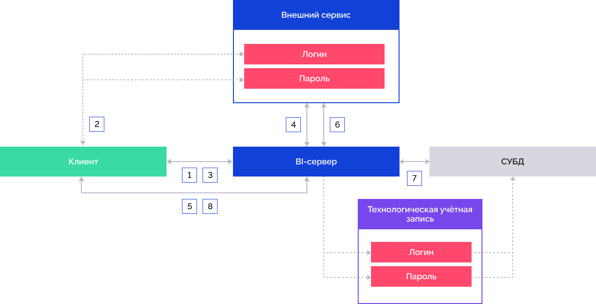

# OAuth 2.0 или OpenID Connect

OAuth 2.0 или OpenID Connect
-

# OAuth 2.0 или OpenID Connect

	Для авторизации пользователей при подключении к репозиторию в веб-приложении
	 доступно использование протокола OAuth 2.0 или OpenID Connect. Аутентификация
	 пользователя производится под учётной записью сервисов, поддерживающих
	 данный протокол.

	Если учётная запись пользователя внешнего сервиса содержится в менеджере
	 безопасности, то будет выполнено подключение к репозиторию и вход
	 в навигатор объектов под этим пользователем.

	Если учётная запись пользователя внешнего сервиса не содержится
	 в менеджере безопасности, то будет создан временный пользователь и
	 добавлен в группы из списка атрибута, указанного в userinfo. Если
	 атрибут не задан, то временный пользователь добавляется во встроенную
	 группу ПОЛЬЗОВАТЕЛИ.

	Подключение к СУБД производится под технологической учётной записью.

	При необходимости ознакомьтесь с [расширенной схемой
	 взаимодействия веб-приложения с внешним сервисом](#scheme).

## Шаг 1. Сохранение технологической
	 учётной записи для подключения к СУБД

	Для подключения к репозиторию, необходимо выполнить описанные в
	 данном шаге настройки для каждого репозитория. Повторите данный шаг
	 на всех рабочих [узлах
	 кластера](../01_BIServer/Cluster/Cluster_Of_BI_Server.htm).

	Для настройки подключения к репозиторию:

		- Запустите приложение [PP.Util](../../05_RepoMngr/Service_Applications/PP_Util.htm),
		 расположенное в папке установки продукта «Форсайт. Аналитическая платформа»,
		 с помощью командной строки от имени администратора. Ниже приведены
		 команды для настройки подключения к репозиторию. Вместо PP.Util
		 используйте PP.Util_start.sh для выполнения команды в ОС Linux,
		 PP.Util.exe для ОС Windows.

	Примечание.
	 В ОС Linux при сохранении зашифрованного пароля технологической учётной
	 записи запрашивается единица лицензирования [AnalyticsPlatform](../../08_Licensing/AboutFeatures.htm).
	 Ознакомьтесь со [способами](../../05_RepoMngr/Service_Applications/PP_Util.htm#license)
	 указания системной переменной LSFORCEHOST или LSHOST перед выполнением
	 PP.Util_start.sh.

		- Сохраните зашифрованный пароль технологической
		 учётной записи для подключения к СУБД:

			- если предполагается аутентификация на сервере базы данных
			 под одной технологической учётной записью для всех пользователей
			 внешнего сервиса, то в [менеджере
			 безопасности](Admin.chm::/01_RunSecManager/Admin_Organizational_Starting.htm) не обязательно добавлять всех
			 внешних пользователей, но обязательно должен быть добавлен
			 пользователь, учётные данные которого будут использоваться
			 в качестве технологической учётной записи для подключения
			 к СУБД. В этом случае данные единой технологической учётной
			 записи должны быть сохранены с помощью команды:

PP.Util /save_creds /ALG gos <идентификатор репозитория> /DC <имя пользователя репозитория (технологической учётной записи)>

	Пример сохранения данных одной общей
	 технологической учётной записи для всех пользователей внешнего сервиса:

PP.Util /save_creds /ALG gos REPOSITORY_ID /DC TECHNO_ACCOUNT TECHNO_PASSWORD

			- если предполагается аутентификация на сервере базы данных
			 под разными технологическими учётными записями, соответствующими
			 пользователю внешнего сервиса, то в [менеджере
			 безопасности](Admin.chm::/01_RunSecManager/Admin_Organizational_Starting.htm) не обязательно добавлять всех
			 внешних пользователей, но обязательно должны быть добавлены
			 пользователи, учётные данные которых будут использоваться
			 в качестве соответствующих технологических учётных записей
			 для подключения к СУБД. В этом случае данные каждой технологической
			 учётной записи для соответствующих внешних пользователей должны
			 быть сохранены с помощью команды:

PP.Util /save_creds /ALG gos <идентификатор репозитория> <имя пользователя репозитория (технологической учётной записи)> <пароль пользователя репозитория (технологической учётной записи)> <имя пользователя репозитория (внешнего сервиса)>

	Пример сохранения данных различных технологических
	 учётных записей:

PP.Util /save_creds /ALG gos REPOSITORY_ID TECHNO_NAME1 TECHNO_PASSWORD1 USER1
PP.Util /save_creds /ALG gos REPOSITORY_ID TECHNO_NAME2 TECHNO_PASSWORD2 USER2
PP.Util /save_creds /ALG gos REPOSITORY_ID TECHNO_NAME2 TECHNO_PASSWORD2 USER3

	Пользователи TECHNO_NAME1, TECHNO_NAME2,
	 учётные данные которых используются в качестве технологических, обязательно
	 должны быть добавлены в менеджере безопасности. Пользователи внешнего
	 сервиса USER1, USER2, USER3 могут быть не добавлены в менеджере безопасности,
	 а могут быть временными пользователями.

	Примечание.
	 Пользователь, используемый в качестве технологической учётной записи,
	 должен обладать [набором
	 привилегий](Admin.chm::/04_SecurityPolicy/Admin_Priv.htm),
	 который включает в себя привилегии соответствующих пользователей внешнего
	 сервиса, для которых он сохранён.

	При подключении к репозиторию происходит
	 поиск сохранённой технологической учётной записи для подключения к
	 СУБД:

			- Сначала выполняется поиск сохранённой технологической
			 учётной записи, соответствующей пользователю внешнего сервиса;

			- Если такая учетная запись не найдена, то подключение
			 к СУБД осуществляется под единой учётной записью, сохранённой
			 по умолчанию с параметром /DC;

			- Если отсутствует единая учётная запись, сохранённая
			 с параметром /DC, и учётная запись, соответствующая пользователю
			 внешнего сервиса, то генерируется ошибка подключения.

	Примечание.
	 При [входе
	 в систему](getstarted.chm::/getstarted/get_started.htm#login) выполняется проверка имени пользователя,
	 полученного от внешнего сервиса с учётом формата, заданного в параметре
	 [PPUserNameFormat](OAuth_OpenID_Connect.htm#oauth_parameters).

	После выполнения действий будет настроено подключение к репозиторию.

## Шаг 2. Настройка параметров для
	 протокола OAuth/OpenID Connect

	При аутентификации через внешние сервисы должно быть настроено соединение
	 между клиентом и BI-сервером по [протоколу
	 HTTPS](../04_FAQ/setting_https.htm). По умолчанию выполняется проверка параметра state
	 для защиты от потенциальных атак типа CSRF при получении кода авторизации.
	 Если соединение между клиентом и BI-сервером настроено по протоколу
	 HTTP, то создайте параметр StateCheckOff
	 со значением «1» в разделе [реестра](../03_Setup_Web/BI_Server_Registry_Key.htm#system)
	 [HKLM\SOFTWARE\Foresight\Foresight Analytics Platform\10.0\PP\BIS\System\OAuth]
	 или в соответствующем разделе файла [settings.xml](../03_Setup_Web/BI_Server_Settings_XML.htm)
	 для отключения проверки.

	Для протокола OAuth или OpenID Connect добавьте подразделы с наименованиями
	 сервисов и задайте соответствующие [настройки
	 реестра](../03_Setup_Web/BI_Server_Registry_Key.htm#system) в разделе [HKLM\SOFTWARE\Foresight\Foresight Analytics Platform\10.0\PP\BIS\System\OAuth\<наименование сервиса>] или в
	 соответствующем разделе файла [settings.xml](../03_Setup_Web/BI_Server_Settings_XML.htm)
	 со следующими параметрами:

	- AuthUrl. Адрес сервиса
	 авторизации, который будет использоваться в веб-приложении для параметра
	 RequestTokenUrl, с содержанием
	 дополнительных URL-параметров. Для протокола OpenID Connect в параметре
	 scope указываются значения
	 «profile+openid»;

	- ConsumerKey. Ключ зарегистрированного
	 приложения;

	- ConsumerSecret. Секретный
	 код зарегистрированного приложения;

	- Icon. Пиктограмма, которая
	 будет отображаться на кнопке авторизации с помощью сервера аутентификации
	 OAuth/OpenID Connect. Если параметр не задан, то пиктограмма будет
	 загружена из ресурсов «Форсайт. Аналитическая платформа».
	 В качестве значения параметра указывается строка, содержащая изображение
	 в формате [base64](https://www.base64-image.de/);

	- PPUserNameFormat. Формат
	 имен пользователей, например, «oa-ggl-%s»;

	- RequestCallbackParam.
	 Наименование атрибута, через который будет передаваться адрес для
	 переадресации пользователя в веб-приложение после авторизации на внешнем
	 сервисе, например, «redirect_uri». Адрес веб-приложения должен содержаться
	 в настройках авторизации внешнего сервиса;

	- RequestTokenUrl. Адрес
	 сервиса авторизации, по которому будет запрашиваться токен авторизации;

	- UserDataUrl. Адрес сервиса
	 данных, по которому будут запрашиваться данные о пользователе после
	 авторизации в веб-приложении. Актуально только для протокола OAuth;

	- UserIdAttr. Наименование
	 атрибута или путь до него в userinfo, который будет использоваться
	 в качестве уникального идентификатора пользователя. Например, наименование
	 атрибута «given_name» или путь «/path/to/given_name»;

	- UserNameAttr. Наименование
	 атрибута или путь до него в userinfo, который будет использоваться
	 в качестве отображаемого имени пользователя. Например, наименование
	 атрибута «name» или путь «/path/to/name»;

	- UserRolesAttr. Наименование
	 атрибута или путь до него в userinfo, который будет использоваться
	 для получения списка групп пользователей и временного добавления пользователя
	 в полученные группы. Используется, если учётная запись пользователя
	 не создана в [менеджере
	 безопасности](admin.chm::/Admin_Title.htm),
	 а требуемые группы пользователей созданы в нём. Например, наименование
	 атрибута «groups» или путь «/path/to/groups». Если параметр UserRolesAttr не указан, то временный
	 пользователь добавляется во встроенную группу ПОЛЬЗОВАТЕЛИ.

Важно.
 В списке групп пользователей не допускается указание встроенной группы
 АДМИНИСТРАТОРЫ. Если данная группа имеется в списке, то при подключении
 будет сгенерирована исключительная ситуация.

При настройке подключения к репозиторию под конкретным пользователем,
 который проходил авторизацию на внешнем сервисе, значения в параметрах
 UserIdAttr и
 UserNameAttr могут совпадать.

Уникальный идентификатор и имя пользователя, полученные при работе с
 внешним сервисом с помощью параметров UserIdAttr
 и UserNameAttr, записываются:

	- в файл /var/log/apache2-fp10.x/error.log для Astra
	 Linux;

	- в файл /var/log/httpd/error-fp10.x.log для РЕД ОС, Rocky
	 Linux;

	- в файл /var/log/httpd2/error-fp10.x.log для ALT Linux.

Значения, указываемые в параметрах ConsumerKey
 и ConsumerSecret, будут получены
 после регистрации разрабатываемого приложения на необходимом сервере аутентификации
 OAuth/OpenID Connect. Данные параметры необходимы, чтобы после авторизации
 на сервере аутентификации OAuth/OpenID Connect BI-сервер смог проверить
 и авторизовать соответствующего пользователя в репозитории.

Если параметры ConsumerKey и
 ConsumerSecret не указаны, то
 используются внутренние настройки BI-сервера, при этом на сервере аутентификации
 OAuth/OpenID Connect должно быть зарегистрировано приложение на базе веб-приложения
 «Форсайт. Аналитическая платформа».

	Пример заполнения параметров представлен в разделе [System](../03_Setup_Web/BI_Server_Settings_XML.htm#system)
	 для файла [settings.xml](../03_Setup_Web/BI_Server_Settings_XML.htm).

	Примечание.
	 Для [конструктора
	 бизнес-приложений](../../Extensions/Backend_Designer_of_Business_Applications.htm) можно настроить автоматическую переадресацию
	 на авторизацию пользователей через протокол OAuth/OpenID Connect при
	 входе в веб-приложение. Для этого в файле [DBA.config.json](../../Extensions/Configuration_Designer_of_Business_Applications.htm#dba_config_json)
	 задайте значение «OAuth» в поле authentication
	 и укажите сервисы авторизации,
	 заданные при настройке параметров для протокола OAuth или OpenID Connect,
	 в поле allowOauthProviders.

## Шаг 3. Подготовка BI-сервера

	Взаимодействие BI-сервера с внешними сервисами осуществляется через
	 стороннюю библиотеку libcurl. С её назначением, возможностями и ограничениями
	 можно ознакомиться на официальном сайте [https://curl.haxx.se/libcurl/](https://curl.haxx.se/libcurl/).
	 Работа BI-сервера должна осуществляться по протоколу HTTPS.

	Для подготовки BI-сервера проверьте наличие сети Интернет на сервере,
	 где установлен BI-сервер, и убедитесь, что доступ к сайтам сервисов
	 открыт.

	Если интернет-соединение осуществляется через прокси-сервер, то
	 создайте системные переменные:

		- CURLOPT_PROXY. Задайте
		 переменной значение «proxy.sever.ru:8080», в котором содержится
		 адрес прокси-сервера и порт, через который осуществляется подключение;

		- CURLOPT_PROXYUSERPWD.
		 Задайте переменной значение «login:password», в котором содержится
		 имя пользователя и пароль для подключения к интернету.

	В ОС Linux переменные окружения содержатся в файле /opt/foresight/fp10.x-biserver/etc/envvars
	 и добавляются в формате: <имя
	 переменной>=<значение>.

	Переменные окружения считываются при старте BI-сервера с экземпляром
	 Apache2. Для получения подробной информации о добавлении переменных
	 окружения в ОС Linux обратитесь к разделу «[Конфигурация
	 и настройка](../03_Setup_Web/config_and_setting.htm)».

	Примечание.
	 При необходимости для отслеживания выполняемых действий и получения
	 отладочной информации создайте переменные окружения PP_LOG и CURLOPT_VERBOSE
	 со значением «1».

	Если внешний сервис доступен по протоколу HTTPS, то скопируйте корневой
	 сертификат *.crt, с помощью которого был подписан сертификат безопасности
	 внешнего сервиса, на BI-сервер и выполните следующие действия:

		- в ОС Linux:

			- Создайте папку fp-extra-certs и переместите в неё корневой
			 сертификат внешнего сервиса:

	sudo mkdir /usr/share/ca-certificates/fp-extra-certs

	sudo cp <путь до папки>/<наименование сертификата>.crt
	 /usr/share/ca-certificates/fp-extra-certs/fp-extra-ca.crt

	После выполнения действий будет создана
	 папка /usr/share/ca-certificates/fp-extra-certs с корневым сертификатом
	 внешнего сервиса fp-extra-ca.crt.

			- Откройте на редактирование файл /etc/ca-certificates.conf
			 и добавьте строку в конец файла:

	fp-extra-certs/fp-extra-ca.crt

			- Примените изменение конфигурации:

	sudo update-ca-certificates
	 -v

		- в ОС Windows импортируйте корневой сертификат внешнего сервиса
		 в хранилище доверенных корневых центров сертификации средствами
		 операционной системы:

			- Дважды щёлкните по корневому сертификату *.crt. После
			 чего будет открыто окно «Сертификат».

			- Нажмите кнопку «Установить
			 сертификат». После чего будет открыт мастер импорта
			 сертификатов.

			- Выберите расположение хранилища «Текущий
			 пользователь» и нажмите кнопку «Далее».

			- Установите переключатель «Поместить
			 все сертификаты в следующее хранилище», выберите хранилище
			 сертификатов «Доверенные
			 корневые центры сертификации» и нажмите кнопку «Далее».

	После выполнения действий корневой сертификат
	 будет импортирован в хранилище доверенных корневых центров сертификации.

## Шаг 4. Подготовка и открытие веб-приложения

	Работа веб-приложения должна осуществляться по протоколу HTTPS.
	 Для подготовки веб-приложения используйте файл [Metabases.xml](../../06_AK_Client_Config/Configuring_repository_list_in_the_system_registry.htm#metabase_xml_list),
	 добавьте атрибут [Authentication](../../06_AK_Client_Config/Configuring_repository_list_in_the_system_registry.htm#authentification_type)
	 со значением «7» и заполните раздел [OAuthService](../../06_AK_Client_Config/Configuring_repository_list_in_the_system_registry.htm#oauth)
	 с атрибутами:

		- Providers. Массив
		 наименований сервисов авторизации, учётные записи которых можно
		 использовать для входа в веб-приложение. Допустимые значения определяются
		 тем, какие сервисы заданы при [настройке
		 параметров для протокола OAuth/OpenID Connect](OAuth_OpenID_Connect.htm#oauth_parameters), и указываются
		 через точку с запятой. Обязательный атрибут;

		- AutoStartProvider.
		 Индекс сервиса авторизации, указанного в массиве атрибута Providers. На выбранный сервис
		 будет выполняться автоматическая переадресация при попытке входа
		 в веб-приложение с использованием протокола OAuth/OpenID Connect.
		 Необязательный атрибут.

	Если в качестве значения атрибута используется
	 сервис, который не содержится в атрибуте Providers,
	 то автоматическая переадресация выполняться не будет;

	Пример файла Metabases.xml:

<PP>
    <Metabases>
        <REPOSITORY_ID Name="REPOSITORY_ID" Authentication="7" Package="STANDARDSECURITYPACKAGE">
            <OAuthService AutoStartProvider="0" Providers="Google"/>
            <LogonData DATABASE="DATABASE_NAME" CASESENSITIVE="true" SERVER="SERVER_DATABASE"/>
        </REPOSITORY_ID>
    </Metabases>
</PP>

	Альтернативным способом подготовки веб-приложения является добавление
	 аналогичных параметров в раздел реестра:

		- [HKEY_CURRENT_USER\SOFTWARE\Foresight\Foresight Analytics Platform\10.0\Metabases\<идентификатор репозитория>] -
		 настройки конкретного репозитория для текущего пользователя, не
		 зависимо от разрядности системы;

		- [HKEY_LOCAL_MACHINE\SOFTWARE\Foresight\Foresight Analytics Platform\10.0\Metabases\<идентификатор репозитория>] -
		 настройки конкретного репозитория в случае, когда разрядность
		 «Форсайт. Аналитическая платформа»
		 совпадает с разрядностью операционной системы. Для всех пользователей.

	После изменений [перезапустите
	 BI-сервер](../01_BIServer/bi-service_restart.htm) и [откройте
	 веб-приложение](../03_Setup_Web/Opening_Web_Application.htm). В окне регистрации будут доступны кнопки авторизации
	 для входа в систему с использованием протокола OAuth или OpenID Connect:

	

	Выберите репозиторий и нажмите кнопку одного из сервисов авторизации.
	 После чего будет осуществлен переход на страницу учётной записи соответствующего
	 сервиса, например, Google. Введите имя пользователя и пароль на странице
	 сервиса. При успешной авторизации в веб-приложении будет открыт [навигатор
	 объектов](getstarted.chm::/Interface/Interface_Navigator.htm).

## Расширенная схема взаимодействия веб-приложения
	 с внешним сервисом

	Схема взаимодействия веб-приложения с внешним сервисом:

	

		- Пользователь выбирает репозиторий, настроенный на работу
		 с внешним сервисом:

	

	BI-сервер обрабатывает запрос на передачу
	 настроек внешних сервисов и отображения соответствующих кнопок в окне
	 регистрации.

		- Пользователь нажимает кнопку соответствующего внешнего сервиса
		 в окне регистрации и переходит на страницу авторизации. Вводит
		 логин и пароль.

	При успешной аутентификации происходит
	 перенаправление пользователя в веб-приложение и клиент получает код
	 подтверждения авторизации. Переадресация пользователя выполняется
	 с помощью параметра [RequestCallbackParam](OAuth_OpenID_Connect.htm#oauth_parameters).

		- Клиент отправляет запрос BI-серверу на получение токена
		 авторизации внешнего сервиса. В запросе передаётся код подтверждения
		 авторизации и адрес веб-приложения.

		- BI-сервер отправляет запрос внешнему сервису на получение
		 токена авторизации. Запрос выполняется через адрес сервиса авторизации,
		 указанный в параметре [RequestTokenUrl](OAuth_OpenID_Connect.htm#oauth_parameters).
		 Внешний сервис обрабатывает запрос по коду подтверждения авторизации
		 и возвращает данные:

			- access_token.
			 Токен авторизации;

			- id_token. Идентификационный
			 токен, если в параметре [AuthUrl](OAuth_OpenID_Connect.htm#oauth_parameters)
			 задан дополнительный параметр scope
			 для протокола OpenID Connect;

			- refresh_token.
			 Токен для периодического обновления токена авторизации;

			- expires_in.
			 Время жизни токена авторизации. Во время открытой сессии с
			 репозиторием будет выполняться запрос на обновление access_token и
			 refresh_token по истечении времени жизни токена авторизации.
			 Если на внешнем сервисе сессия пользователя неактивна или
			 сервер недоступен, то соединение с репозиторием будет прервано.

	Полученные данные определяют текущее
	 состояние авторизации. В качестве хранилища состояний авторизации
	 используется:

			- [сервер
			 состояний](../01_BIServer/StateServer/State_Server.htm). Сохранённые данные автоматически удаляются
			 по истечении [времени
			 хранения записей на сервере](../03_Setup_Web/BI_Server_Registry_Key.htm#stateserver);

			- оперативная память BI-сервера. Сохранённые данные автоматически
			 удаляются при перезапуске BI-сервера.

		- BI-сервер создаёт в хранилище уникальный ключ текущего состояния
		 авторизации и передаёт его на клиент. Клиент отправляет запрос
		 BI-серверу на подключение к репозиторию. В запросе передаётся
		 уникальный ключ текущего состояния авторизации.

		- BI-сервер отправляет запрос внешнему сервису на получение
		 данных авторизованного пользователя. Внешний сервис обрабатывает
		 запрос по значению параметра [UserDataUrl](OAuth_OpenID_Connect.htm#oauth_parameters)
		 и возвращает информацию о пользователе, в том числе имя пользователя,
		 которое будет отображаться в [навигаторе
		 объектов](getstarted.chm::/Interface/Interface_Navigator.htm) и [менеджере безопасности](admin.chm::/Admin_Title.htm).

		- BI-сервер обращается к СУБД, используя предварительно сохранённую
		 технологическую учётную запись.

		- BI-сервер возвращает на клиент моникёр сессии. Происходит
		 перенаправление пользователя в навигатор объектов.

См. также:

[Аутентификация
 в продукте](Authentication.htm) | [Настройка
 аутентификации через внешние сервисы](login_settings_using_external_services.htm)

		Справочная
		 система на версию 10.9
		 от 18/08/2025,
		 © ООО «ФОРСАЙТ»,
