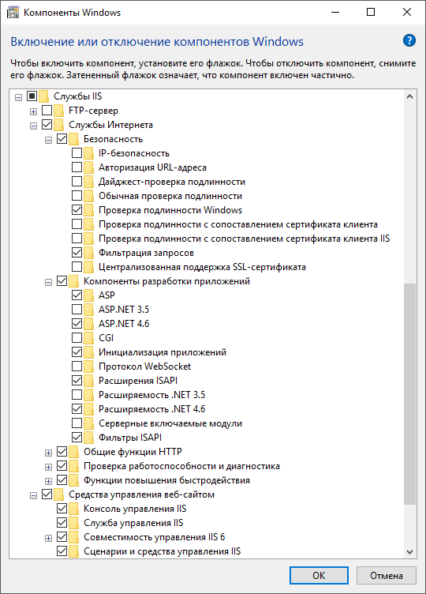

# Настройка доменной/интегрированной доменной аутентификации на веб-сервере IIS

Настройка доменной/интегрированной доменной аутентификации на веб-сервере IIS
-

# Настройка доменной/интегрированной доменной аутентификации на веб-сервере
 IIS

Данная статья предназначена для настройки доменной/интегрированной доменной
 [аутентификации](Authentication.htm#web) в веб-приложении,
 развернутом на базе веб-сервера IIS.
 Перед настройкой веб-приложения необходимо [добавить](Admin.chm::/03_Admin/Users/Admin_UserCreate_Domain.htm)
 доменных пользователей в менеджере безопасности настольного приложения
 и раздать им необходимые права доступа.

Для настройки аутентификации в веб-приложении «Форсайт. Аналитическая платформа»
 выполните следующие шаги:

	- Убедитесь, что были произведены настройки веб-сервера:

		- [настройки
		 для серверной ОС](../03_Setup_Web/Add_WebServer_Role.htm);

		- [настройки для
		 не серверной ОС](../03_Setup_Web/IIS_turn_on.htm).

	- [Установите BI-сервер](../Install_Web_on_Windows.htm)
	 и [веб-приложение](../03_Setup_Web/WebSetup_Setup.htm).

	- Если репозиторий, с которым предполагается работа, создан на
	 базе СУБД Oracle, то произведите [дополнительную
	 настройку](../../03_DB_Server_Config/Setup_DB_Server_Config_Oracle_Tuning.htm#domain) сервера СУБД и клиентского компьютера. Для других СУБД
	 этот шаг можно пропустить.

	- Настройка IIS.

Убедитесь, что среди служб IIS установлена
 проверка подлинности Windows:

Откройте диспетчер служб IIS, выполнив в
 командной строке команду «inetmgr».
 В дереве «Подключения» выберите
 подключение к серверу (localhost). Затем в списке функций (отображаются
 справа от подключений) выберите  «Проверка подлинности» и дважды щелкните
 для её открытия. Для пункта «Проверка
 подлинности Windows» в столбце «Состояние»
 должно быть установлено «Включено».

Для пула, который использует веб-приложение,
 измените следующие параметры:

		- Загрузить профиль пользователя.
		 Установите значение «False»;

		- Удостоверение. Установите
		 значение «NetworkService».

	- Настройка веб-приложения. В зависимости от выбранного типа аутентификации
	 в файле [PP.xml](../03_Setup_Web/PP_config_Java.htm) в
	 разделе [<metabase>](../03_Setup_Web/PP_config_Java.htm#metabase)
	 добавьте атрибут authentication со следующими значениями:

		- для доменной аутентификации: authentication=”Domain”;

		- для интегрированной доменной аутентификации:
		 authentication=”IntegratedDomain”.

В дереве «Подключения»
 для веб-приложения в списке функций откройте  «Проверка подлинности». Включите
 настройки «Олицетворение ASP.NET»
 и «Проверка подлинности Windows»,
 остальные настройки должны быть выключены. Вместо настройки «Проверка
 подлинности Windows» можно включить настройку «Обычная
 проверка подлинности».

Также необходимо проверить, чтобы для папки
 Config была включена анонимная проверка подлинности. Для этого внутри
 веб-приложения выделите папку Config и в списке функций откройте  «Проверка
 подлинности». Если флажок «Анонимная
 проверка подлинности» снят, то включите его, выполнив соответствующую
 команду контекстного меню.

	- Настройка BI-сервера:

Для приложения BI-сервера
 необходимо в списке функций открыть  «Проверка подлинности», включить
 настройку «Проверка подлинности Windows»
 и отключить остальные настройки.

	- Настройка веб-сервера:

Если веб-сервер находится в домене, для него
 должно быть установлено делегирование «Trust
 computer for delegation». А для учетных записей пользователей в
 Active Directory должен быть снят флажок «Account
 is sensitive and cannot be delegated».

Примечание.
 Данная настройка обязательна, если интегрированная доменная аутентификация
 работает по протоколу Kerberos. Для выполнения настройки необходимо обладать
 правами администратора сети.

Для входа в систему при использовании доменной
 аутентификации на сервере с установленным [BI-сервером](../Install_Web_on_Windows.htm)
 и [серверной частью веб-приложения](../03_Setup_Web/WebSetup_Setup.htm)
 пользователи должны обладать привилегией «Интерактивный
 вход в систему» (LOGON32_LOGON_INTERACTIVE) на уровне домена.

	- Настройки браузера:

В настройках браузера включите сервер в разрешенные
 узлы или локальную сеть.

Примечание.
 Для подключения к сайту используйте имя сервера, протокол Kerberos не
 поддерживает работу с IP-адресами. Kerberos поддерживает работу в следующих
 браузерах: [Яндекс.Браузер](https://browser.yandex.ru/),
 Chromium-Gost, [Google Chrome](https://www.google.ru/chrome/browser/desktop/index.html), [Mozilla
 Firefox](http://firefox-downloads.ru) и [Chromium](https://www.chromium.org/getting-involved/download-chromium/).

Для браузера [Microsoft
 Edge](https://www.microsoft.com/ru-ru/windows/microsoft-edge) дополнительно создайте параметры [AuthNegotiateDelegateAllowlist](https://learn.microsoft.com/ru-ru/deployedge/microsoft-edge-policies#authnegotiatedelegateallowlist)
 и [AuthServerAllowlist](https://learn.microsoft.com/ru-ru/deployedge/microsoft-edge-policies#authserverallowlist)
 на локальных компьютерах всех пользователей в одном из разделов реестра:

		- [HKEY_LOCAL_MACHINE\SOFTWARE\Policies\Microsoft\Edge] для
		 всех пользователей на компьютере;

		- [HKEY_CURRENT_USER\SOFTWARE\Policies\Microsoft\Edge] для
		 текущего пользователя.

	- [Проверьте](../03_Setup_Web/Opening_Web_Application.htm)
	 работу веб-приложения.

См. также:

[Аутентификация
 в продукте](Authentication.htm) | [Интегрированная
 доменная аутентификация при использовании Service Reference](WebKnowledgeBase.chm::/integrated_domain_login.htm)

		Справочная
		 система на версию 10.9
		 от 18/08/2025,
		 © ООО «ФОРСАЙТ»,
