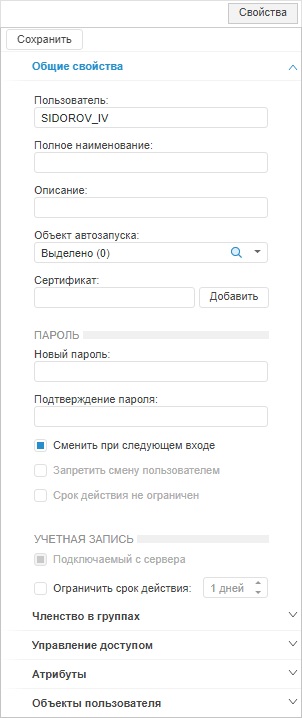
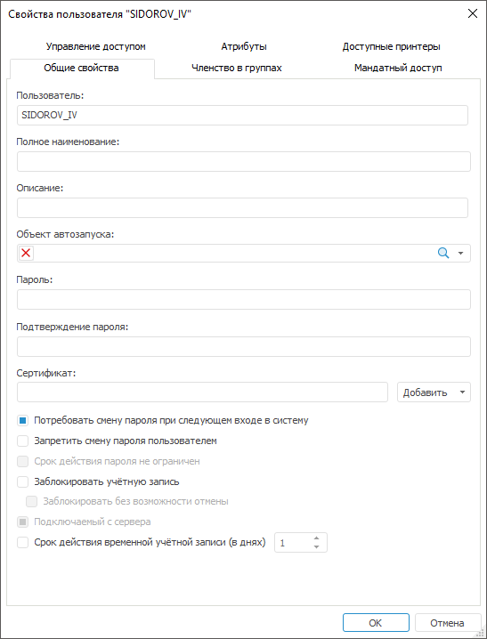

# Настройка двухфакторной аутентификации

Настройка двухфакторной аутентификации
-

# Настройка двухфакторной аутентификации

	Двухфакторная аутентификация предназначена для повышения информационной
	 безопасности за счёт дополнительного этапа проверки подлинности пользователя
	 при его авторизации. В качестве первого фактора используется выбранный
	 [тип
	 аутентификации](../../06_AK_Client_Config/UiNav_RepoConfig_repo1.htm#authentication_type). В качестве второго фактора используется слепок
	 сертификата клиента, который сохраняется в «Форсайт. Аналитическая платформа».

	Сертификат клиента является частью сертификата безопасности, который
	 включает в себя набор сгенерированных сертификатов:

		- Корневой сертификат.
		 Используется для генерации и подписи сертификата сервера и сертификата
		 клиента;

		- Сертификат сервера.
		 Используется веб-сервером Apache2 в ОС Linux или IIS в ОС Windows
		 в веб-приложении;

		- Сертификат клиента.
		 Используется для проверки подлинности пользователя при его авторизации
		 и представляет собой личную цифровую подпись.

	По умолчанию при успешной аутентификации пользователя будет запрашиваться
	 привязанный сертификат клиента для входа в систему.

	Примечание.
	 Настройка двухфакторной аутентификации доступна в настольном и веб-приложении,
	 работа которого [настроена по
	 протоколу HTTPS](../04_FAQ/setting_https.htm). Для работы двухфакторной аутентификации в [файлах конфигурации веб-приложения](../03_Setup_Web/PP_config_Java.htm)
	 должен быть указан адрес веб-сервиса PP.SOM.Som.

	При настройке двухфакторной аутентификации для веб-приложения предполагается,
	 что корневой сертификат и сертификат сервера уже получены и установлены
	 в процессе настройки работы веб-приложения по протоколу HTTPS. Получите
	 только сертификат клиента client.pfx и разместите его в папке с корневым
	 сертификатом на локальном компьютере пользователя. Также получите
	 сертификат клиента с расширением *.cer или *.crt для последующей его
	 привязки к пользователю в «Форсайт. Аналитическая платформа».

	При настройке двухфакторной аутентификации для настольного приложения
	 получите корневой сертификат и сертификат клиента, подписанные доверенным
	 центром сертификации. После чего создайте произвольную папку и разместите
	 сертификаты на локальном компьютере пользователя: сертификат клиента
	 client.pfx; корневой сертификат ca.cer и его закрытый ключ ca.key.

	Указанные файлы сертификатов и ключа приведены в качестве примера
	 и могут отличаться.

## Шаг 1. Импорт сертификата клиента в
	 хранилище

	Для импорта сертификата клиента в личное хранилище сертификатов
	 используйте [поддерживаемый](../../03_DB_Server_Config/Setup_DB_ServerSysReq.htm#client)
	 браузер или средства операционной системы. Средствами операционной
	 системы можно импортировать сертификаты в хранилища только в ОС Windows.

	Рассмотрим импорт сертификатов на примере Mozilla Firefox:

		- Откройте настройки браузера по адресу:

	about:preferences

		- Перейдите в раздел «Приватность
		 и Защита».

		- Нажмите кнопку «Просмотр
		 сертификатов» в подразделе «Сертификаты».
		 После чего будет открыто окно «Управление
		 сертификатами».

		- Нажмите кнопку «Импортировать»
		 и выполните действия. После чего будет выдан стандартный диалог
		 выбора файла.

		- Выберите сертификат клиента client.pfx на вкладке «Ваши сертификаты».

		- Введите пароль закрытого ключа, который был задан при создании
		 сертификата клиента.

	После выполнения действий сертификат клиента будет импортирован
	 в личное хранилище сертификатов.

## Шаг 2. Привязка сертификата клиента к
	 пользователю

	Сертификат клиента должен быть привязан индивидуально к каждому
	 пользователю.

	Примечание.
	 Привязка сертификата клиента к [доменному
	 пользователю](admin.chm::/03_Admin/Users/Admin_UserCreate_Domain.htm) недоступна.

	Для привязки сертификата к пользователю в [менеджере
	 безопасности](admin.chm::/01_RunSecManager/Admin_Organizational_Starting.htm):

		- Выполните одно из действий в разделе «[Пользователи](admin.chm::/03_Admin/Users/Admin_Users.htm)»:

			- в веб-приложении выберите
			 пользователя;

			- в настольном приложении:

				- выберите пользователя и выполните команду контекстного
				 меню «Свойства»;

				- выберите пользователя и выполните команду [главного
				 меню](admin.chm::/01_RunSecManager/Admin_Organizational_Starting.htm) «Пользователь
				 > Свойства»;

				- дважды щелкните по выбранному пользователю.

	После выполнения одного из действий будет
	 открыта боковая панель «Свойства»
	 в веб-приложении и окно «Свойства
	 пользователя» в настольном приложении.

		Веб-приложение
		 Настольное
		 приложение

			

			

		- Нажмите кнопку «Добавить»,
		 расположенную напротив поля «Сертификат»,
		 на вкладке «[Общие свойства](admin.chm::/03_Admin/Users/Admin_UserProp_Common.htm)»
		 и выберите вариант добавления сертификата клиента в раскрывающемся
		 меню кнопки:

			- из файла. При
			 выполнении команды будет открыт стандартный диалог выбора
			 файла. Выберите файл с расширением *.cer или *.crt и нажмите
			 кнопку «Открыть»;

			- из хранилища Windows.
			 При выполнении команды будет открыт стандартный диалог выбора
			 сертификата Windows. Выберите сертификат и нажмите кнопку
			 «ОК».

	Примечание.
	 В веб-приложении добавление сертификата доступно только из файла.

	После выполнения действий в поле «Сертификат» будет содержаться слепок
	 выбранного сертификата клиента.

		- Нажмите кнопку «Сохранить»
		 в веб-приложении или «ОК»
		 в настольном приложении.

	После выполнения действий сертификат клиента будет привязан к выбранному
	 пользователю.

## Шаг 3. Настройка BI-сервера

	Шаги по настройке BI-сервера отличаются в зависимости от операционной
	 системы.

		ОС
		 Linux ОС Windows

			Для настройки BI-сервера в ОС Linux:

				- Добавьте параметры SSL в файле конфигурации:

					- /etc/apache2-fp10.x/mods-available/fp10.x-biserver.conf
					 в Debian-подобных дистрибутивах;

					- /etc/httpd-fp10.x/conf.d/fp10.x-biserver.conf
					 в RedHat-подобных дистрибутивах;

					- /etc/httpd2-fp10.x/conf/mods-available/fp10.x-biserver.conf
					 в ALT Linux.

			<VirtualHost
			 *:8810>

			   ...

			   SSLVerifyClient require

			   SSLVerifyDepth 10

			   SSLCACertificateFile <путь
			 до папки>/ca.cer

			   ...

			</VirtualHost>

			В подстановке <путь до папки> укажите папку, в которой
			 расположен корневой сертификат.

				- [Перезапустите
				 BI-сервер](../01_BIServer/bi-service_restart.htm).

			После выполнения действий будет настроен BI-сервер.

			Для настройки веб-сервера IIS, на котором установлен BI-сервер,
			 в ОС Windows откройте диспетчер служб IIS и выполните действия:

				- Откройте функцию 
				 «Параметры SSL»
				 в разделе «IIS»
				 двойным щелчком мыши или с помощью команды контекстного
				 меню «Открытие функции».

				- Установите флажок «Требовать
				 SSL» и переключатель «Требовать»
				 для сертификатов клиента.

			После выполнения действий при двухфакторной аутентификации
			 для подключения к веб-сервису будет использоваться протокол
			 HTTPS. Авторизация пользователей будет выполняться по клиентским
			 сертификатам.

## Шаг 4. Изменение применения двухфакторной
	 аутентификации

	По умолчанию двухфакторная аутентификация применятся только для
	 пользователей, к которым привязан сертификат клиента. При необходимости
	 измените применение двухфакторной аутентификации.

	Способы изменения применения двухфакторной аутентификации в веб-приложении
	 и настольном приложении отличаются.

		Веб-приложение
		 Настольное
		 приложение

			В веб-приложении создайте строковый параметр Strategy_check
			 и задайте ему значение в файле конфигурации [settings.xml](../03_Setup_Web/BI_Server_Settings_XML.htm):

			<Key Name="Manager">

			  <Certificate Strategy_check="Always"/>

			</Key>

			Допустимые значения параметра:

				- User. По
				 умолчанию. Двухфакторная аутентификация применяется, если
				 к пользователю привязан сертификат клиента;

				- Always.
				 Двухфакторная аутентификация применяется для всех пользователей.
				 Пользователям, к которым не привязан сертификат клиента,
				 доступ будет запрещен;

				- Never. Двухфакторная
				 аутентификация не применяется, даже если к пользователю
				 привязан сертификат клиента.

			В настольном приложении создайте строковый параметр Strategy_check и задайте
			 ему значение в разделе реестра [HKEY_LOCAL_MACHINE\Software\Foresight\Foresight Analytics Platform\10.0\Manager\Certificate]
			 на локальных компьютерах всех пользователей.

			Допустимые значения параметра:

				- User. По
				 умолчанию. Двухфакторная аутентификация применяется, если
				 к пользователю привязан сертификат клиента;

				- Always.
				 Двухфакторная аутентификация применяется для всех пользователей.
				 Пользователям, к которым не привязан сертификат клиента,
				 доступ будет запрещен;

				- Never. Двухфакторная
				 аутентификация не применяется, даже если к пользователю
				 привязан сертификат клиента.

## Шаг 5. Проверка двухфакторной аутентификации

	Для проверки двухфакторной аутентификации:

		- [Откройте
		 веб-приложение](../03_Setup_Web/Opening_Web_Application.htm) по протоколу HTTPS или запустите настольное
		 приложение.

		- Войдите в систему в соответствии с используемым [типом
		 аутентификации](../../06_AK_Client_Config/UiNav_RepoConfig_repo1.htm#authentication_type).

	После выполнения действий результат двухфакторной аутентификации
	 будет зависеть от заданного [применения](double_auth.htm#toggle).
	 Если применение двухфакторной авторизации не менялось, то по умолчанию
	 при успешной аутентификации пользователя будет запрашиваться привязанный
	 сертификат клиента для входа в систему.

См. также:

[Аутентификация
 в продукте](Authentication.htm)

		Справочная
		 система на версию 10.9
		 от 18/08/2025,
		 © ООО «ФОРСАЙТ»,
