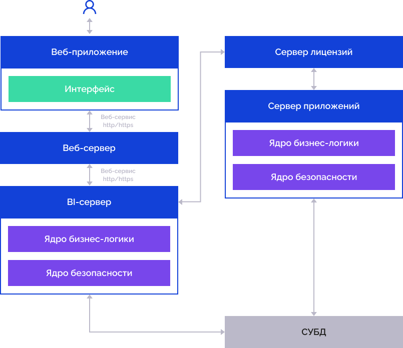

# Расширенная установка веб-приложения «Форсайт. Аналитическая платформа» в ОС Linux (СУБД PostgreSQL)

Расширенная установка веб-приложения «Форсайт. Аналитическая платформа» в ОС Linux (СУБД PostgreSQL)
-

# Расширенная установка веб-приложения «Форсайт. Аналитическая платформа»
	 в ОС Linux (СУБД PostgreSQL)

	Для работы с веб-приложением должна быть сформирована система с
	 использованием программного обеспечения «Форсайт. Аналитическая платформа»,
	 которая предполагает наличие:

		- клиентских компьютеров с доступом к сети, в которой расположен
		 веб-сервер;

		- веб-сервера, на котором установлена [серверная
		 часть веб-приложения](03_Setup_Web/Web_server_setup.htm);

		- BI-сервера, на котором установлен веб-сервис [PP.SOM](ppsomservice.chm::/intro/pp7service_using.htm);

		- сервера лицензий на базе [Guardant](../08_Licensing/Guardant/License_Server_Guardant.htm)
		 или [RMS](../08_Licensing/RMS/LicenseServer.htm), используемого
		 для активации продукта «Форсайт. Аналитическая платформа»
		 [сетевой
		 лицензией](../08_Licensing/Admin_Licensing_Variants.htm#network) и контроля количества одновременно работающих пользователей;

		- [сервера приложений](AppServer.htm),
		 используемого для выполнения отложенных задач;

		- сервера баз данных, на котором установлена одна из [поддерживаемых
		 версий СУБД PostgreSQL](../01_SysReq/database_Support.htm#postgresql).

	

	Примечание.
	 BI-сервер, сервер приложений и веб-приложение могут располагаться
	 на одном физическом сервере. При выполнении ресурсоёмких задач располагайте
	 сервер приложений и BI-сервер на различных физических серверах.

	В руководстве представлена установка веб-приложения «Форсайт. Аналитическая платформа»
	 с использованием СУБД PostgreSQL для следующих версий ОС семейства
	 Linux:

		- Astra Linux SE 1.7;

		- РЕД ОС 7.3;

		- Rocky Linux 8;

		- ALT Linux 10.

	При возникновении проблем с
	 установкой и запуском «Форсайт. Аналитическая платформа»
	 обратитесь к разделу «[Решение возможных проблем с продуктом
	 «Форсайт. Аналитическая платформа](faq.chm::/FAQ_title.htm)».

	В процессе установки BI-сервера ([шаг
	 4](#bi_server_installation)) и серверной части веб-приложения ([шаг
	 8](#web_server_installation)) используются дистрибутивы, входящие в [комплект
	 поставки](../02_AK_Install/DistributionKit.htm#linux) продукта «Форсайт. Аналитическая платформа»:

			 Версия ОС семейства Linux
			 Дистрибутивы для установки BI-сервера
			 Дистрибутивы для установки веб-сервера

			 Astra Linux SE 1.7
			 foresight-fp10.x-biserver_10.9.<номер сборки>~astra~1.7_amd64.deb
			 foresight-fp10.x-webserver_10.9.<номер сборки>~astra~1.7_all.deb

			 РЕД ОС 7.3
			 foresight-fp10.x-biserver_10.9.<номер сборки>.redos7.3.x86_64.rpm
			 foresight-fp10.x-webserver_10.9.<номер сборки>.redos7.3.noarch.rpm

			 Rocky Linux 8
			 foresight-fp10.x-biserver_10.9.<номер сборки>.rocky8.x86_64.rpm
			 foresight-fp10.x-webserver_10.9.<номер сборки>.rocky8.noarch.rpm

			 ALT Linux 10
			 foresight-fp10.x-biserver_10.9.<номер сборки>.alt10.x86_64.rpm
			 foresight-fp10.x-webserver_10.9.<номер сборки>.alt10.noarch.rpm

	После установки веб-приложения будут созданы следующие каталоги:

		- для BI-cервера:

			- /opt/foresight/fp10.x-biserver.
			 Основные файлы BI-сервера;

			- /etc/apache2-fp10.x.
			 Конфигурационные файлы экземпляра Apache2 с BI-сервером для
			 Astra Linux;

			- /etc/httpd-fp10.x.
			 Конфигурационные файлы экземпляра Apache2 с BI-сервером для
			 РЕД ОС, Rocky Linux;

			- /etc/httpd2-fp10.x.
			 Конфигурационные файлы экземпляра Apache2 с BI-сервером для
			 ALT Linux;

		- для веб-сервера:

			- /opt/foresight/fp10.x-webserver.
			 Основные файлы веб-сервера;

			- /etc/opt/foresight/fp10.x-webserver.
			 Дополнительный конфигурационный файл экземпляра веб-сервера
			 envvars для задания переменных окружения Apache2;

			- /etc/apache2-fp10.x-web. Конфигурационные файлы
			 экземпляра Apache2 с веб-сервером для Astra Linux;

			- /etc/httpd-fp10.x-web.
			 Конфигурационные файлы экземпляра Apache2 с веб-сервером для
			 РЕД ОС, Rocky Linux;

			- /etc/httpd2-fp10.x-web.
			 Конфигурационные файлы экземпляра Apache2 с веб-сервером для
			 ALT Linux.

## Шаг 1. Проверка системных требований

	Убедитесь в соблюдении системных требований для:

		- [клиентских
		 компьютеров](../03_DB_Server_Config/Setup_DB_ServerSysReq.htm#client);

		- [веб-сервера](../03_DB_Server_Config/Setup_DB_ServerSysReq.htm#web);

		- [BI-сервера
		 и сервера приложений](../03_DB_Server_Config/Setup_DB_ServerSysReq.htm#bi);

		- [сервера
		 лицензий](../08_Licensing/RMS/LicenseServer.htm#system_requirements);

		- [сервера
		 баз данных](../03_DB_Server_Config/Setup_DB_ServerSysReq.htm).

	Также ознакомьтесь с [требованиями
	 к настройкам операционной системы](../01_SysReq/EnviromentRequirements.htm) и [поддерживаемыми
	 версиями СУБД PostgreSQL](../01_SysReq/database_Support.htm#postgresql).

## Шаг 2. Подготовка серверной части
	 СУБД

	Подготовка заключается в создании отдельной базы данных и пользователя,
	 который будет являться администратором этой базы данных.

	После выполнения всех действий по подготовке СУБД рекомендуется
	 проверить подключение пользователя к созданной базе данных средствами
	 самой СУБД. Если в дальнейшем возникнут проблемы подключения к репозиторию,
	 то также может потребоваться проверка прав пользователя и дополнительная
	 настройка на уровне СУБД.

Процедура подготовки сервера PostgreSQL производится администратором
 СУБД.

Важно. Для
 обеспечения безопасности системы перед подготовкой сервера PostgreSQL
 проверьте настройки доступа к серверу в конфигурационном файле pg_hba.conf
 и настройки параметра [lc_messages](https://postgrespro.ru/docs/postgrespro/16/runtime-config-client#GUC-LC-MESSAGES)
 в конфигурационном файле postgresql.conf. Язык сообщений PostgreSQL должен
 совпадать с языковыми настройками операционной системы. Также параметр
 [standard_conforming_strings](https://postgrespro.ru/docs/postgrespro/16/runtime-config-compatible#GUC-STANDARD-CONFORMING-STRINGS) должен иметь значение «on».

Для подготовки сервера PostgreSQL выполните скрипты любым из доступных
 способов, например, с помощью приложения [pgAdmin](https://www.pgadmin.org/download/)
 или консоли psql. При выполнении скриптов учитывайте следующие особенности:

	- параметры USER_NAME,
	 DATABASE_NAME и SCHEMA_NAME
	 должны быть прописаны в верхнем регистре;

	- наименования параметров регистрозависимые и должны быть указаны
	 в кавычках. Если кавычки пропущены, то при выполнении скрипта в СУБД
	 наименования параметров будут преобразованы к нижнему регистру;

	- выполнение скриптов должно производиться администратором СУБД
	 с привилегией SUPERUSER, если при подготовке сервера PostgreSQL используется
	 консоль psql.

	Совет. Для подготовки
	 сервера PostgreSQL в ОС Linux используйте [готовый
	 скрипт](#script). После выполнения скрипта будет создан пользователь базы
	 данных NEW_USER с паролем NEW_USER, база данных NEW_DATABASE, репозиторий
	 с идентификатором NEW_DATABASE и служебный пользователь SERVICE_USER
	 с паролем SERVICE_USER.

### Создание пользователя базы данных

Для создания пользователя базы данных выполните скрипт:

CREATE ROLE "USER_NAME"
 LOGIN ENCRYPTED PASSWORD 'USER_PASSWORD'
 NOSUPERUSER INHERIT NOCREATEDB NOCREATEROLE NOREPLICATION;

Где:

	- USER_NAME. Имя создаваемого
	 пользователя;

Важно.
 Имя пользователя ADMIN недопустимо для использования.

	- USER_PASSWORD. Пароль
	 создаваемого пользователя.

### Создание базы данных

Для создания базы данных выполните скрипт:

CREATE DATABASE "DATABASE_NAME"
 WITH OWNER = "USER_NAME"
 ENCODING = 'UTF8' TABLESPACE = pg_default  LC_COLLATE = default LC_CTYPE
 = default CONNECTION LIMIT = -1;

ALTER DATABASE "DATABASE_NAME"
 SET lo_compat_privileges = 'on';

GRANT ALL ON DATABASE "DATABASE_NAME"
 TO "USER_NAME";

Где:

	- USER_NAME. Имя пользователя,
	 созданного ранее;

	- DATABASE_NAME. Имя создаваемой
	 базы данных.

При создании базы данных используется единственная поддерживаемая кодировка - UTF-8.

Важно. Создание
 базы данных выполняется через служебную базу данных postgres по умолчанию.
 Для дальнейшей подготовки сервера СУБД подключитесь к созданной базе данных.

### Создание пользовательской схемы в текущей
	 базе данных

	По умолчанию используется схема public.

Для создания пользовательской схемы в текущей базе данных выполните
 скрипт:

CREATE SCHEMA "SCHEMA_NAME" AUTHORIZATION "USER_NAME";

Где:

	- USER_NAME. Имя пользователя,
	 созданного ранее;

	- SCHEMA_NAME. Идентификатор
	 пользовательской схемы.

После выполнения действий будет создана пользовательская схема. Созданный
 на первом этапе пользователь будет являться владельцем схемы.

Для использования пользовательской схемы в качестве схемы по умолчанию
 выполните скрипт:

SET search_path TO "SCHEMA_NAME";

После выполнения действий вместо схемы public по умолчанию будет использоваться
 пользовательская схема.

Примечание.
 При поддержке типа данных Lo не рекомендуется использование нескольких
 пользовательских схем в одной базе данных.

Для получения подробной информации о работе с пользовательскими схемами
 обратитесь к [документации PostgreSQL](https://postgrespro.ru/docs/postgrespro/11/sql-createschema).

### Поддержка типа данных Lo

Для хранения многобайтовой информации в PostgreSQL используется тип
 данных Lo. По умолчанию, после создания базы данных, поддержка работы
 с данным типом отключена. Для включения поддержки типа данных Lo выполните
 скрипт:

SET search_path TO "SCHEMA_NAME";

CREATE FUNCTION loin (cstring) RETURNS lo AS 'oidin'
 LANGUAGE internal IMMUTABLE STRICT;

CREATE FUNCTION loout (lo) RETURNS cstring AS 'oidout'
 LANGUAGE internal IMMUTABLE STRICT;

CREATE FUNCTION lorecv (internal) RETURNS lo AS
 'oidrecv' LANGUAGE internal IMMUTABLE STRICT;

CREATE FUNCTION losend (lo) RETURNS bytea AS 'oidsend'
 LANGUAGE internal IMMUTABLE STRICT;

CREATE TYPE lo (INPUT = loin, OUTPUT = loout, RECEIVE
 = lorecv, SEND = losend, INTERNALLENGTH = 4, PASSEDBYVALUE);

CREATE CAST (lo AS oid) WITHOUT FUNCTION AS IMPLICIT;

CREATE CAST (oid AS lo) WITHOUT FUNCTION AS IMPLICIT;

CREATE OR REPLACE FUNCTION lo_manage() RETURNS pg_catalog.trigger
 AS '$libdir/lo' LANGUAGE C;

Где:

	- SCHEMA_NAME. Идентификатор
	 пользовательской схемы.

Примечание.
 Если используется одна или несколько пользовательских схем, то выполните
 скрипт для каждой схемы. Если пользовательская схема не создана, то выполните
 скрипт без указания параметра SCHEMA_NAME.
 По умолчанию используется схема public.

### Особенности работы с СУБД PostgreSQL

Конфигурация по умолчанию для серверов PostgreSQL включает в себя функцию
 автоочистки - освобождение пространства, занимаемого удалёнными из таблиц
 данными, с помощью SQL-команды VACUUM. Также производится обновление статистики,
 которая используется планировщиком для выбора способа выполнения запросов.
 Если предполагается интенсивная работа по изменению данных в таблицах,
 то рекомендуется настроить конфигурацию таким образом, чтобы автоочистка
 производилась в периоды малых нагрузок на сервер (ночью, в выходные).
 Настройку можно производить в соответствии с документацией, доступной
 на [сайте разработчика](https://postgrespro.ru/docs/postgrespro/16/routine-vacuuming#AUTOVACUUM).

## Шаг 3. Установка клиентской части СУБД

	Для установки клиентской части СУБД PostgreSQL выполните команду:

		- Astra Linux:

	sudo
	 apt-get install postgresql-client

		- Rocky Linux:

	sudo
	 yum install postgresql postgresql-libs

		- РЕД ОС:

	sudo
	 dnf install postgresql postgresql-libs

		- ALT Linux:

	sudo
	 apt-get install postgresql14

	После выполнения действия будет установлен драйвер PostgreSQL, с
	 помощью которого «Форсайт. Аналитическая платформа»
	 взаимодействует с сервером баз данных.

	Альтернативным вариантом является установка клиента Postgres Pro.
	 Инструкция по установке доступна на [сайте производителя](https://postgrespro.ru/docs/enterprise/14/binary-installation-on-linux).

	Если осуществляется ручная установка BI-сервера из архива или установка
	 клиентской части СУБД выполнена после установки BI-сервера, то создайте
	 символьную ссылку с помощью команды:

		- Astra Linux:

	sudo
	 ln -s /usr/lib/x86_64-linux-gnu/libpq.so.5 /usr/lib/x86_64-linux-gnu/libpq.so

		- РЕД ОС, Rocky Linux, ALT Linux:

	sudo
	 ln -s /usr/lib64/libpq.so.5 /usr/lib64/libpq.so

## Шаг 4. Установка BI-сервера

	Для установки BI-сервера:

		- Убедитесь, что доступна сеть Интернет.

		- Обновите информацию о пакетах:

			- Astra Linux, ALT Linux:

	sudo
	 apt-get update

			- РЕД ОС, Rocky Linux:

	sudo
	 yum update

		- Скопируйте дистрибутив foresight-fp10.x-biserver*.deb/rpm
		 из комплекта поставки в домашнюю директорию /home/<имя
		 пользователя>. Наименование дистрибутива зависит от
		 версии OC Linux.

	При необходимости определите пользователя,
	 от имени которого будет установлен BI-сервер:

	whoami

		- Установите скопированный дистрибутив BI-сервера:

			- Astra Linux:

	sudo
	 dpkg -i foresight-fp10.x-biserver*.deb

			- Rocky Linux:

	sudo
	 yum localinstall foresight-fp10.x-biserver*.rpm

			- РЕД ОС:

	sudo
	 dnf install foresight-fp10.x-biserver*.rpm

			- ALT Linux:

	sudo
	 apt-get install -y foresight-fp10.x-biserver*.rpm

		- Установите недостающие зависимости для Astra Linux:

	sudo apt-get -f install

	При необходимости повторно обновите информацию
	 о пакетах.

	Для корректной работы используйте актуальные
	 библиотеки из системных репозиториев.

	Примечание.
	 Необходимые библиотеки содержатся в [дистрибутиве](../02_AK_Install/DistributionKit.htm#linux)
	 BI-сервера и не требуют дополнительной установки. При установке недостающих
	 библиотек отображается соответствующее сообщение.

	[Список
	 библиотек для пакета fp10.x-biserver](javascript:TextPopup(this))

		Для Astra Linux: libc6, libstdc++6,
		 libglib2.0-0, lsb-release, libx11-6, libgl1-mesa-glx, libglu1-mesa,
		 libgomp1, libxi6, libxrandr2, libxrender1, libxcursor1, libxinerama1,
		 fontconfig, fonts-liberation, xvfb, libldap-2.4-2, libqt5gui5,
		 libqt5opengl5, qt5-image-formats-plugins, libssl1.0.2, libtiff5,
		 libjpeg62-turbo, libopengl0, libqt5printsupport5, libatomic1.

		Примечание.
		 Пакет libqt5printsupport5 требуется только для дистрибутивов,
		 в которых отсутствует графический интерфейс.

		Для РЕД ОС, Rocky Linux, ALT Linux:
		 glibc, glib2, libgomp, libjpeg, libXi, libXrandr, libXrender,
		 libXcursor, libXinerama, fontconfig, findutils, bash, sed, openssl-libs
		 >= 1, libglvnd-opengl, libstdc++, redhat-lsb-core, xorg-x11-server-Xvfb,
		 libpng, mesa-libGL, mesa-libGLU, openldap, liberation-sans-fonts,
		 qt5-qtbase, qt5-qtbase-gui, qt5-qtimageformats.

		Дополнительно для ALT Linux: httpd,
		 xorg-xvfb, libpng15, qt5-imageformats.

	В процессе установки будет:

		- создан новый экземпляр конфигурации [Apache2](https://httpd.apache.org);

		- включен MPM worker;

		- включен модуль fp10.x-biserver
		 для загрузки mod_axis2;

		- созданы ссылки вида apachectl-fp10.x
		 в директории /usr/sbin для управления экземпляром;

		- зарегистрирован и добавлен в автозагрузку сервис apache2-fp10.x
		 для Astra Linux, сервис
		 httpd-fp10.x для РЕД
		 ОС, Rocky Linux, сервис httpd2-fp10.x
		 для ALT Linux;

		- установлены файлы BI-сервера;

		- зарегистрирован и добавлен в автозагрузку сервис foresight-xvfb
		 для запуска виртуального графического дисплея под номером 987.
		 Сервис foresight-xvfb будет запущен автоматически.

	Примечание.
	 Для изменения версии BI-сервера достаточно установить поверх другую
	 версию пакета. Файлы конфигурации будут сохранены, если в пакете не
	 будет обновлена их версия.

	В шагах [9](#configuration) и [10](#work_check)
	 используются подстановки:

		- <BI-сервер>.
		 IP-адрес или DNS-имя сервера, на котором установлен BI-сервер;

		- <номер порта>.
		 Номер порта, по которому доступен BI-сервер. По умолчанию используется
		 порт 8810.

	Для просмотра необходимых портов используйте:

			- файл /etc/apache2-fp10.x/ports.conf
			 для Astra Linux;

			- файл /etc/httpd-fp10.x/conf/httpd-fp10.x.conf
			 для РЕД ОС, Rocky Linux;

			- файл /etc/httpd2-fp10.x/conf/ports-enabled/http-fp10.x.conf
			 для ALT Linux.

	Для определения IP-адреса сервера выполните команду:

	ip address

	Для определения DNS-имени сервера выполните команду:

	hostname

### Настройка логирования

	Для отслеживания работы BI-сервера и фиксирования различных ошибок
	 включите логирование системных сообщений при необходимости. Для этого
	 в файле /opt/foresight/fp10.x-biserver/etc/envvars
	 добавьте следующие строки:

	PP_LOG=1

	PP_LOGTIME=1

	По умолчанию системные сообщения записываются:

		- в файл /var/log/apache2-fp10.x/error.log для Astra
		 Linux;

		- в файл /var/log/httpd/error-fp10.x.log для РЕД ОС,
		 Rocky Linux;

		- в файл /var/log/httpd2/error-fp10.x.log для ALT Linux.

## Шаг 5. Настройка BI-сервера

	Для настройки BI-сервера:

		- Отключите режим AstraMode для экземпляра apache2-fp10.x
		 в Astra Linux. Для этого замените строку «#AstraMode on» в конфигурационном
		 файле /etc/apache2-fp10.x/apache2.conf на
		 указанную:

	AstraMode off

		- Запустите веб-сервер Apache2:

			- Astra Linux:

	sudo
	 systemctl start apache2-fp10.x

			- РЕД ОС, Rocky Linux:

	sudo
	 systemctl start httpd-fp10.x

			- ALT Linux:

	sudo
	 systemctl start httpd2-fp10.x

		- Создайте файл [Metabases.xml](../06_AK_Client_Config/Configuring_repository_list_in_the_system_registry.htm#metabase_xml_list)
		 для настройки подключения к репозиторию:

	sudo nano /opt/foresight/fp10.x-biserver/etc/Metabases.xml

		- Заполните файл Metabases.xml:

	<PP>

	  <Metabases>

	    <REPOSITORY_ID Name="REPOSITORY_ID"
	 Authentication="1" Driver="DRIVER_ID" Package="STANDARDSECURITYPACKAGE">

	      <LogonData DATABASE="DATABASE_NAME"
	 SERVER="SERVER_DATABASE" CASESENSITIVE="true"/>

	      <Credentials Authentication="1"/>

	    </REPOSITORY_ID>

	  </Metabases>

	</PP>

	Где:

			- REPOSITORY_ID.
			 Уникальный идентификатор репозитория;

			- DRIVER_ID. Идентификатор
			 драйвера СУБД у репозитория. Для PostgreSQL – POSTGRES;

			- DATABASE_NAME.
			 Идентификатор базы данных, созданной при подготовке серверной
			 части СУБД в [шаге 2](#create_database). Если создана
			 [пользовательская схема](#create_schema), то укажите
			 её идентификатор через точку после идентификатора базы данных.
			 Например: DATABASE_NAME.SCHEMA_NAME;

			- SERVER_DATABASE.
			 IP-адрес или DNS-имя, под которым зарегистрирован сервер базы
			 данных.

	В зависимости от настроек подключения
	 к репозиторию формируется список репозиториев в [окне регистрации](GetStarted.chm::/GetStarted/Get_Started.htm)
	 для входа в систему.

	При
	 необходимости скачайте и распакуйте архив [Metabases.zip](Metabases.zip)
	 с примером заполнения файла Metabases.xml.

		- Раздайте права доступа для пользователя Apache2 на папку
		 с установленным BI-сервером:

			- Astra Linux:

	sudo
	 chown -R www-data:www-data /opt/foresight/fp10.x-biserver

			- РЕД ОС, Rocky Linux:

	sudo
	 chown -R apache:apache /opt/foresight/fp10.x-biserver

			- ALT Linux:

	sudo
	 chown -R apache2:apache2 /opt/foresight/fp10.x-biserver

		- Перезапустите BI-сервер:

			- Astra Linux:

	sudo
	 systemctl restart apache2-fp10.x

			- РЕД ОС, Rocky Linux:

	sudo
	 systemctl restart httpd-fp10.x

			- ALT Linux:

	sudo
	 systemctl restart httpd2-fp10.x

	Установленный BI-сервер будет работать в фоновом режиме как отдельный
	 сервис Linux. Экземпляр Apache2 с BI-сервером по умолчанию будет запускаться
	 на порту 8810.
	 Для просмотра необходимых портов используйте:

		- файл /etc/apache2-fp10.x/ports.conf для
		 Astra Linux;

		- файл /etc/httpd-fp10.x/conf/httpd-fp10.x.conf
		 для РЕД ОС, Rocky Linux;

		- файл /etc/httpd2-fp10.x/conf/ports-enabled/http-fp10.x.conf
		 для ALT Linux.

## Шаг 6. Создание репозитория метаданных

	Для создания репозитория метаданных на сервере PostgreSQL:

		- Измените текущий каталог на папку установки BI-сервера:

	cd /opt/foresight/fp10.x-biserver/bin

		- Установите дополнительный пакет xvfb-run в ALT Linux:

	sudo apt-get install
	 xvfb-run

		- Запустите консольное приложение [RepoManager](../05_RepoMngr/RepoManager_Linux.htm)
		 с помощью скрипта RepoManager_start.sh с указанными параметрами:

			- для схемы public:

	./RepoManager_start.sh
	 -ocreate-repo -tpostgres -sSERVER_DATABASE
	 -pPORT -uUSER_NAME
	 -wUSER_PASSWORD -dDATABASE_NAME
	 -fRM_FILE -i

			- для пользовательской схемы:

	./RepoManager_start.sh
	 -ocreate-repo -tpostgres -sSERVER_DATABASE
	 -pPORT -uUSER_NAME
	 -wUSER_PASSWORD -dDATABASE_NAME
	 -mSCHEMA_NAME -fRM_FILE -i

	Где:

			- SERVER_DATABASE.
			 IP-адрес или DNS-имя, под которым зарегистрирован сервер базы
			 данных, указанный в [шаге 5](#bi_server_setup);

			- PORT. [Порт
			 сервера СУБД](../01_SysReq/EnviromentRequirements.htm#ports_and_protocols). Параметр является необязательным, если сервер
			 СУБД доступен через порт 5432, используемый по умолчанию.
			 Если порт по умолчанию был изменён, то укажите актуальный
			 номер порта;

			- USER_NAME. Имя
			 пользователя, созданного при подготовке серверной части СУБД
			 в [шаге 2](#create_admin);

			- USER_PASSWORD.
			 Пароль пользователя, созданного при подготовке серверной части
			 СУБД в [шаге 2](#create_admin);

			- DATABASE_NAME.
			 Идентификатор базы данных, созданной при подготовке серверной
			 части СУБД в [шаге 2](#create_database);

			- SCHEMA_NAME.
			 Идентификатор пользовательской схемы, созданной при подготовке
			 серверной части СУБД в [шаге 2](#create_schema);

			- RM_FILE. Путь
			 до файла current.rm4, в котором хранятся скрипты для создания
			 репозитория. По умолчанию: /opt/foresight/fp10.x-biserver/bin/rm/current.rm4.

	После выполнения действия будет создан репозиторий метаданных в
	 указанной СУБД на схеме по умолчанию public или на пользовательской
	 схеме с учётом регистра. При подготовке серверной части СУБД в [шаге 2](#create_admin) параметры задаются в верхнем регистре,
	 поэтому включение учёта регистра является обязательным.

## Шаг 7. Создание служебного пользователя подсистемы безопасности

	Служебный пользователь подсистемы безопасности обеспечивает:

		- вход в систему;

		- корректную работу аудита и блокировку пользователей;

		- использование [роли
		 приложения](admin.chm::/03_admin/Access_control_settings.htm#role) при работе с СУБД;

		- использование функции [хеширования
		 паролей](admin.chm::/03_admin/Access_control_settings.htm#hash).

	Для создания служебного пользователя подсистемы безопасности:

		- [Создайте учётные данные служебного
		 пользователя на сервере базы данных](#service_user).

Важно.
	 На сервере базы данных поддерживается использование только одной учётной
	 записи служебного пользователя. Если на сервере базы данных содержится
	 несколько репозиториев, то создайте служебного пользователя с одинаковыми
	 учётными данными для каждого репозитория.

		- [Сохраните созданные учётные
		 данные служебного пользователя на компьютере с установленным BI-сервером](#add_service_user).

	После выполнения действий будет создан служебный пользователь подсистемы
	 безопасности на сервере базы данных и сохранён в соответствии с выбранным
	 способом на компьютере с установленным BI-сервером.

	Совет. Настоятельно
	 рекомендуется отключить политику обязательной периодической смены
	 пароля для учётной записи служебного пользователя подсистемы безопасности
	 в СУБД.

### Создание учётных данных служебного пользователя

	Для создания учётных данных служебного пользователя запустите приложение
	 [PP.Util](../05_RepoMngr/Service_Applications/PP_Util.htm),
	 которое расположено в папке установки BI-сервера /opt/foresight/fp10.x-biserver/bin, со следующими
	 параметрами:

	sudo -E /opt/foresight/fp10.x-biserver/bin/PP.Util_start.sh
	 /create_audit_user metabase_id login password audit_login audit_password
	 db_login db_password

	Где:

		- metabase_id. Идентификатор
		 репозитория, указанный в [шаге 5](#bi_server_setup).
		 Обязательный параметр;

		- login. Имя владельца
		 схемы ADMIN для подключения к репозиторию. Обязательный параметр;

		- password. Пароль
		 владельца схемы ADMIN для подключения к репозиторию. Обязательный
		 параметр;

		- audit_login. Имя
		 создаваемого служебного пользователя. Обязательный параметр;

	Примечание.
	 Имя служебного пользователя P4AUDIT зарезервировано системой и недоступно
	 для использования.

		- audit_password.
		 Пароль создаваемого служебного пользователя. Обязательный параметр;

		- db_login. Имя пользователя
		 базы данных, у которого есть привилегии на создание пользователей
		 в СУБД. Необязательный параметр. Если имя пользователя не указано,
		 то оно будет запрошено в интерактивном режиме;

		- db_password. Пароль
		 пользователя базы данных, у которого есть привилегии на создание
		 пользователей в СУБД. Необязательный параметр. Если пароль не
		 указан, то он будет запрошен в интерактивном режиме.

### Сохранение созданных учётных данных
	 служебного пользователя

	Для сохранения созданных учётных данных служебного пользователя
	 на компьютере с установленным BI-сервером запустите приложение [PP.Util](../05_RepoMngr/Service_Applications/PP_Util.htm),
	 которое расположено в папке установки BI-сервера /opt/foresight/fp10.x-biserver/bin, со следующими
	 параметрами:

	sudo /opt/foresight/fp10.x-biserver/bin/PP.Util_start.sh
	 /save_audit_creds /ALG enc_alg
	 realm|/DC login
	 password

	Где:

		- enc_alg. Алгоритм
		 шифрования, который будет применяться при шифровании учётных данных:

			- gos. По умолчанию.
			 Используется шифрование алгоритмом ГОСТ 28147-89;

			- sim. Учётные
			 данные сохраняются в открытом виде.

	Важно.
	 Для обеспечения безопасности в промышленной эксплуатации продукта
	 «Форсайт. Аналитическая платформа»
	 используйте значение gos.

	Необязательный параметр. Если параметр
	 не задан, то используется значение по умолчанию;

		- realm|/DC. Область
		 действия учётных данных служебного пользователя. Выберите один
		 из способов:

			- realm. Если
			 в файле Metabases.xml, созданном в [шаге
			 5](#bi_server_setup), указано более одного сервера базы данных и учётные
			 данные служебного пользователя должны отличаться для каждого
			 из них, то задайте идентификатор вида «SERVER_DATABASE|TYPE»
			 для конкретного сервера, где:

				- SERVER_DATABASE.
				 IP-адрес или DNS-имя, под которым зарегистрирован сервер
				 базы данных, указанный в [шаге
				 5](#bi_server_setup);

				- TYPE. Тип
				 используемого драйвера - POSTGRES.

	Например: "127.0.0.1|POSTGRES".

	Примечание.
	 Для избежания синтаксических ошибок значение задаётся в верхних кавычках.

			- /DC. Если в
			 файле Metabases.xml, созданном в [шаге
			 5](#bi_server_setup), указан один или более серверов баз данных, но учётные
			 данные служебного пользователя должны быть одинаковыми для
			 всех серверов, то используйте данный параметр без указания
			 дополнительных настроек.

	Обязательный параметр;

		- login.
		 Имя существующего служебного пользователя. Обязательный параметр;

		- password.
		 Пароль существующего служебного пользователя. Необязательный параметр.
		 Если пароль не указан, то он будет запрошен в интерактивном режиме.

	После выполнения действий учётные данные служебного пользователя
	 будут сохранены на компьютере с BI-сервером в файле settings.xml,
	 расположенном по пути /opt/foresight/fp10.x-biserver/etc.

	Примеры использования команды:

	sudo /opt/foresight/fp10.x-biserver/bin/PP.Util_start.sh
	 /save_audit_creds "10.30.210.10|POSTGRES" SERVICE_USER_NAME
	 SERVICE_USER_PASSWORD

	sudo /opt/foresight/fp10.x-biserver/bin/PP.Util_start.sh
	 /save_audit_creds /DC SERVICE_USER_NAME SERVICE_USER_PASSWORD

## Шаг 8. Установка серверной
	 части веб-приложения

	Для установки серверной части веб-приложения:

		- Убедитесь, что доступна сеть Интернет.

		- Скопируйте дистрибутив foresight-fp10.x-webserver*.deb/rpm
		 из комплекта поставки в домашнюю директорию /home/<имя
		 пользователя>. Наименование дистрибутива зависит от
		 версии ОС Linux.

		- Установите скопированный дистрибутив веб-сервера:

			- Astra Linux:

	sudo
	 dpkg -i foresight-fp10.x-webserver*.deb

			- Rocky Linux:

	sudo
	 yum localinstall foresight-fp10.x-webserver*.rpm

			- РЕД ОС:

	sudo
	 dnf install foresight-fp10.x-webserver*.rpm

			- ALT Linux:

	sudo
	 apt-get install -y foresight-fp10.x-webserver*.rpm

		- Отключите режим AstraMode для экземпляра apache2-fp10.x-web
		 в Astra Linux. Для этого замените строку «#AstraMode on» в конфигурационном
		 файле /etc/apache2-fp10.x-web/apache2.conf
		 на указанную:

	AstraMode off

	[Список зависимостей
	 для пакета fp10.x-webserver](javascript:TextPopup(this))

		apache2, lsb-release, findutils, bash, sed.

	Серверная часть веб-приложения будет установлена в папку /opt/foresight/fp10.x-webserver. При установке
	 будет создан и настроен новый экземпляр apache2-fp10.x-web
	 для Astra Linux, httpd-fp10.x-web
	 для РЕД ОС, Rocky Linux, httpd2-fp10.x-web
	 для ALT Linux. Веб-приложение будет настроено на работу с локальным
	 BI-сервером по порту 8810.
	 Адрес BI-сервера можно изменить в файле /opt/foresight/fp10.x-webserver/config/PP.xml.
	 Само веб-приложение будет доступно на порте 8110.

	В шагах [9](#configuration) и [10](#work_check)
	 используется подстановка:

		- <веб-сервер>.
		 IP-адрес или DNS-имя сервера, на котором установлена серверная
		 часть веб-приложения.

	Для определения IP-адреса сервера выполните команду:

	ip address

	Для определения DNS-имени сервера выполните команду:

	hostname

## Шаг 9. Настройка конфигурации веб-приложения
	 на веб-сервере

	Для настройки конфигурации веб-приложения используйте файлы:

		- [PP.xml](#pp_xml).
		 Предназначен для настройки подключения к BI-серверу и указания
		 параметров веб-приложения. Файл расположен в папке /opt/foresight/fp10.x-webserver/config;

		- [config.json](#config_json).
		 Предназначен для открытия инструментов и объектов репозитория
		 в веб-приложении. Файл расположен в папке /opt/foresight/fp10.x-webserver/r/config.

### Настройка параметров конфигурации в файле
	 PP.xml

	Для настройки подключения к BI-серверу и указания параметров веб-приложения:

		- Откройте файл [PP.xml](03_Setup_Web/PP_config_Java.htm#pp_xml).
		 По умолчанию в файле содержится следующая структура:

	<?xml version="1.0"
	 encoding="utf-8"?>

	<pp>

	    <proxy url="http://<текущий
	 IP-адрес>:8810/FPBI_App_v10.x/axis2/services/PP.SOM.Som"/>

	    <metabase id="" />

	    <serviceCM ParamsUrl="http://<текущий IP-адрес>:8110/fp10.x/r/#/settings"/>

	    <modules commonModulesUrl="http://<текущий IP-адрес>:8110/fp10.x/r/#">

	    </modules>

	</pp>

		- Задайте параметры подключения к BI-серверу:

			- proxy/service.
			 Укажите путь, по которому располагается BI-сервер, в качестве
			 значения атрибута url:

	http://<BI-сервер>:<номер
	 порта>/FPBI_App_v10.x/axis2/services/PP.SOM.Som

	Примечание.
	 При использовании раздела <proxy> выполнение запросов будет
	 происходить через серверную часть веб-приложения - PPService.axd.
	 При использовании раздела <service> выполнение запросов будет
	 происходить из браузера напрямую, в обход серверной части веб-приложения.

	При использовании раздела <proxy>
	 значение атрибута url не учитывается.
	 Параметры подключения к BI-серверу содержатся в следующих файлах:

				- /etc/opt/foresight/fp10.x-webserver/envvars.
				 В переменной PP_SOM автоматически задаётся путь, по которому
				 располагается BI-сервер по умолчанию, при установке серверной
				 части веб-приложения:

	PP_SOM=http://localhost:8810/FPBI_App_v10.x/axis2/services/PP.SOM.Som

				- /etc/apache2-fp10.x-web/sites-available/webserver.conf
				 в Astra Linux, /etc/httpd-fp10.x-web/conf.d/00-virtualhost.conf
				 в РЕД ОС, Rocky Linux, /etc/httpd2-fp10.x-web/conf/sites-available/default.conf
				 в ALT Linux. В параметре ProxyPass используется переменная
				 PP_SOM и задан путь до PPService.axd:

	ProxyPass /fp10.x/app/PPService.axd
	 ${PP_SOM} retry=1 acquire=3000 timeout=6000 Keepalive=On

			- metabase. Укажите
			 идентификатор репозитория, заданный в [шаге
			 5](#bi_server_setup), в качестве значения атрибута id;

			- serviceCM. Укажите
			 адрес параметров репозитория в качестве значения атрибута
			 ParamsUrl в формате:

	http://<веб-сервер>:8110/fp10.x/r/#/settings

			- modules. Укажите
			 адрес настроек веб-приложения, которые позволяют открывать
			 инструменты и объекты репозитория, в качестве значения атрибута
			 commonModulesUrl в
			 формате:

	http://<веб-сервер>:8110/fp10.x/r/#

		- Перезапустите веб-сервер:

			- Astra Linux:

	sudo
	 systemctl restart apache2-fp10.x

	sudo systemctl restart apache2-fp10.x-web

			- РЕД ОС, Rocky Linux:

	sudo
	 systemctl restart httpd-fp10.x

	sudo systemctl restart httpd-fp10.x-web

			- ALT Linux:

	sudo
	 systemctl restart httpd2-fp10.x

	sudo systemctl restart httpd2-fp10.x-web

	Пример файла PP.xml:

	<?xml version="1.0" encoding="utf-8"
	 ?>

	<pp>

	  <service url="http://10.7.0.100:8810/FPBI_App_v10.x/axis2/services/PP.SOM.Som"/>

	  <metabase id="WAREHOUSE" />

	  <serviceCM ParamsUrl="http://10.7.0.100:8110/fp10.x/r/#/settings"/>

	  <modules commonModulesUrl="http://10.7.0.100:8110/fp10.x/r/#">

	  </modules>

	</pp>

### Настройка параметров конфигурации в файле
	 config.json

	Для открытия инструментов и объектов репозитория в веб-приложении:

		- Откройте файл [config.json](03_Setup_Web/PP_config_Java.htm#config_json).
		 По умолчанию в файле содержится следующая структура:

	{

	  "targetRepo": "",

	  "serviceUrl": "http://<текущий
	 IP-адрес>:8110/fp10.x/app/PPService.axd",

	  "locale": "ru",

	  "locales": ["ru"],

	  "title": "FAP10",

	  "baseUrl": "http://<текущий
	 IP-адрес>:8110/fp10.x/"

	}

		- Задайте поля в формате JSON:

			- targetRepo.
			 Укажите идентификатор репозитория, заданный в [шаге
			 5](#bi_server_setup);

	Примечание.
	 Идентификатор репозитория, заданный в качестве атрибута id
	 в разделе <metabase> файла PP.xml, должен совпадать с идентификатором
	 репозитория, заданным в поле targetRepo.

			- serviceUrl.
			 Укажите адрес веб-сервиса продукта «Форсайт. Аналитическая платформа»:

	http://<веб-сервер>:8110/fp10.x/app/PPService.axd

			- locale. Укажите
			 двухбуквенный код языка, который будет использоваться по умолчанию,
			 если указан массив для переключения языка интерфейса;

			- locales. Укажите
			 массив, содержащий двухбуквенные коды языков, на которые может
			 быть переключён интерфейс:

				- ru. Русский
				 язык;

				- en. Английский
				 язык.

	По умолчанию в массив включён только
	 один элемент, соответствующий русскому языку. Если в массив добавить
	 английский язык, то на стартовой странице, где осуществляется авторизация
	 в репозитории, в нижней части будут доступны гиперссылки для переключения
	 языка интерфейса;

			- title. Укажите
			 заголовок веб-приложения при необходимости. По умолчанию поле
			 принимает значение «FAP10»;

			- baseUrl. Укажите
			 адрес веб-приложения:

	http://<текущий IP-адрес>:8110/fp10.x/

		- Перезапустите веб-сервер:

			- Astra Linux:

	sudo
	 systemctl restart apache2-fp10.x

	sudo systemctl restart apache2-fp10.x-web

			- РЕД ОС, Rocky Linux:

	sudo
	 systemctl restart httpd-fp10.x

	sudo systemctl restart httpd-fp10.x-web

			- ALT Linux:

	sudo
	 systemctl restart httpd2-fp10.x

	sudo systemctl restart httpd2-fp10.x-web

	Пример файла config.json:

	{

	  "targetRepo": "WAREHOUSE",

	  "serviceUrl": "http://10.7.0.100:8110/fp10.x/app/PPService.axd",

	  "locale": "ru",

	  "locales": ["ru"],

	  "title": "Форсайт",

	  "baseUrl": "http://10.7.0.100:8110/fp10.x/"

	}

## Шаг 10. Проверка работы BI-сервера

	Для проверки работы BI-сервера:

		- Скопируйте URL BI-сервера:

	http://<BI-сервер>:<номер
	 порта>/FPBI_App_v10.x/axis2/services/PP.SOM.Som

	Где:

			- <BI-сервер>.
			 IP-адрес или DNS-имя сервера, указанное в [шаге
			 9](#configuration);

			- <номер порта>.
			 Номер порта, указанного в [шаге 9](#configuration).
			 По умолчанию используется порт 8810.

		- Создайте две ссылки и откройте их в браузере:

			- добавьте к адресу «?wsdl», например:

	http://localhost:8810/FPBI_App_v10.x/axis2/services/PP.SOM.Som?wsdl

			- удалите из адреса «PP.SOM.Som», например:

	http://localhost:8810/FPBI_App_v10.x/axis2/services

	Если в браузере отображается ошибка, то проверьте настройки BI-сервера
	 и перезапустите его.

	Если BI-сервер работает корректно, то будет открыт набор доступных
	 операций для работы с веб-сервисом по первой ссылке в виде XML, по
	 второй – в виде списка.

## Шаг 11. Активация продукта

	Продукт «Форсайт. Аналитическая платформа»
	 и приложения на его основе проверяют лицензию в процессе работы.

	Примечание.
	 Для получения лицензии обратитесь в техническую поддержку по адресу
	 [support@fsight.ru](mailto:support@fsight.ru) или через
	 [сервисы технической
	 поддержки](https://www.fsight.ru/support/), которые доступны после регистрации на сайте.

	Процесс активации продукта зависит от используемого программного
	 обеспечения:

		- Guardant;

		- RMS (Sentinel RMS License Manager).

Совет. Начиная с версии 10.8,
 рекомендуется использовать программное обеспечение Guardant. В следующих
 версиях «Форсайт. Аналитическая платформа»
 поддержка RMS будет прекращена.

	Для активации продукта на базе программного обеспечения Guardant:

		- Установите и настройте [сервер
		 лицензий](../08_Licensing/Guardant/License_Server_Guardant.htm).

		- Установите [сервис
		 лицензирования](../08_Licensing/Service/Licensing_Service.htm).

		- Активируйте лицензию, полученную в виде серийного номера,
		 в [мастере
		 лицензий Guardant](../08_Licensing/Guardant/License_Activation_Guardant.htm).

	Примечание.
	 Активация продукта на базе программного обеспечения Guardant производится
	 только при использовании [сетевой
	 лицензии](../08_Licensing/Admin_Licensing_Variants.htm#network).

	Для активации продукта на базе программного обеспечения RMS:

		- при использовании [сетевой
		 лицензии](../08_Licensing/Admin_Licensing_Variants.htm#network):

			- Установите и настройте [сервер
			 лицензий](../08_Licensing/RMS/LicenseServer.htm).

			- Установите [сервис
			 лицензирования](../08_Licensing/Service/Licensing_Service.htm) для ускорения работы с сервером лицензий
			 при необходимости.

			- Разместите полученный файл лицензии lservrc без расширения
			 в папку установки сервера лицензий.

			- Создайте системную переменную [LSFORCEHOST](../08_Licensing/RMS/LicenseServer.htm#lshost)
			 с указанием имени сервера лицензий в конце файла /opt/foresight/fp10.x-biserver/etc/envvars
			 и в файле глобальных переменных /etc/environment:

	LSFORCEHOST=<имя сервера>

			- Перезагрузите ОС для применения настроек в файле /etc/environment.

		- при использовании [временной
		 автономной лицензии](../08_Licensing/Admin_Licensing_Variants.htm#temporary):

			- Разместите полученный файл лицензии lservrc без расширения
			 в папку установки BI-сервера /opt/foresight/fp10.x-biserver/bin.

			- Создайте системную переменную [LSFORCEHOST](../08_Licensing/RMS/LicenseServer.htm#lshost)
			 со значением «NO-NET» в конце файла /opt/foresight/fp10.x-biserver/etc/envvars
			 и в файле глобальных переменных /etc/environment:

	LSFORCEHOST=NO-NET

			- Перезагрузите ОС для применения настроек в файле /etc/environment.

## Шаг 12. Запуск веб-приложения

	Для запуска веб-приложения откройте веб-браузер и в адресной строке
	 укажите путь к веб-приложению:

	http://<веб-сервер>:8110/fp10.x/r/#

	После выполнения действия будет отображено окно регистрации. По
	 умолчанию выполняется подключение к репозиторию, указанному в файле
	 PP.xml в [шаге 9](#configuration). Для подключения к другому
	 репозиторию укажите его идентификатор в адресной строке:

	http://<веб-сервер>:8110/fp10.x/r/#/login?repo=<идентификатор репозитория>

	Список доступных репозиториев формируется в файле Metabases.xml,
	 созданном в [шаге 5](#bi_server_setup).

	Примечание.
	 При авторизации в веб-приложении могут возникнуть ошибки, связанные
	 с ограничениями политики [CORS](https://developer.mozilla.org/ru/docs/Web/HTTP/CORS).

	Для решения проблемы и повышения безопасности системы при обмене
	 данными между разными доменами настройте механизм CORS:

		- Откройте файл:

			- /etc/apache2-fp10.x/apache2.conf
			 в Astra Linux;

			- /etc/httpd-fp10.x/conf/httpd-fp10.x.conf
			 в РЕД ОС, Rocky Linux;

			- /etc/httpd2-fp10.x/conf/httpd2-fp10.x.conf
			 в ALT Linux.

	- Задайте заголовки [Origin](https://developer.mozilla.org/ru/docs/Web/HTTP/Headers/Origin), [Access-Control-Allow-Origin](https://developer.mozilla.org/ru/docs/Web/HTTP/Headers/Access-Control-Allow-Origin), [Access-Control-Allow-Methods](https://developer.mozilla.org/ru/docs/Web/HTTP/Headers/Access-Control-Allow-Methods),
	 [Access-Control-Allow-Headers](https://developer.mozilla.org/ru/docs/Web/HTTP/Headers/Access-Control-Allow-Headers):

<IfModule mod_headers.c>

    SetEnvIf
 Origin ^(<разрешённый домен>)$
 CORS_ALLOW_ORIGIN=$1

    Header
 always set Access-Control-Allow-Origin %{CORS_ALLOW_ORIGIN}e env=CORS_ALLOW_ORIGIN

    Header
 merge Vary "Origin"

    Header
 always set Access-Control-Allow-Methods "POST, OPTIONS, <методы HTTP-запросов>"

    Header
 always set Access-Control-Allow-Headers "get-ppbi-time, content-type,
 soapaction, accept-language, cache-control, Authorization, <заголовки
 HTTP-запросов>"

</IfModule>

RewriteEngine On

    RewriteCond
 %{REQUEST_METHOD} OPTIONS

    RewriteRule
 ^(.*)$ $1 [R=200,L]

В подстановках:

		- <разрешённый домен>.
		 Укажите домен, для которого будет разрешено получение запросов,
		 в виде регулярного выражения. Например, регулярное выражение для
		 домена example.com:

https?://(?:.+\.)?example\.com(?::\d{1,5})?

Данная настройка включает использование механизма
 CORS на родительском и дочерних ему доменах, а также динамически устанавливается
 на текущий протокол, домен, порт без использования правил перезаписи;

		- <методы HTTP-запросов>.
		 Укажите дополнительные методы для доступа к ресурсу. Методы POST,
		 OPTIONS являются обязательными;

		- <заголовки HTTP-запросов>.
		 Укажите заголовки, которые используются ресурсом. Заголовки get-ppbi-time,content-type,
		 soapaction, accept-language, cache-control, Authorization являются
		 обязательными.

Примечание.
 Убедитесь, что указанные параметры механизма CORS соответствуют требованиям
 используемого ресурса.

		- Подключите модули headers, rewrite в Astra Linux:

	sudo a2enmod-fp10.x
	 headers rewrite

		- Перезапустите BI-сервер:

			- Astra Linux:

	sudo
	 systemctl restart apache2-fp10.x

			- РЕД ОС, Rocky Linux:

	sudo
	 systemctl restart httpd-fp10.x

			- ALT Linux:

	sudo
	 systemctl restart httpd2-fp10.x

## Пример готового скрипта для СУБД PostgreSQL

	В примере содержатся все части выделенных скриптов для СУБД PostgreSQL,
	 приведённые в шагах 2, 6, 7:

		- скачайте и распакуйте
		 архив [Script_example_public.zip](Script_example_public.zip),
		 если используется схема public;

		- скачайте и распакуйте
		 архив [Script_example_custom_scheme.zip](Script_example_custom_scheme.zip),
		 если используется пользовательская схема.

## Аутентификация в продукте

	В продукте «Форсайт. Аналитическая платформа»
	 доступно несколько методов аутентификации. Метод аутентификации выбирается
	 в зависимости от требуемых мер безопасности при [настройке
	 доступа к репозиторию](../06_AK_Client_Config/UiNav_RepoConfig.htm).

	Проверка учётных данных может производиться на сервере СУБД и/или
	 в «Форсайт. Аналитическая платформа».

	Доступны следующие [базовые
	 типы аутентификации](../06_AK_Client_Config/UiNav_RepoConfig_repo1.htm#authentication_type):

		- парольная. По умолчанию;

		- интегрированная доменная;

		- доменная.

	Для получения подробной информации обратитесь к разделу «[Аутентификация
	 в продукте](Authentication/Authentication.htm)».

	Для использования интегрированной доменной или доменной аутентификации
	 [включите
	 поддержку доменных групп](../03_DB_Server_Config/Postgres_server_preparation.htm#domain) на сервере PostgreSQL и выполните настройку
	 в соответствии с разделом «[Настройка
	 доменной/интегрированной доменной аутентификации на веб-сервере Apache2](Authentication/Domain_Authentication_Apache.htm)».

## Удаление BI-сервера

	Для удаления файлов BI-сервера без удаления конфигурационных файлов
	 выполните команду:

		- Astra Linux, ALT Linux:

	sudo
	 apt-get remove fp10.x-biserver

		- РЕД ОС, Rocky Linux:

	sudo
	 yum remove fp10.x-biserver

	После выполнения действия будут удалены файлы BI-сервера. Файлы
	 конфигурации, содержащиеся в папках /etc/apache2-fp10.x и /etc/opt/foresight/fp10.x-biserver, а также новые
	 файлы, не входящие в пакет установки, в этих папках и /opt/foresight/fp10.x-biserver будут сохранены
	 и могут использоваться при следующей установке дистрибутива.

	Для полного удаления BI-сервера вместе с файлами конфигурации выполните
	 команду:

		- Astra Linux:

	sudo
	 apt-get purge fp10.x-biserver

		- РЕД ОС, Rocky Linux:

	sudo
	 yum purge fp10.x-biserver

		- ALT Linux:

	sudo
	 apt-get remove --purge fp10.x-biserver

	После выполнения действия будет полностью удалён BI-сервер вместе
	 с файлами конфигурации. При этом новые файлы, не входящие в пакет
	 установки, будут сохранены.

## Удаление серверной части веб-приложения

	Для удаления файлов веб-сервера без удаления конфигурационных файлов
	 выполните команду:

		- Astra Linux, ALT Linux:

	sudo
	 apt-get remove fp10.x-webserver

		- РЕД ОС, Rocky Linux:

	sudo
	 yum remove fp10.x-webserver

	После выполнения действия будут удалены файлы веб-сервера. Файлы
	 конфигурации, содержащиеся в папках /etc/apache2-fp10.x-web и /etc/opt/foresight/fp10.x-webserver, а также
	 новые файлы, не входящие в пакет установки, в этих папках и /opt/foresight/fp10.x-webserver будут сохранены
	 и могут использоваться при следующей установке дистрибутива.

	Для полного удаления веб-сервера вместе с файлами конфигурации выполните
	 команду:

		- Astra Linux:

	sudo
	 apt-get purge fp10.x-webserver

		- РЕД ОС, Rocky Linux:

	sudo
	 yum purge fp10.x-webserver

		- ALT Linux:

	sudo
	 apt-get remove --purge fp10.x-webserver

	После выполнения действия будет полностью удалён веб-сервер вместе
	 с файлами конфигурации. При этом новые файлы, не входящие в пакет
	 установки, будут сохранены.

См. также:

[Установка
 и настройка продукта «Форсайт. Аналитическая платформа»](../Setup_TitlePage.htm)

		Справочная
		 система на версию 10.9
		 от 18/08/2025,
		 © ООО «ФОРСАЙТ»,
