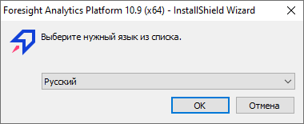
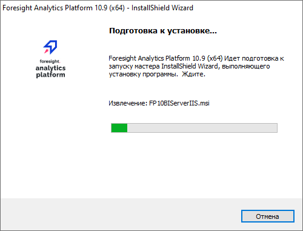
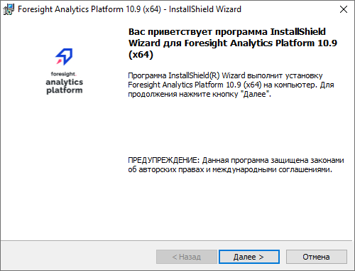
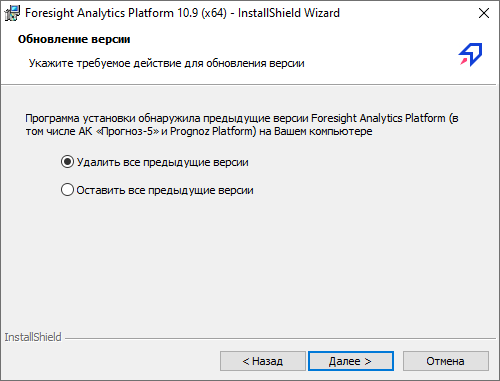
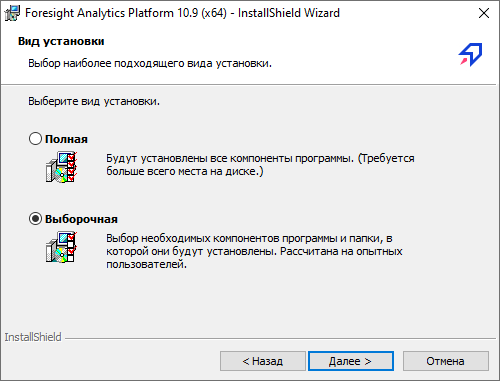
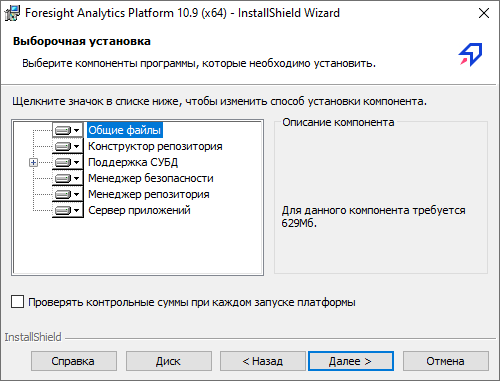
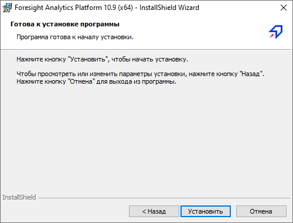
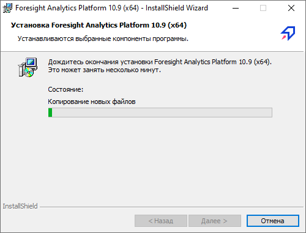
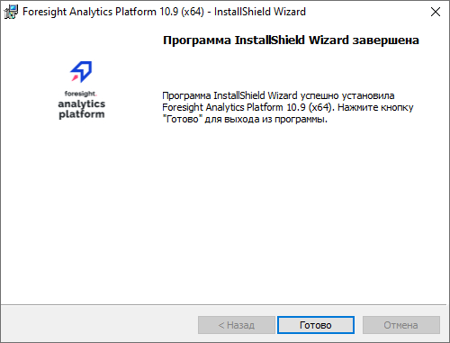
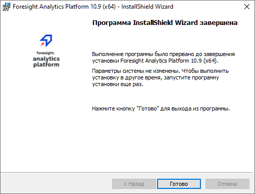

# Установка BI-сервера в ОС Windows

Установка BI-сервера в ОС Windows
-

# Установка BI-сервера в ОС Windows

На странице приведён порядок действий для установки BI-сервера в ОС
 Windows.

## Подготовка

Выполните подготовительные действия перед установкой:

	- Убедитесь в соблюдении [настроек
	 операционной системы](../01_SysReq/EnviromentRequirements.htm) и [программно-аппаратных
	 требований](../01_SysReq/SystemRequirement.htm), необходимых для корректной установки и полноценного
	 функционирования веб-приложения «Форсайт. Аналитическая платформа».

	- Выполните настройку для [серверной
	 части СУБД](../03_DB_Server_Config/Setup_DB_Server_Config.htm).

	- Используя настольное приложение [создайте
	 репозиторий метаданных](../05_RepoMngr/Setup_RepoMngr_CreateRepo.htm), [служебного
	 пользователя подсистемы безопасности](../05_RepoMngr/Setup_RepoMngr_Service_User.htm) и выполните [настройку
	 подключения к репозиторию](../06_AK_Client_Config/UiNav_RepoConfig_repo1.htm).

	- Выполните установку клиентской части СУБД.

	- Выполните подготовку к установке BI-сервера на веб-сервер IIS:

		- перед установкой BI-сервера и веб-сервера на серверную операционную
		 систему Windows на серверах [добавьте
		 роль сервера](03_Setup_Web/Add_WebServer_Role.htm);

		- если BI-сервера и веб-сервер будут установлены не на серверной
		 OC Windows, то перед установкой [подключите
		 службы IIS](03_Setup_Web/IIS_turn_on.htm).

Примечание.
 Версия веб-сервера должна соответствовать одной из
 поддерживаемых версий.

## Установка и настройка BI-сервера

Установка BI-сервера на веб-сервер IIS выполняется
 с помощью инсталлятора FP10BIServerIIS_x64.exe
 от имени пользователя, обладающего правами локального администратора компьютера.
 Инсталлятор использует технологию [Reg-free
 COM registration](setup.chm::/02_ak_install/DistributionKit.htm#regfree).

Примечание.
 Комплект поставки может включать папку, содержащую пререквизиты и msi-инсталляторы
 справочной системы. Особенности установки пререквизитов и справочной системы
 описаны в разделе «[Комплект
 поставки «Форсайт. Аналитическая платформа»](Setup.chm::/02_AK_Install/DistributionKit.htm)».
 Не допускается установка нескольких [комплектов](../02_AK_Install/DistributionKit.htm)
 одного релиза.

В результате работы инсталлятор устанавливает BI-сервер и настольное
 приложение «Форсайт. Аналитическая платформа».

BI-сервер можно устанавливать на веб-сервер, не содержащий серверную часть веб-приложения.
 Установить и настроить серверную часть веб-приложения следует позднее на этом же или на
 другом веб-сервере. Если установка BI-сервера выполнена корректно, то
 в системе будет создан виртуальный каталог BI-сервера FPBI_App_v10.x.

В результате установки BI-сервер доступен по следующему адресу:

http://localhost:80/FPBI_App_v10.x/axis2/services/PP.SOM.Som

После установки и настройки всех компонентов [проверьте
 работу BI-сервера](01_BIServer/CheckBIServices.htm) и [откройте
 веб-приложение](03_Setup_Web/Opening_Web_Application.htm).

### Порядок работы с инсталлятором

Для начала установки запустите инсталлятор FP10BIServerIIS_x64.exe.
 После запуска инсталлятор проверяет наличие более ранней сборки устанавливаемой
 версии «Форсайт. Аналитическая платформа»:

	- если на рабочей станции установлена более ранняя сборка, то
	 будет предложено [обновление «Форсайт. Аналитическая платформа»](../Update/Update.htm);

	- если другой сборки не обнаружено, то будет запущена установка
	 BI-сервера, состоящая из следующих операций:

[Выбор
 языка для установки](javascript:TextPopup(this))

	Выберите язык, на котором будет отображаться
	 интерфейс инсталлятора:

	

[Проверка
 наличия дополнительного программного обеспечения](javascript:TextPopup(this))

	Инсталлятор проверяет наличие дополнительного
	 программного обеспечения (пререквизитов) на рабочей станции. Если
	 необходимый пререквизит не установлен (или установлена более ранняя
	 версия), то будет предложена его установка, например:

	

	Для начала установки пререквизитов нажмите
	 кнопку «Установить». Будет произведена попытка последовательной установки
	 всех предлагаемых пререквизитов. Если необходимый пререквизит отсутствует
	 в папке «ISSetupPrerequisites», то установка BI-сервера будет остановлена
	 и отображено сообщение о том, что не удалось найти файлы.

	Если необходимые пререквизиты входят
	 в комплект поставки, то в столбце «Состояние» будет отражено состояние
	 установки для каждого компонента: успешно, установка, ожидание.

	После установки некоторых пререквизитов
	 может быть отображено сообщение о необходимости перезагрузки рабочей
	 станции. При положительном ответе будет осуществлена перезагрузка,
	 в противном случае продолжена установка BI-сервера. При появлении
	 сообщения рекомендуется перезагрузить рабочую станцию, так как это
	 необходимо для корректной установки оставшихся пререквизитов и BI-сервера.
	 После перезагрузки установка будет продолжена автоматически: будет
	 открыт диалог для продолжения установки пререквизитов или будет продолжена
	 установка BI-сервера.

[Подготовка
 к установке](javascript:TextPopup(this))

	Выполняется извлечение необходимых файлов:

	

	Для прерывания работы инсталлятора нажмите
	 кнопку «Отмена».

[Переход
 к настройке параметров установки](javascript:TextPopup(this))

	Если необходимые файлы извлечены, то
	 отображается вводная информация:

	

	Для перехода к настройке параметров установки
	 нажмите кнопку «Далее».

[Настройка
 параметров обновления версии](javascript:TextPopup(this))

	Данная операция будет выполняться, если
	 на рабочей станции установлены более ранние версии «Форсайт. Аналитическая платформа»
	 в том числе АК «Прогноз-5» или Prognoz Platform.

	

	Выберите дальнейшее действие:

			- Удалить все предыдущие
			 версии. Все имеющиеся более ранние версии Prognoz Platform и «Форсайт. Аналитическая платформа»
			 будут удалены с компьютера;

			- Оставить все предыдущие
			 версии. Все имеющиеся версии Prognoz Platform
			 и «Форсайт. Аналитическая платформа»
			 будут оставлены.

	Важно.
	 Одновременное использование новой и прошлой версии продукта «Форсайт. Аналитическая платформа»
	 невозможно, начиная с версии 9.4.

[Выбор
 папки для установки «Форсайт. Аналитическая платформа»](javascript:TextPopup(this))

	Выберите папку, в которую будет установлен
	 «Форсайт. Аналитическая платформа»:

	

	По умолчанию для установки «Форсайт. Аналитическая платформа»
	 предлагается папка: C:\Program Files\Foresight\.

	Для изменения папки установки нажмите
	 кнопку «Изменить». Будет открыт
	 диалог, в котором выберите требуемую папку.

[Выбор
 вида установки](javascript:TextPopup(this))

	Выберите наиболее подходящий вид установки:

	

	Доступны следующие варианты установки:

			- Полная. Предлагается
			 по умолчанию. На рабочую станцию будет установлен полный набор
			 компонентов. Данный вариант установки рекомендуется в большинстве
			 случаев, но требует больше всего места на жестком диске;

			- Выборочная.
			 На рабочую станцию будут установлены только компоненты, указанные
			 пользователем. Данный вариант установки рекомендуется для
			 опытных пользователей.

			При выборе выборочной установки следующей операцией будет выбор
			 устанавливаемых компонентов:

	

	Доступна установка следующих компонентов:

				- Общие файлы.
				 Файлы и библиотеки, необходимые для правильной работы
				 всего набора компонентов;

				- Конструктор репозитория.
				 Модуль, осуществляющий работу с существующим репозиторием;

				- Поддержка СУБД.
				 Набор системных библиотек для поддержки СУБД (Oracle,
				 Microsoft SQL Server, OLE DB, PostgreSQL, SQLite);

				- Менеджер безопасности.
				 Модуль, реализующий комплекс средств для контроля целостности
				 программной системы и информации в этой системе;

				- Менеджер репозитория.
				 Модуль, используемый для автоматизации процесса обновления
				 версий и версий репозитория «Форсайт. Аналитическая платформа»;

				- Сервер приложений.
				 BI-сервер. Если BI-сервер устанавливается на веб-сервер,
				 то данный компонент включает в себя конфигурацию для IIS.

	Примечание.
	 Установку некоторых компонентов отключить нельзя, так как они являются
	 обязательными.

	Для [проверки
	 целостности](Admin.chm::/04_SecurityPolicy/Integrity_control.htm) при каждом запуске установите флажок
	 «Проверять контрольные суммы при
	 каждом запуске платформы». Проверка контрольных сумм для исполняемых
	 файлов производится в момент их загрузки. При каждом запуске «Форсайт. Аналитическая платформа»
	 загружается минимальный набор исполняемых файлов, а по мере обращения
	 к функциональности загружаются дополнительные библиотеки, необходимые
	 для работы. По умолчанию флажок снят и проверка целостности не производится.
	 Данная настройка применяется только для устанавливаемой версии «Форсайт. Аналитическая платформа».

	Для просмотра информации о месте, требуемом
	 на жестком диске для установки компонента, выделите его в списке.
	 Информация будет отображена в области «Описание
	 компонента».

	Для просмотра информации о дисковом пространстве,
	 требуемом для установки выбранных компонентов, и о свободном пространстве
	 на жестком диске рабочей станции нажмите кнопку «Диск».
	 Будет отображена информация об имеющихся томах жесткого диска, об
	 их размерах, размерах свободного пространства и размерах, требуемых
	 для установки выбранных компонентов.

[Запуск
 установки](javascript:TextPopup(this))

	Инсталлятор готов к установке:

	

	Для начала установки нажмите кнопку «Установить».

[Установка
 BI-сервера](javascript:TextPopup(this))

	Выполняется установка и настройка всех
	 требуемых компонентов:

	

	Для прерывания работы инсталлятора нажмите
	 кнопку «Отмена».

[Завершение
 установки](javascript:TextPopup(this))

	Установка выполнена успешно:

	

	Если установка была прервана или завершилась
	 с ошибками:

	

### Лицензии

Продукт «Форсайт. Аналитическая платформа»
 проверяет лицензию в процессе работы. Для работы в веб-приложении [активируйте
 продукт «Форсайт. Аналитическая платформа»](../08_Licensing/Admin_Licensing.htm)
 на BI-сервере. Активация на BI-сервере возможна только с помощью [сетевой](../08_Licensing/Admin_Licensing_Variants.htm#network)
 или [временной
 автономной лицензии](../08_Licensing/Admin_Licensing_Variants.htm#temporary). Для использования сетевой лицензии требуется
 установка сервера лицензий на базе [Guardant](../08_Licensing/Guardant/License_Server_Guardant.htm)
 или [RMS](../08_Licensing/RMS/LicenseServer.htm) в той же подсети,
 где установлен BI-сервер.

См. также:

[Установка
 BI-сервера](UiWebSetup_TitlePage.htm) | [Установка серверной
 части веб-приложения на IIS](03_Setup_Web/WebSetup_Setup.htm) | [Проверка работы BI-сервера](01_BIServer/CheckBIServices.htm)
 | [Вопросы
 и ответы](04_FAQ/Setup_FAQ.htm)

		Справочная
		 система на версию 10.9
		 от 18/08/2025,
		 © ООО «ФОРСАЙТ»,
