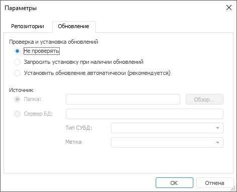
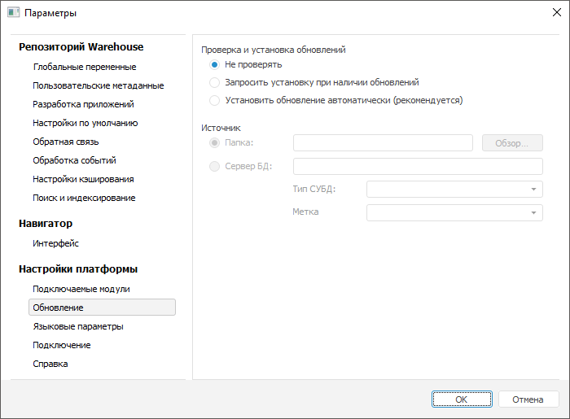

# Автоматическое обновление

Автоматическое обновление
-

# Автоматическое обновление

Автоматическое обновление предназначено для обновления настольного приложения
 и справочных систем в рамках одного релиза на локальных компьютерах нескольких
 пользователей из единого источника, в котором администратор размещает
 файлы обновления.

В качестве источника может использоваться папка на диске или сервер
 базы данных.

Примечание.
 Размещение файлов обновления на сервере базы данных доступно только для
 [СУБД](../01_SysReq/database_Support.htm) Microsoft SQL Server
 и Oracle.

Обновление BI-сервера и серверной части веб-приложения производится
 только с помощью [инсталляторов](../02_AK_Install/DistributionKit.htm#32_and_64)
 FP10BIServer.exe и FP10WebServer.exe. Для получения
 подробной информации обратитесь к разделу «[Обновление
 инсталлятором](ManualUpdate.htm)».

Для автоматического обновления настольного приложения и справочных систем:

	- Ознакомьтесь с [особенностями обновления](UpdateFeature.htm).

	- Разместите файлы обновления в папке или на сервере базы данных:

		- файлы
		 MSI. Файлы обновления. Для разных [комплектов
		 поставки](../02_AK_Install/DistributionKit.htm) FP10Full.exe
		 или FP10Standard.exe
		 набор файлов отличается;

		- MSI-инсталлятор
		 справочной системы:

			- FP10Help_RU.msi.
			 Справочная система на русском языке;

			- FP10Help_EN.msi.
			 Справочная система на английском языке;

		- папки
		 с файлами MST. Данные файлы содержат переводы, необходимые
		 для корректного отображения инсталлятора и ярлыков, созданных
		 в ходе выполнения обновления. Для разных комплектов поставки набор
		 файлов отличается;

		- Cfg.exe.
		 Данный файл не обязателен. Используется при запуске Cfg.exe, если
		 в новой версии конфигурация данного файла изменилась. По умолчанию
		 используется файл Cfg.exe, созданный при [установке
		 продукта](../Setup_TitlePage.htm). Конфигурация файлов Cfg.exe в источнике и в папке
		 установки может отличаться;

		- Version.xml.
		 Файл, содержащий номер версии продукта «Форсайт. Аналитическая платформа»;

		- [Cfgconfig.xml](StructureCFG.htm). Данный файл
		 не обязателен. Используется для управления процессом до и после
		 обновления с помощью дополнительного набора команд.

Если файлы обновления размещены на сервере
 базы данных, то дополнительно [создайте пользователя](PPUPDATE.htm)
 для хранения дистрибутива и [скопируйте MSI-версию](CopyMSIDistr.htm)
 дистрибутива.

	- Настройте параметры обновления одним из способов:

		- с помощью XML-файла с [заданной структурой](Tuner.htm);

		- в [окне
		 регистрации](GetStarted.chm::/GetStarted/Get_Started.htm)
		 или [навигаторе
		 объектов](GetStarted.chm::/Interface/Interface_Navigator.htm):

	Окно регистрации Навигатор объектов

		Для задания параметров обновления с помощью окна регистрации:

			- Нажмите кнопку «Настройка».

		После выполнения действия будет открыто
		 окно «Параметры»:

		

			- Задайте параметры на вкладке «Обновление»:

		- Проверка
		 и установка обновлений. Установите один из переключателей:

		-

			- Не проверять.
			 Обновление производиться не будет;

			- Запросить установку
			 при наличии обновлений. Если в источнике обнаружена
			 более поздняя версия, чем установлена на данный момент, то
			 при запуске «Форсайт. Аналитическая платформа»
			 пользователю будет предложено произвести обновление;

			- Установить обновление
			 автоматически (рекомендуется). Если в источнике обнаружена
			 более поздняя сборка, то обновление будет происходить автоматически
			 при запуске «Форсайт. Аналитическая платформа»,
			 без каких-либо запросов;

		- Источник. Выберите
		 источник, в который были размещены файлы обновления:

		-

			- Папка.
			 Если переключатель установлен, то укажите путь к каталогу,
			 в котором находятся файлы новых версий продукта «Форсайт. Аналитическая платформа»;

			- Сервер
			 БД. Если переключатель установлен, то укажите параметры
			 подключения к серверу БД, на котором находятся файлы новых
			 версий продукта «Форсайт. Аналитическая платформа»:

			-

				- Сервер БД.
				 Укажите имя сервера БД, на котором находятся файлы новых
				 версий продукта «Форсайт. Аналитическая платформа»;

				- Тип СУБД.
				 Выберите тип СУБД, на которую производится настройка (Oracle
				 или Microsoft SQL);

				- Метка обновления.
				 Выберите из списка метку обновления, которая была присвоена
				 файлам при их записи на сервер БД. Набор меток обновляется
				 каждый раз при раскрытии списка. При невозможности получения
				 списка будет выдано сообщение о том, что не удалось соединиться
				 с сервером. Создание меток производится при копировании
				 MSI-версии продукта «Форсайт. Аналитическая платформа»
				 на сервер БД.

		Для задания параметров обновления с помощью навигатора объектов:

			- Выполните команду главного меню «Сервис
			 > Параметры».

		После выполнения действия будет открыто
		 окно «Параметры»:

		

			- Задайте параметры на вкладке «Обновление»:

		- Проверка
		 и установка обновлений. Установите один из переключателей:

		-

			- Не проверять.
			 Обновление производиться не будет;

			- Запросить установку
			 при наличии обновлений. Если в источнике обнаружена
			 более поздняя версия, чем установлена на данный момент, то
			 при запуске «Форсайт. Аналитическая платформа»
			 пользователю будет предложено произвести обновление;

			- Установить обновление
			 автоматически (рекомендуется). Если в источнике обнаружена
			 более поздняя сборка, то обновление будет происходить автоматически
			 при запуске «Форсайт. Аналитическая платформа»,
			 без каких-либо запросов;

		- Источник. Выберите
		 источник, в который были размещены файлы обновления:

		-

			- Папка.
			 Если переключатель установлен, то укажите путь к каталогу,
			 в котором находятся файлы новых версий продукта «Форсайт. Аналитическая платформа»;

			- Сервер
			 БД. Если переключатель установлен, то укажите параметры
			 подключения к серверу БД, на котором находятся файлы новых
			 версий продукта «Форсайт. Аналитическая платформа»:

			-

				- Сервер БД.
				 Укажите имя сервера БД, на котором находятся файлы новых
				 версий продукта «Форсайт. Аналитическая платформа»;

				- Тип СУБД.
				 Выберите тип СУБД, на которую производится настройка (Oracle
				 или Microsoft SQL);

				- Метка обновления.
				 Выберите из списка метку обновления, которая была присвоена
				 файлам при их записи на сервер БД. Набор меток обновляется
				 каждый раз при раскрытии списка. При невозможности получения
				 списка будет выдано сообщение о том, что не удалось соединиться
				 с сервером. Создание меток производится при копировании
				 MSI-версии продукта «Форсайт. Аналитическая платформа»
				 на сервер БД.

Примечание.
 Параметры, заданные с помощью [окна регистрации](GetStarted.chm::/GetStarted/Get_Started.htm)
 или [навигатора
 объектов](GetStarted.chm::/Interface/Interface_Navigator.htm), синхронизируются.

	- [Запустите](GetStarted.chm::/GetStarted/Get_Started.htm)
	 «Форсайт. Аналитическая платформа»
	 с помощью файла Cfg.exe, содержащегося в папке AutoUpdate, которая
	 расположена рядом с папкой установки продукта.

Важно.
 Обновление продукта «Форсайт. Аналитическая платформа»
 должен выполнять пользователь, обладающий правами локального администратора.

После выполнения действий будет обновлено настольное приложение и справочные
 системы. В [окне
 регистрации](GetStarted.chm::/GetStarted/Get_Started.htm)
 будет указана новая версия продукта.

## Особенности обновления

При запуске автоматического обновления могут возникнуть следующие особенности:

	- если источник содержит файлы той же
	 конфигурации Full или Standard, но более поздней сборки продукта «Форсайт. Аналитическая платформа»
	 (например, текущая версия 10.9.615,
	 а новая версия 10.9.620),
	 то будет произведено обновление продукта. После обновления будет открыто
	 окно регистрации с указанием новой версии продукта;

	- если источник содержит файлы другой
	 конфигурации (например, Full вместо Standard), но более поздней сборки
	 «Форсайт. Аналитическая платформа»,
	 то будет произведено обновление продукта на новую конфигурацию. После
	 обновления будет открыто окно регистрации с указанием новой версии
	 продукта, текущая версия будет удалена;

	- если источник содержит файлы той же
	 конфигурации Full или Standard, но более ранней сборки продукта «Форсайт. Аналитическая платформа»
	 (например, 10.9.600)
	 или такой же сборки (например, 10.9.615),
	 то обновление не будет произведено, откроется окно регистрации с указанием
	 текущей версии продукта.

## Дополнительные возможности

При наличии нескольких версий продукта «Форсайт. Аналитическая платформа»
 при [запуске платформы из
 командной строки](../07_AK_Run_Additional/UseKeys.htm) есть возможность указать обновляемую версию. Для
 этого используйте ключ [Profile](../07_AK_Run_Additional/UseKeys.htm#profile)
 с указанием обновляемой версии. Если запуск произведён без данного ключа,
 будет обновлена та версия, которая указана в реестре в ОС Windows: [HKEY_CURRENT_USER\Software\Foresight Analytics Platform\10.0\AutoUpdate\Profiles].

Ключ Default, где значение ключа - запускаемый релиз, например,
 10.9.

См. также:

[Обновление
 продукта «Форсайт. Аналитическая платформа»](Update.htm)

		Справочная
		 система на версию 10.9
		 от 18/08/2025,
		 © ООО «ФОРСАЙТ»,
