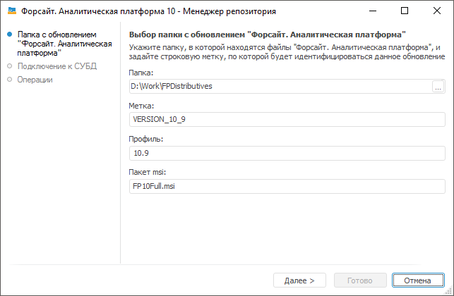
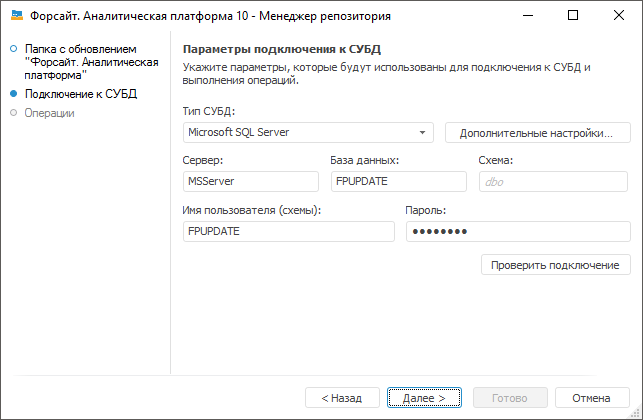
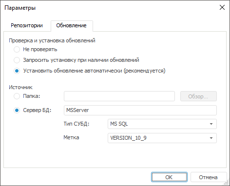

# Копирование MSI-версии дистрибутива на сервер БД

Копирование MSI-версии дистрибутива на сервер БД
-

# Копирование MSI-версии дистрибутива на сервер БД

Для автоматического обновления с сервера БД требуется скопировать на
 сервер пакет MSI для обновления.

Если на сервер скопировано несколько различных пакетов, то для разграничения
 их требуется создать метку, которая позволяет однозначно идентифицировать
 пакет обновления.

Копирование MSI-версии дистрибутива на сервер БД позволяет обновлять
 версию «Форсайт. Аналитическая платформа»
 непосредственно с сервера БД.

Примечание.
 Операция доступна только для [СУБД](../01_SysReq/database_Support.htm)
 Microsoft SQL Server и Oracle.

Для выполнения операции копирования выполните шаги:

	- Запустите менеджер репозитория:

	- загрузите исполняемый файл RepoMngr.exe, находящийся в папке
	 с установленным продуктом «Форсайт. Аналитическая платформа»;

	- выполните команду «Форсайт. Аналитическая платформа 10.9 > Менеджер репозитория (x64)»,
	 расположенную в главном меню Windows.

	- Выберите «Обновление платформы»
	 и нажмите кнопку «Продолжить».

	- Укажите параметры папки с обновлением:

		- Папка. Укажите путь
		 к папке, в которой расположены MSI-файлы «Форсайт. Аналитическая платформа»,
		 MSI-файлы справочных систем (FP10Help_RU.msi,
		 FP10Help_EN.msi),
		 файл Version.xml, файл лицензии и другие файлы. В папке обязательно
		 должны находиться MSI-файлы «Форсайт. Аналитическая платформа»
		 и файл Version.xml;

		- Метка. Введите имя
		 метки, которая будет идентифицировать данную копию «Форсайт. Аналитическая платформа»
		 на сервере БД. Имя метки в дальнейшем будет использоваться при
		 настройке обновления;

		- Профиль. Укажите
		 версию «Форсайт. Аналитическая платформа».
		 По умолчанию отображается версия «Форсайт. Аналитическая платформа»,
		 установленного на рабочем месте, с которого производится операция
		 копирования MSI-версии;

		- Пакет msi. Укажите
		 название пакета MSI (FP10Standard.msi,
		 FP10Full.msi),
		 по умолчанию отображается название пакета msi, соответствующего
		 пакету установки «Форсайт. Аналитическая платформа»
		 на рабочем месте, с которого производится операция копирования
		 MSI-версии.

Если в указанной папке отсутствуют обязательные
 файлы, то при попытке перейти на следующую страницу будет выдано сообщение
 со списком обязательных файлов.

Для перехода на следующую страницу нажмите
 кнопку «Далее».

	- Укажите параметры подключения к СУБД:

		- Тип СУБД. В раскрывающемся
		 списке выберите тип СУБД. Более подробно о доступных СУБД читайте
		 в подразделе «[Поддерживаемые
		 СУБД](../01_SysReq/database_Support.htm)».

Примечание.
 Обновление с сервера базы данных доступно только для [СУБД
 Oracle и MSSQL](../01_SysReq/database_Support.htm).

		- Дополнительные
		 настройки. Кнопка становится доступной, если производится
		 настройка на сервер MS SQL и PostgreSQL. В дополнительных параметрах
		 указывается:

		-

			- Учитывать регистр при
			 работе с СУБД. Установите флажок для работы с репозиторием,
			 объектами и их полями в СУБД с различным регистром символов
			 в их физическом имени. После установки флажка объекты базы
			 данных будут доступны только при указании их точного физического
			 имени;

			- Файловая группа.
			 Если пользователем в дополнительных параметрах не задана файловая
			 группа, то по умолчанию в поле отображается DEFAULT, и при
			 подключении будет использоваться файловая группа, отмеченная
			 в свойствах БД флагом «по умолчанию»;

			- Имя пользователя-администратора
			 схемы в базе данных. Параметр отображается в диалоге,
			 если выбран тип СУБД Microsoft SQL Server . По умолчанию будут
			 использоваться данные DATABASE OWNER. В случае если неизвестны
			 учетные данные DATABASE OWNER, то укажите пользователя, который
			 обладает привилегией DB_OWNER на сервере СУБД. От имени указанного
			 пользователя будут выполняться системные процедуры;

		- Сервер. Введите
		 псевдоним сервера;

		- База данных. Поле
		 доступно, если выбран тип СУБД Microsoft SQL Server. Задайте имя
		 базы данных;

		- Схема. Поле отображается,
		 если выбран тип СУБД Microsoft SQL Server. Для использования пользовательской
		 схемы в БД укажите ее идентификатор. По умолчанию используется
		 dbo;

		- Имя пользователя (схемы).
		 В данном поле автоматически устанавливается значение PPUPDATE;

		- Пароль. Введите
		 пароль для пользователя PPUPDATE.

Важно.
 Для копирования MSI-версии дистрибутива должен быть создан пользователь
 [PPUPDATE](PPUPDATE.htm). В схеме этого пользователя будет
 сохраняться дистрибутив «Форсайт. Аналитическая платформа»
 и из этой схемы он будет браться при обновлении.

Для проверки корректности введенных данных
 нажмите кнопку «Проверить подключение».
 В случае успешного (неуспешного) подключения появится соответствующее
 сообщение.

	- Для начала процесса копирования нажмите кнопку «Далее»,
	 при этом на экране будет отображаться ход процесса.

Окончание процесса сопровождается соответствующим информационным сообщением:
 успешно или с ошибками.

Таким образом, скопировав на сервер несколько версий «Форсайт. Аналитическая платформа»
 и установив им соответствующие метки, можно производить [автоматическое
 обновление](AutomaticUpdate.htm) версии «Форсайт. Аналитическая платформа»
 на клиентском компьютере по заданной метке при запуске «Форсайт. Аналитическая платформа».

## Пример

В окне регистрации нажмите кнопку «Настройка»,
 будет открыт диалог «Параметры»,
 перейдите на вкладку «Обновление»:

В группе «Источник» установите
 переключатель «Сервер БД» и заполните
 соответствующее поле. В списке «Метка
 обновления» выберите название метки, которая идентифицирует необходимую
 копию «Форсайт. Аналитическая платформа»
 на сервере БД.

См. также:

[Работа с менеджером
 репозитория](../05_RepoMngr/Setup_RepoMngr_Work_Main.htm) | [Создание пользователя
 PPUPDATE](PPUPDATE.htm)

		Справочная
		 система на версию 10.9
		 от 18/08/2025,
		 © ООО «ФОРСАЙТ»,
