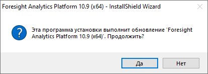

# Обновление инсталлятором

Обновление инсталлятором
-

# Обновление инсталлятором

В [комплект поставки](../02_AK_Install/DistributionKit.htm)
 продукта входит [инсталлятор](../02_AK_Install/DistributionKit.htm#32_and_64)
 FP10Full.exe или FP10Standard.exe, который используется
 при [установке настольного
 приложения](../02_AK_Install/Setup_AK_Install.htm) «Форсайт. Аналитическая платформа».
 С помощью данного инсталлятора можно произвести обновление настольного
 приложения и справочных систем в рамках одного релиза. Каждый пользователь
 должен самостоятельно произвести обновление на локальном компьютере.

Для обновления настольного приложения и справочных систем:

	- Разместите msi-инсталляторы документации (FP10Help_RU.msi,
	 FP10Help_EN.msi) на
	 одном уровне с дистрибутивом настольного приложения.

Примечание.
 Обновление будет распространяться только на ранее установленные справочные
 системы.

	- При необходимости задайте [дополнительные
	 настройки](Tuner.htm), которые будут установлены в процессе обновления.

	- Запустите инсталлятор более поздней сборки «Форсайт. Аналитическая платформа»
	 в зависимости [дистрибутива](../02_AK_Install/DistributionKit.htm#32_and_64),
	 который использовался при установке [настольного
	 приложения](../02_AK_Install/Setup_AK_Install.htm): FP10Full.exe
	 или FP10Standard.exe.

Процесс обновления производится аналогично установке [настольного
 приложения](../02_AK_Install/Setup_AK_Install.htm). После выполнения действий будет установлена новая версия
 «Форсайт. Аналитическая платформа»
 и обновлены справочные системы. На последней странице инсталлятора будет
 выдано сообщение об успешной установке.

Для обновления BI-сервера и серверной части веб-приложения запустите
 [инсталляторы](../02_AK_Install/DistributionKit.htm#32_and_64)
 FP10BIServer.exe и FP10WebServer.exe. Процесс обновления
 производится аналогично [установке
 BI-сервера](../UiWebSetup/Install_Web_on_Windows.htm) и [серверной
 части веб-приложения](../UiWebSetup/03_Setup_Web/WebSetup_Setup.htm). После выполнения действий будет обновлено веб-приложение.
 На последней странице инсталляторов будет выдано сообщение об успешной
 установке «Форсайт. Аналитическая платформа».

## Особенности обновления

При запуске инсталлятора могут возникнуть следующие особенности обновления:

	- если используется тот же тип дистрибутива, но более поздней
	 сборки «Форсайт. Аналитическая платформа»
	 (например, текущая версия 10.9.615,
	 а новая версия 10.9.620),
	 то перед обновлением будет отображен диалог подтверждения:

При выборе положительного ответа начнется
 обновление продукта. При выборе отрицательного ответа установка новой
 версии прекратится.

	- если используется тот же тип дистрибутива, но более ранней сборки
	 «Форсайт. Аналитическая платформа» (например, 10.9.600)
	 или такой же сборки (например, 10.9.615),
	 то будет выдано сообщение о том, что уже установлена более поздняя
	 или такая же сборка. Установка новой версии прекратится;

	- если используется другой тип дистрибутива (например, Full вместо
	 Standard), но более поздней сборки «Форсайт. Аналитическая платформа»,
	 то будет установлена новая версия продукта в новой конфигурации. Текущая
	 версия будет удалена;

	- если используется другой тип дистрибутива (например, Full вместо
	 Standard), но более ранней сборки «Форсайт. Аналитическая платформа»,
	 то будет выдано сообщение о том, что уже установлена более поздняя
	 или такая же сборка. Установка новой версии прекратится.

См. также:

[Обновление
 продукта «Форсайт. Аналитическая платформа»](Update.htm)

		Справочная
		 система на версию 10.9
		 от 18/08/2025,
		 © ООО «ФОРСАЙТ»,
