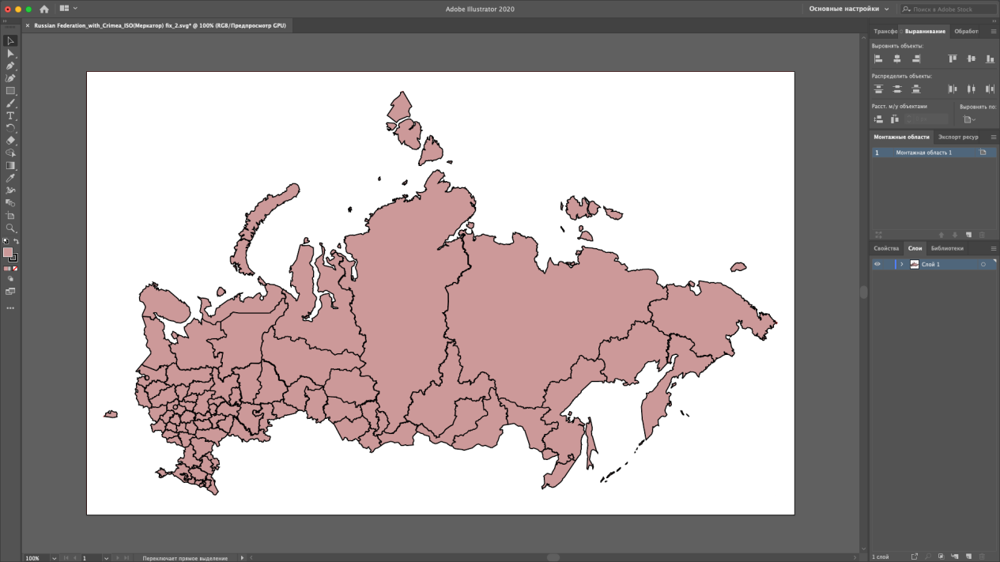
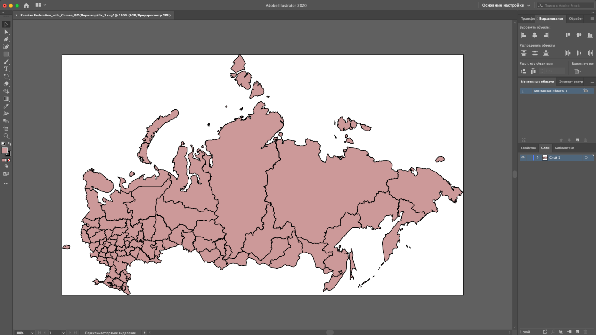
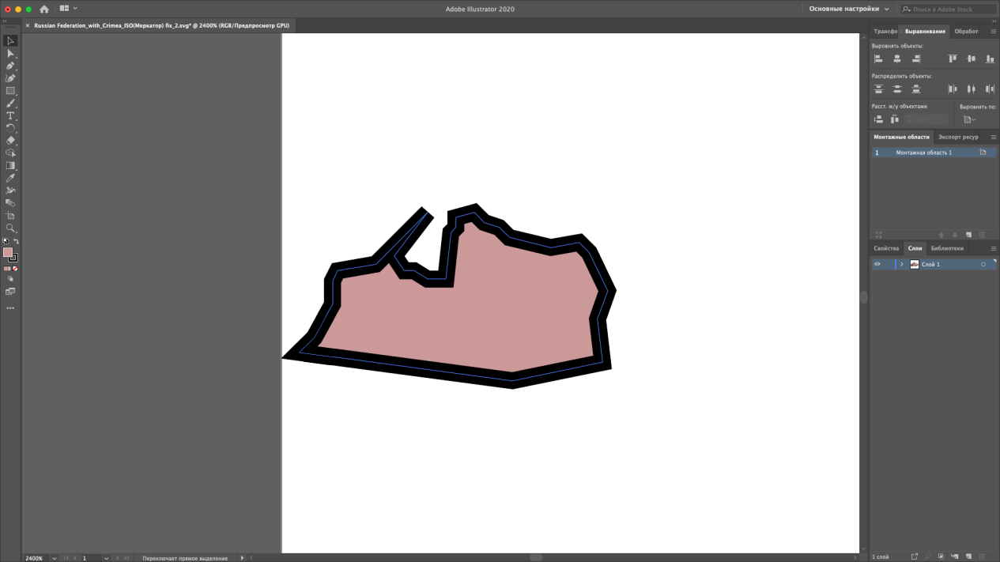
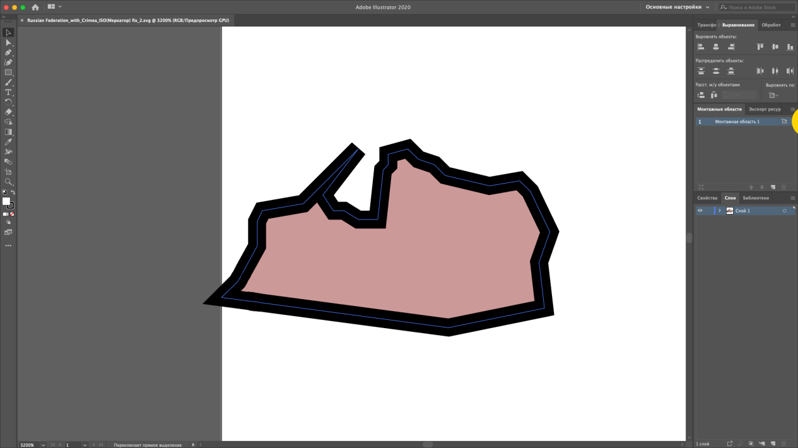
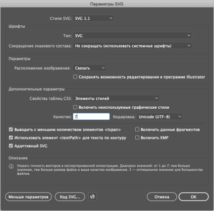

# Подготовка SVG-топоосновы

Подготовка SVG-топоосновы
-

# Подготовка SVG-топоосновы

Для точного определения координат границ территорий подготовьте SVG-топооснову
 в любом редакторе векторной графики. Рассмотрим подготовку SVG-топоосновы
 с помощью Adobe Illustrator:

	- Откройте SVG-топооснову:

	- Обрежьте изображение до крайних границ территорий с помощью
	 команды главного меню «Объект >
	 Монтажные области > Подогнать по границам иллюстрации».

После выполнения действия изображение примет
 вид:

	- Убедитесь, что по всем краям изображения нет отступов между
	 границами территорий и изображения, например:

	- Уменьшите изображение вручную с помощью редактирования монтажной
	 области до границ территорий без учёта контура, например:

	- Сохраните изображение в формате *.svg со значением качества
	 7 в дополнительных параметрах SVG:

	- Откройте [структуру
	 SVG-топоосновы](Structure/SVGMap_Structure.htm) и выделите часть, сформировавшуюся при работе в
	 Adobe Illustrator:

<?xml version="1.0" encoding="utf-8"?>
<!-- Generator: Adobe Illustrator 24.0.3, SVG Export Plug-In . SVG Version: 6.00 Build 0)  -->
<svg version="1.1" id="Слой_1" xmlns:fs="http://www.fsight.ru" xmlns="http://www.w3.org/2000/svg"
xmlns:xlink="http://www.w3.org/1999/xlink" x="0px" y="0px" viewBox="0 0 988.52 593.97"
style="enable-background:new 0 0 988.52 593.97;" xml:space="preserve">

	- Замените выделенную часть следующим:

<svg version="1.1" xmlns:fs="http://www.fsight.ru" xmlns="http://www.w3.org/2000/svg"
xmlns:xlink="http://www.w3.org/1999/xlink" x="0px" y="0px" width="988.52px" height="593.97px"
proportionality="0.6" xml:space="preserve">

После выполнения действий SVG-топооснова будет готова к использованию
 в различных инструментах продукта «Форсайт. Аналитическая платформа».
 При необходимости дополнительно измените [структуру
 SVG-топоосновы](Structure/SVGMap_Structure.htm).

См.
 также:

[SVG-топоосновы](SVGMap_Intro.htm)
 | [Структура SVG-топоосновы](Structure/SVGMap_Structure.htm)

		Справочная
		 система на версию 10.9
		 от 18/08/2025,
		 © ООО «ФОРСАЙТ»,
