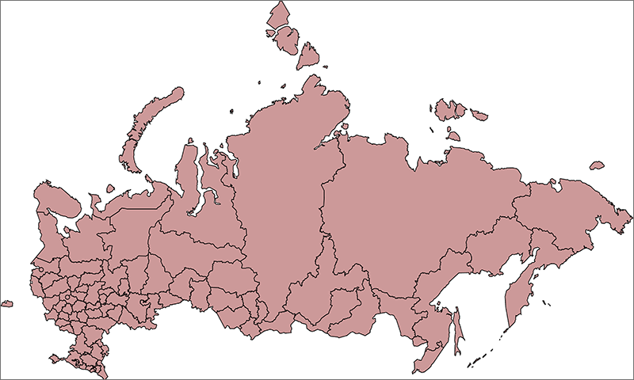

# SVG-топоосновы

SVG-топоосновы
-

# SVG-топоосновы

Продукт «Форсайт. Аналитическая платформа»
 поддерживает топоосновы, созданные на основе языка разметки масштабируемой
 векторной графики SVG, который является расширением языка XML. Формат
 топоосновы совпадает с форматом SVG версии 1.1, а также имеет свои ограничения
 и расширения.

Пример SVG-топоосновы:

Для использования SVG-топоосновы в различных инструментах продукта «Форсайт. Аналитическая платформа»:

	- [Подготовьте SVG-топооснову](Prepare_SVG_topobase.htm)
	 с помощью любого редактора векторной графики.

	- При необходимости измените [структуру
	 SVG-топоосновы](Structure/SVGMap_Structure.htm), которая состоит из элементов XML-структуры.

	- [Загрузите](UiMaps.chm::/Common/Topobase.htm#addmap)
	 файл топоосновы с расширением *.svg из [навигатора
	 объектов](GetStarted.chm::/Interface/Interface_Navigator.htm).

	- Убедитесь, что выполняются все [требования к наличию топоосновы](UiMaps.chm::/Common/Topobase.htm).

После выполнения действий SVG-топооснова будет готова к использованию.

Для получения подробной информации
 о структуре SVG-топоосновы обратитесь к разделу «[Структура SVG-топоосновы](Structure/SVGMap_Structure.htm)».

Примеры структур SVG-топооснов приведены
 в разделе «[Примеры](Sample/SVGMap_Sample.htm)».

См. также:

[Подготовка
 SVG-топоосновы](Prepare_SVG_topobase.htm) | [Структура
 SVG-топоосновы](Structure/SVGMap_Structure.htm) | [Примеры](Sample/SVGMap_Sample.htm)

		Справочная
		 система на версию 10.9
		 от 18/08/2025,
		 © ООО «ФОРСАЙТ»,
