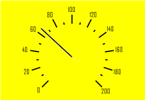
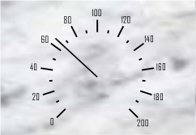
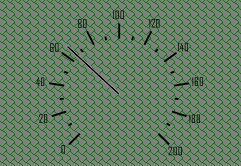

# SpeedometerBackgroundType

SpeedometerBackgroundType
-

# SpeedometerBackgroundType

## Описание

Перечисление SpeedometerBackgroundType содержит типы фона спидометра.

Используется следующим свойством:

-
[ISpeedometerBackground.Type](../Interface/ISpeedometerBackground/ISpeedometerBackground.Type.htm).

## Возможные значения

 Значение
 Краткое описание
 Пример

 0
 None. Фон спидометра отсутствует.

 1
 Color. В качестве фона используется монотонный цвет.

- Цвет заливки определяется значением свойства [Color](../Interface/ISpeedometerBackground/ISpeedometerBackground.Color.htm).

 

 2
 Gradient. В качестве фона используется градиентная заливка.

- основной цвет определяется значением свойства [Color](../Interface/ISpeedometerBackground/ISpeedometerBackground.Color.htm).

- второй заливки определяется значением свойства [GradientColor](../Interface/ISpeedometerBackground/ISpeedometerBackground.GradientColor.htm).

- угол градиента определяется значением свойства [GradientAngle](../Interface/ISpeedometerBackground/ISpeedometerBackground.GradientAngle.htm).

 

 3
 Picture. В качестве фона используется картинка.

- картинка определяется значением свойства [Image](../Interface/ISpeedometerBackground/ISpeedometerBackground.Image.htm).

- вариант расположения картинки в области спидометра определяется значением свойства [ImageDrawStyle](../Interface/ISpeedometerBackground/ISpeedometerBackground.ImageDrawStyle.htm).

 

 4
 Hatch. В качестве фона используется штриховка.

- тип штриховки определяется значением свойства [HatchStyle](../Interface/ISpeedometerBackground/ISpeedometerBackground.HatchStyle.htm).

 

См. также:

[Перечисления сборки Speedometer](Speedometer_EnumsList.htm)

		Справочная
		 система на версию 10.9
		 от 18/08/2025,
		 © ООО «ФОРСАЙТ»,
