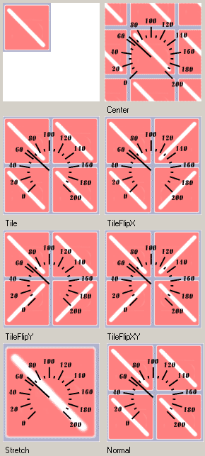

# SpeedometerImageDrawStyle

SpeedometerImageDrawStyle
-

# SpeedometerImageDrawStyle

## Описание

Перечисление SpeedometerImageDrawStyle содержит варианты расположения фоновой картинки в области спидометра.

Используется следующим свойством:

-
[ISpeedometerBackground.ImageDrawStyle](../Interface/ISpeedometerBackground/ISpeedometerBackground.ImageDrawStyle.htm).

## Допустимые значения

 Значение
 Краткое описание

 0
 Normal. Расположить картинку в верхнем левом углу.
Если размер картинки меньше чем область спидометра, то картинка будет размножена на всю область.

 1
 Center. Расположить картинку по центру области спидометра.
Если размер картинки меньше чем область спидометра, то картинка будет размножена на всю область.

 2
 Tile. Расположить картинку в верхнем левом углу.
Если размер картинки меньше чем область спидометра, то картинка будет размножена на всю область.

 3
 TileFlipX. Расположить картинку в верхнем левом углу.
Если размер картинки меньше чем область спидометра, то картинка будет размножена на всю область, при этом картинки, размноженные по оси X будут чередоваться - прямая/зеркальная.

 4
 TileFlipY. Расположить картинку в верхнем левом углу.
Если размер картинки меньше чем область спидометра, то картинка будет размножена на всю область, при этом картинки, размноженные по оси Y будут чередоваться - прямая/зеркальная.

 5
 TileFlipXY. Расположить картинку в верхнем левом углу.
Если размер картинки меньше чем область спидометра, то картинка будет размножена на всю область, при этом размноженные картинки будут чередоваться - прямая/зеркальная.

 6
 Stretch. Растянуть (сжать) размер картинки до размеров области спидометра.

## Пример

См. также:

[Перечисления сборки Speedometer](Speedometer_EnumsList.htm)

		Справочная
		 система на версию 10.9
		 от 18/08/2025,
		 © ООО «ФОРСАЙТ»,
