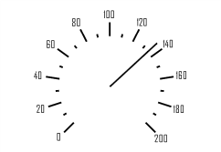

# ISpeedometerArrow.Value

ISpeedometerArrow.Value
-

# ISpeedometerArrow.Value

## Синтаксис

Value: Integer;

## Описание

Свойство Value определяет значение,
 которое индицирует стрелка.

## Пример

Для выполнения примера предполагается наличие формы, расположенной на
 ней кнопки с наименованием «Button1» и компонента SpeedometerBox
 с наименованием «SpeedometerBox1».

	Sub Button1OnClick(Sender:Object; Args: IMouseEventArgs);

	Var

	    s: ISpeedometer;

	    Scale: ISpeedometerScale;

	    Arrow: ISpeedometerArrow;

	Begin

	    s := SpeedometerBox1.Speedometer;

	    s.BeginUpdate;

	    Scale := s.Scales.Item(0);

	    Arrow := Scale.Arrows.Item(0);

	    Arrow.Value := 135;

	End Sub Button1OnClick;

После выполнения примера при нажатии на кнопку будет изменено значение,
 отображаемое стрелкой спидометра.

См. также:

[ISpeedometerArrow](ISpeedometerArrow.htm)

		Справочная
		 система на версию 10.9
		 от 18/08/2025,
		 © ООО «ФОРСАЙТ»,
