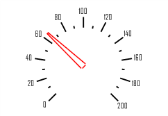

# ISpeedometerArrowView.Pen

ISpeedometerArrowView.Pen
-

# ISpeedometerArrowView.Pen

## Синтаксис

Pen: [IGxPen](ModDrawing.chm::/Interface/IGxPen/IGxPen.htm);

## Описание

Свойство Pen определяет перо,
 которым будет отрисована граница стрелка.

## Пример

Для выполнения примера предполагается наличие формы, расположенной на
 ней кнопки с наименованием «Button1» и компонента SpeedometerBox
 с наименованием «SpeedometerBox1».

	Sub Button1OnClick(Sender:Object; Args: IMouseEventArgs);

	Var

	    s: ISpeedometer;

	    v: ISpeedometerView;

	    ScaleView: ISpeedometerScaleView;

	    ArrowView: ISpeedometerArrowView;

	    Pen: IGxPen;

	Begin

	    s := SpeedometerBox1.Speedometer;

	    v := s.View;

	    s.BeginUpdate;

	    ScaleView := v.ScaleViews.Item(0);

	    ArrowView := ScaleView.ArrowViews.Item(0);

	    Pen := New GxPen.CreateSolid(GxColor.FromName("Red"));

	    ArrowView.Pen := Pen;

	    ArrowView.Shape := SpeedometerArrowShapes.Triangle;

	    ArrowView.Width := 0.1;

	    s.EndUpdate;

	End Sub Button1OnClick;

После выполнения примера при нажатии на кнопку будет изменено оформление
 стрелки шкалы спидометра, отображаемого в компоненте «SpeedometerBox1».
 Для стрелки будет ширина и перо, которым будет отрисовываться граница
 стрелки. Также будет изменена форма стрелки.

См. также:

[ISpeedometerArrowView](ISpeedometerArrowView.htm)

		Справочная
		 система на версию 10.9
		 от 18/08/2025,
		 © ООО «ФОРСАЙТ»,
