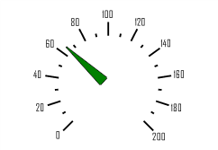

# ISpeedometerArrowViews.Item

ISpeedometerArrowViews.Item
-

# ISpeedometerArrowViews.Item

## Синтаксис

Item(Index: Integer): [ISpeedometerArrowView](../ISpeedometerArrowView/ISpeedometerArrowView.htm);

## Параметры

Index - индекс стиля оформления
 стрелок.

## Описание

Свойство Item возвращает стиль
 оформления стрелки спидометра.

## Пример

Для выполнения примера предполагается наличие формы, расположенной на
 ней кнопки с наименованием «Button1» и компонента SpeedometerBox
 с наименованием «SpeedometerBox1».

	Sub Button1OnClick(Sender:Object; Args: IMouseEventArgs);

	Var

	    s: ISpeedometer;

	    v: ISpeedometerView;

	    ScaleView: ISpeedometerScaleView;

	    ArrowView: ISpeedometerArrowView;

	Begin

	    s := SpeedometerBox1.Speedometer;

	    v := s.View;

	    s.BeginUpdate;

	    ScaleView := v.ScaleViews.Item(0);

	    ArrowView := ScaleView.ArrowViews.Item(0);

	    ArrowView.AxisOffset:= 0.1;

	    ArrowView.Background.Color:= GxColor.FromName("Green");

	    ArrowView.Length := 0.8;

	    ArrowView.Shape := SpeedometerArrowShapes.Triangle;

	    ArrowView.Width := 0.15;

	    s.EndUpdate;

	End Sub Button1OnClick;

После выполнения примера при нажатии на кнопку будет изменено оформление
 стрелки шкалы спидометра, отображаемого в компоненте «SpeedometerBox1».

См. также:

[ISpeedometerArrowViews](ISpeedometerArrowViews.htm)

		Справочная
		 система на версию 10.9
		 от 18/08/2025,
		 © ООО «ФОРСАЙТ»,
