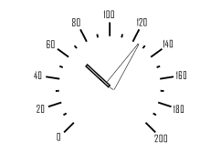

# ISpeedometerArrows.Count

ISpeedometerArrows.Count
-

# ISpeedometerArrows.Count

## Синтаксис

Count: Integer;

## Описание

Свойство Count определяет количество
 стрелок шкалы спидометра.

## Пример

Для выполнения примера предполагается наличие формы, расположенной на
 ней кнопки с наименованием «Button1» и компонента SpeedometerBox
 с наименованием «SpeedometerBox1».

	Sub Button1OnClick(Sender:Object; Args: IMouseEventArgs);

	Var

	    s: ISpeedometer;

	    v: ISpeedometerView;

	    Arrows: ISpeedometerArrows;

	    ArrowsViews: ISpeedometerArrowViews;

	    ScaleView: ISpeedometerScaleView;

	    ArrowView, ArrowView1:ISpeedometerArrowView;

	Begin

	    s := SpeedometerBox1.Speedometer;

	    v := s.View;

	    s.BeginUpdate;

	    Arrows := s.Scales.Item(0).Arrows;

	    Arrows.Count := 2;

	    Arrows.Item(0).Value:= 50;

	    Arrows.Item(0).Value:= 125;

	    ScaleView := v.ScaleViews.Item(0);

	    ArrowsViews := ScaleView.ArrowViews;

	    ArrowsViews.Count :=2;

	    ArrowView := ArrowsViews.Item(0);

	    ArrowView1 := ArrowsViews.Item(1);

	    //Первая стрелка

	    ArrowView.Length := 0.8;

	    ArrowView.Shape := SpeedometerArrowShapes.Triangle;

	    ArrowView.Width := 0.15;

	    //Вторая стрелка

	    ArrowView1.Length :=0.5;

	    ArrowView1.Shape := SpeedometerArrowShapes.Linear;

	    ArrowView1.Width := 0.06;

	    s.EndUpdate;

	End Sub Button1OnClick;

После выполнения примера при нажатии на кнопку будет изменено оформление
 стрелок шкалы спидометра, отображаемого в компоненте «SpeedometerBox1».
 Для шкалы будет создано две стрелки. У каждой стрелки будет задано свое
 оформление.

См. также:

[ISpeedometerArrows](ISpeedometerArrows.htm)

		Справочная
		 система на версию 10.9
		 от 18/08/2025,
		 © ООО «ФОРСАЙТ»,
