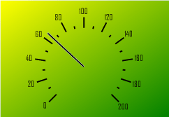

# ISpeedometerBackground.GradientColor

ISpeedometerBackground.GradientColor
-

# ISpeedometerBackground.GradientColor

## Синтаксис

GradientColor: [IGxColor](ModDrawing.chm::/Interface/IGxColor/IGxColor.htm);

## Описание

Свойство GradientColor определяет
 второй цвет, используемый при градиентной заливке.

## Комментарии

Используется, если [тип фона](ISpeedometerBackground.Type.htm)
 установлен SpeedometerBackgroundType.Gradient. Первый цвет, используемый
 при градиентной заливке, задается в свойстве [Color](ISpeedometerBackground.Color.htm).

## Пример

Для выполнения примера предполагается наличие формы, расположенной на
 ней кнопки с наименованием «Button1» и компонента SpeedometerBox
 с наименованием «SpeedometerBox1».

	Sub Button1OnClick(Sender:Object; Args: IMouseEventArgs);

	Var

	    s: ISpeedometer;

	    v: ISpeedometerView;

	    Back: ISpeedometerBackground;

	Begin

	    s := SpeedometerBox1.Speedometer;

	    v := s.View;

	    s.BeginUpdate;

	    Back := v.Background;

	    Back.Type := SpeedometerBackgroundType.Gradient;

	    Back.Color := GxColor.FromName("Yellow");

	    Back.GradientColor :=GxColor.FromName("Green");

	    Back.GradientAngle :=45;

	    s.EndUpdate;

	End Sub Button1OnClick;

После выполнения примера при нажатии на кнопку будут изменены параметры
 оформления спидометра, отображаемого в компоненте «SpeedometerBox1». Для
 фона спидометра будет установлена градиентная заливка.

См.также:

[ISpeedometerBackground](ISpeedometerBackground.htm)

		Справочная
		 система на версию 10.9
		 от 18/08/2025,
		 © ООО «ФОРСАЙТ»,
