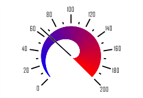

# ISpeedometerBar.Shape

ISpeedometerBar.Shape
-

# ISpeedometerBar.Shape

## Синтаксис

Shape: [SpeedometerBarSegmentShape](../../Enums/SpeedometerBarSegmentShape.htm);

## Описание

Свойство Shape определяет фигуру
 сегмента.

## Пример

Для выполнения примера предполагается наличие формы, расположенной на
 ней кнопки с наименованием «Button1» и компонента SpeedometerBox
 с наименованием «SpeedometerBox1».

	Sub Button1OnClick(Sender:Object; Args: IMouseEventArgs);

	Var

	    s: ISpeedometer;

	    v: ISpeedometerView;

	    ScaleView: ISpeedometerScaleView;

	    FilledBar: ISpeedometerFilledBar;

	    Bar: ISpeedometerBar;

	Begin

	    s := SpeedometerBox1.Speedometer;

	    v := s.View;

	    s.BeginUpdate;

	    ScaleView := s.View.ScaleViews.Item(0);

	    FilledBar := ScaleView.FilledBar;

	    FilledBar.StartRadius:= 0.1;

	    FilledBar.EndRadius :=0.9;

	    FilledBar.Bars.Count:= 2;

	    Bar := FilledBar.Bars.Item(0);

	    Bar.StartColor := GxColor.FromName("Blue");

	    Bar.EndColor := GxColor.FromName("Red");

	    Bar.Part := 0.7;

	    Bar.Shape := SpeedometerBarSegmentShape.TriangleTopLeft;

	    s.EndUpdate;

	End Sub Button1OnClick;

После выполнения примера при нажатии на кнопку будет изменено оформление
 цветной интервальной полосы спидометра, отображаемого в компоненте «SpeedometerBox1».
 Интервальная полоса будет содержать один сегмент. Для сегмента будут определены
 начальный и конечный цвет градиента. Начальный и конечный радиус полосы
 будут установлены 0,1 и 0,9 соответственно. В качестве фигуры для сегмента
 будет использоваться треугольник с прижатой к шкале вершиной и направленный
 влево.

См. также:

[ISpeedometerBar](ISpeedometerBar.htm)

		Справочная
		 система на версию 10.9
		 от 18/08/2025,
		 © ООО «ФОРСАЙТ»,
