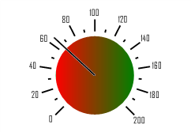

# ISpeedometerCentralShape.Background

ISpeedometerCentralShape.Background
-

# ISpeedometerCentralShape.Background

## Синтаксис

Background: [ISpeedometerBackground](../ISpeedometerBackground/ISpeedometerBackground.htm);

## Описание

Свойство Background определяет
 фон заливки круга, находящегося в центре поворота стрелки.

## Пример

Для выполнения примера предполагается наличие формы, расположенной на
 ней кнопки с наименованием «Button1» и компонента SpeedometerBox
 с наименованием «SpeedometerBox1».

	Sub Button1OnClick(Sender:Object; Args: IMouseEventArgs);

	Var

	    s: ISpeedometer;

	    v: ISpeedometerView;

	    CentralS: ISpeedometerCentralShape;

	    CentralSBack: ISpeedometerBackground;

	Begin

	    s := SpeedometerBox1.Speedometer;

	    v := s.View;

	    s.BeginUpdate;

	    CentralS := v.CentralShape;

	    CentralSBack := CentralS.Background;

	    CentralSBack.Type :=SpeedometerBackgroundType.Gradient;

	    CentralSBack.Color :=GxColor.FromName("Red");

	    CentralSBack.GradientColor:= GxColor.FromName("Green");

	    CentralS.ShapeOrder :=SpeedometerArrowCircleOrder.BelowArrow;

	    CentralS.Radius := 0.7;

	    s.EndUpdate;

	End Sub Button1OnClick;

После выполнения примера при нажатии на кнопку будет настроено оформление
 круга, расположенного в центре спидометра компонента «SpeedometerBox1».
 Для круга будет настроена градиентная заливка фона, сам круг будет расположен
 за стрелкой спидометра. Радиус круга - 0,7 от радиуса спидометра.

См. также:

[ISpeedometerCentralShape](ISpeedometerCentralShape.htm)

		Справочная
		 система на версию 10.9
		 от 18/08/2025,
		 © ООО «ФОРСАЙТ»,
