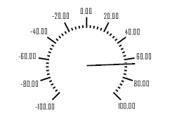

# ISpeedometerScale.MaxValue

ISpeedometerScale.MaxValue
-

# ISpeedometerScale.MaxValue

## Синтаксис

MinValue: Double;

## Описание

Свойство MaxValue определяет
 максимальное значение, которое может быть отображено на шкале.

## Пример

Для выполнения примера предполагается наличие формы, расположенной на
 ней кнопки с наименованием «Button1» и компонента SpeedometerBox
 с наименованием «SpeedometerBox1».

	Sub Button1OnClick(Sender:Object; Args: IMouseEventArgs);

	Var

	    s: ISpeedometer;

	    Scale: ISpeedometerScale;

	Begin

	    s := SpeedometerBox1.Speedometer;

	    s.BeginUpdate;

	    Scale := s.Scales.Item(0);

	    Scale.MajorTickCount:= 10;

	    Scale.MinorTickCount:= 5;

	    Scale.MaxValue := 100;

	    Scale.MinValue := -100;

	    Scale.Precision := 2;

	    s.EndUpdate;

	End Sub Button1OnClick;

После выполнения примера при нажатии на кнопку будут изменены параметры
 шкалы спидометра, отображаемого в компоненте «SpeedometerBox1». Для шкалы
 будут определены максимальное и минимальное отображаемое значение, количество
 основных и дополнительных делений. Значения на шкале будут отображаться
 с точностью два знака после запятой.

См. также:

[ISpeedometerScale](ISpeedometerScale.htm)

		Справочная
		 система на версию 10.9
		 от 18/08/2025,
		 © ООО «ФОРСАЙТ»,
