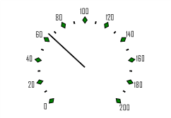

# ISpeedometerScaleView.MajorTickInfo

ISpeedometerScaleView.MajorTickInfo
-

# ISpeedometerScaleView.MajorTickInfo

## Синтаксис

MajorTickInfo: [ISpeedometerTickInfo](../ISpeedometerTickInfo/ISpeedometerTickInfo.htm);

## Описание

Свойство MajorTickInfo возвращает
 параметры основных делений шкалы.

## Пример

Для выполнения примера предполагается наличие формы, расположенной на
 ней кнопки с наименованием «Button1» и компонента SpeedometerBox
 с наименованием «SpeedometerBox1».

	Sub Button1OnClick(Sender:Object; Args: IMouseEventArgs);

	Var

	    s: ISpeedometer;

	    v: ISpeedometerView;

	    ScaleView: ISpeedometerScaleView;

	    Tick: ISpeedometerTickInfo;

	Begin

	    s := SpeedometerBox1.Speedometer;

	    v := s.View;

	    s.BeginUpdate;

	    ScaleView := v.ScaleViews.Item(0);

	    Tick := ScaleView.MajorTickInfo;

	    Tick.Color := GxColor.FromName("Green");

	    Tick.Height := 2;

	    Tick.Proportion := 0.7;

	    Tick.Shape := SpeedometerTickShapes.Rombus;

	    s.EndUpdate;

	End Sub Button1OnClick;

После выполнения примера при нажатии на кнопку будет изменено оформление
 основных делений шкалы спидометра, отображаемого в компоненте «SpeedometerBox1».

См. также:

[ISpeedometerScaleView](ISpeedometerScaleView.htm)

		Справочная
		 система на версию 10.9
		 от 18/08/2025,
		 © ООО «ФОРСАЙТ»,
