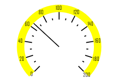

# ISpeedometerScaleView.ScaleLinePen

ISpeedometerScaleView.ScaleLinePen
-

# ISpeedometerScaleView.ScaleLinePen

## Синтаксис

ScaleLinePen: [IGxPen](ModDrawing.chm::/Interface/IGxPen/IGxPen.htm);

## Описание

Свойство ScaleLinePen определяет
 перо, с помощью которого будет отрисована линия, расположенная в области
 значений делений шкалы.

## Пример

Для выполнения примера предполагается наличие формы, расположенной на
 ней кнопки с наименованием «Button1» и компонента SpeedometerBox
 с наименованием «SpeedometerBox1».

	Sub Button1OnClick(Sender:Object; Args: IMouseEventArgs);

	Var

	    s: ISpeedometer;

	    v: ISpeedometerView;

	    ScaleView: ISpeedometerScaleView;

	    Pen: IGxPen;

	Begin

	    s := SpeedometerBox1.Speedometer;

	    v := s.View;

	    s.BeginUpdate;

	    ScaleView := v.ScaleViews.Item(0);

	    Pen := New GxPen.CreateSolid(GxColor.FromName("Yellow"), 4);

	    ScaleView.ScaleLinePen:= Pen;

	    s.EndUpdate;

	End Sub Button1OnClick;

После выполнения примера при нажатии на кнопку будет изменено оформление
 линии, отображаемой в области значений делений шкалы спидометра, отображаемого
 в компоненте «SpeedometerBox1».

См. также:

[ISpeedometerScaleView](ISpeedometerScaleView.htm)

		Справочная
		 система на версию 10.9
		 от 18/08/2025,
		 © ООО «ФОРСАЙТ»,
