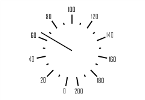

# ISpeedometerScaleView.StartAngle

ISpeedometerScaleView.StartAngle
-

# ISpeedometerScaleView.StartAngle

## Синтаксис

StartAngle: Double;

## Описание

Свойство StartAngle определяет
 начальный угол шкалы.

## Пример

Для выполнения примера предполагается наличие формы, расположенной на
 ней кнопки с наименованием «Button1» и компонента SpeedometerBox
 с наименованием «SpeedometerBox1».

	Sub Button2OnClick(Sender:Object; Args: IMouseEventArgs);

	Var

	    s: ISpeedometer;

	    v: ISpeedometerView;

	    ScaleView: ISpeedometerScaleView;

	Begin

	    s := SpeedometerBox1.Speedometer;

	    v := s.View;

	    s.BeginUpdate;

	    ScaleView := v.ScaleViews.Item(0);

	    ScaleView.StartAngle:= -80;

	    ScaleView.DeltaAngle:= 340;

	    s.EndUpdate;

	End Sub Button1OnClick;

После выполнения примера при нажатии на кнопку будет изменено оформление
 шкалы спидометра, отображаемого в компоненте «SpeedometerBox1». Для шкалы
 будет изменен начальный угол и угол рабочей области шкалы.

См. также:

[ISpeedometerScaleView](ISpeedometerScaleView.htm)

		Справочная
		 система на версию 10.9
		 от 18/08/2025,
		 © ООО «ФОРСАЙТ»,
