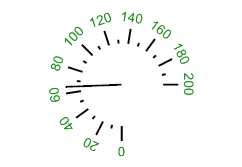

# ISpeedometerScaleViews.Item

ISpeedometerScaleViews.Item
-

# ISpeedometerScaleViews.Item

## Синтаксис

Item(Index: Integer): [ISpeedometerScaleView](../ISpeedometerScaleView/ISpeedometerScaleView.htm);

## Параметры

Index - индекс стиля оформления
 шкалы спидометра.

## Описание

Свойство Item возвращает параметры
 стиля оформления шкалы спидометра.

## Пример

Для выполнения примера предполагается наличие формы, расположенной на
 ней кнопки с наименованием «Button1» и компонента SpeedometerBox
 с наименованием «SpeedometerBox1».

	Sub Button1OnClick(Sender:Object; Args: IMouseEventArgs);

	Var

	    s: ISpeedometer;

	    v: ISpeedometerView;

	    ScaleView: ISpeedometerScaleView;

	Begin

	    s := SpeedometerBox1.Speedometer;

	    v := s.View;

	    s.BeginUpdate;

	    ScaleView := v.ScaleViews.Item(0);

	    ScaleView.StartAngle:= -90;

	    ScaleView.Font := New GxFont.Create("Arial",10);

	    ScaleView.FontColor :=GxColor.FromName("Green");

	    ScaleView.TextPlacement:= SpeedometerTextPlacementType.OutsideRotated;

	    s.EndUpdate;

	End Sub Button1OnClick;

После выполнения примера при нажатии на кнопку будет изменено оформление
 шкалы спидометра, отображаемого в компоненте «SpeedometerBox1». Для шкалы
 будет изменен начальный угол, шрифт и цвет шрифта, используемый для отображения
 значений делений шкалы. Также будет изменено размещение текста значений
 делений относительно самих делений.

См. также:

[ISpeedometerScaleViews](ISpeedometerScaleViews.htm)

		Справочная
		 система на версию 10.9
		 от 18/08/2025,
		 © ООО «ФОРСАЙТ»,
