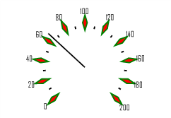

# ISpeedometerTickInfo.Pen

ISpeedometerTickInfo.Pen
-

# ISpeedometerTickInfo.Pen

## Синтаксис

Pen: [IGxPen](ModDrawing.chm::/Interface/IGxPen/IGxPen.htm);

## Описание

Свойство Pen определяет перо,
 которым отрисовывается граница деления шкалы спидометра.

## Пример

Для выполнения примера предполагается наличие формы, расположенной на
 ней кнопки с наименованием «Button1» и компонента SpeedometerBox
 с наименованием «SpeedometerBox1».

	Sub Button1OnClick(Sender:Object; Args: IMouseEventArgs);

	Var

	    s: ISpeedometer;

	    v: ISpeedometerView;

	    ScaleView: ISpeedometerScaleView;

	    MajTick: ISpeedometerTickInfo;

	Begin

	    s := SpeedometerBox1.Speedometer;

	    v := s.View;

	    s.BeginUpdate;

	    ScaleView := v.ScaleViews.Item(0);

	    MajTick := ScaleView.MajorTickInfo;

	    MajTick.Color := GxColor.FromName("Red");

	    MajTick.Height := 4;

	    MajTick.Pen := New GxPen.CreateSolid(GxColor.FromName("Green"));

	    MajTick.Proportion :=0.3;

	    MajTick.Shape := SpeedometerTickShapes.Rombus;

	    s.EndUpdate;

	End Sub Button1OnClick;

После выполнения примера при нажатии на кнопку будет изменено оформление
 основных делений шкалы спидометра, отображаемого в компоненте «SpeedometerBox1».
 Основные деления будут отображаться в виде ромба красного цвета, сторона
 ромба - 4 миллиметра, соотношение диагоналей ромба - 0,3. Граница делений
 будет выделена зеленым цветом.

См.также:

[ISpeedometerTickInfo](ISpeedometerTickInfo.htm)

		Справочная
		 система на версию 10.9
		 от 18/08/2025,
		 © ООО «ФОРСАЙТ»,
