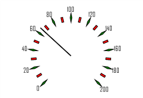

# ISpeedometerTickInfo.Shape

ISpeedometerTickInfo.Shape
-

# ISpeedometerTickInfo.Shape

## Синтаксис

Shape: [SpeedometerTickShapes](../../Enums/SpeedometerTickShapes.htm);

## Описание

Свойство Shape определяет форму
 делений шкалы.

## Пример

Для выполнения примера предполагается наличие формы, расположенной на
 ней кнопки с наименованием «Button1» и компонента SpeedometerBox
 с наименованием «SpeedometerBox1».

	Sub Button1OnClick(Sender:Object; Args: IMouseEventArgs);

	Var

	    s: ISpeedometer;

	    v: ISpeedometerView;

	    ScaleView: ISpeedometerScaleView;

	    MajTick, MinTick: ISpeedometerTickInfo;

	Begin

	    s := SpeedometerBox1.Speedometer;

	    v := s.View;

	    s.BeginUpdate;

	    ScaleView := v.ScaleViews.Item(0);

	    MajTick := ScaleView.MajorTickInfo;

	    MinTick := ScaleView.MinorTickInfo;

	    //Основные

	    MajTick.Color := GxColor.FromName("Green");

	    MajTick.Height := 3;

	    MajTick.Proportion :=0.2;

	    MajTick.Shape := SpeedometerTickShapes.Rombus;

	    //Дополнительные

	    MinTick.Color := GxColor.FromName("Red");

	    MinTick.Height := 2;

	    MinTick.Proportion :=0.3;

	    MinTick.Shape := SpeedometerTickShapes.Rect;

	    s.EndUpdate;

	End Sub Button1OnClick;

После выполнения примера при нажатии на кнопку будет изменено оформление
 основных и дополнительных делений шкалы спидометра, отображаемого в компоненте
 «SpeedometerBox1». Основные деления будут отображаться в виде ромба зеленого
 цвета, сторона ромба - 3 миллиметра, соотношение диагоналей ромба - 0,2.
 Дополнительные деления будут отображаться в виде красных прямоугольников,
 высота прямоугольника - 2 миллиметра, соотношение ширины и высоты - 0,3.

См. также:

[ISpeedometerTickInfo](ISpeedometerTickInfo.htm)

		Справочная
		 система на версию 10.9
		 от 18/08/2025,
		 © ООО «ФОРСАЙТ»,
