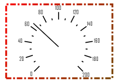

# ISpeedometerView.BorderPen

ISpeedometerView.BorderPen
-

# ISpeedometerView.BorderPen

## Синтаксис

BorderPen: [IGxPen](ModDrawing.chm::/Interface/IGxPen/IGxPen.htm);

## Описание

Свойство BorderPen определяет
 перо, которым будет отрисована граница спидометра.

## Пример

Для выполнения примера предполагается наличие формы, расположенной на
 ней кнопки с наименованием «Button1» и компонента SpeedometerBox
 с наименованием «SpeedometerBox1».

	Sub Button1OnClick(Sender:Object; Args: IMouseEventArgs);

	Var

	    s: ISpeedometer;

	    v: ISpeedometerView;

	    Br: IGxLinearGradientBrush;

	    Pen: IGxPen;

	Begin

	    s := SpeedometerBox1.Speedometer;

	    v := s.View;

	    s.BeginUpdate;

	    Br := New GxLinearGradientBrush.Create(GxColor.FromName("Red"), GxColor.FromName("Green"),30);

	    Pen := New GxPen.CreateBrushed(Br);

	    Pen.DashStyle := GxDashStyle.DashDot;

	    v.BorderPen := Pen;

	    s.EndUpdate;

	End Sub Button1OnClick;

После выполнения примера при нажатии на кнопку будет настроено оформление
 границ компонента «SpeedometerBox1».

См. также:

[ISpeedometerView](ISpeedometerView.htm)

		Справочная
		 система на версию 10.9
		 от 18/08/2025,
		 © ООО «ФОРСАЙТ»,
