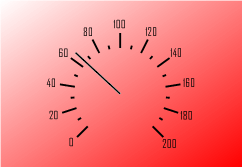

# ISpeedometerView.LeftMargin

ISpeedometerView.LeftMargin
-

# ISpeedometerView.LeftMargin

## Синтаксис

LeftMargin: Double;

## Описание

Свойство LeftMargin определяет
 отступ спидометра от левого края компонента.

## Комментарии

Значение указывается в диапазоне [0, 1].

## Пример

Для выполнения примера предполагается наличие формы, расположенной на
 ней кнопки с наименованием «Button1» и компонента SpeedometerBox
 с наименованием «SpeedometerBox1».

	Sub Button1OnClick(Sender:Object; Args: IMouseEventArgs);

	Var

	    s: ISpeedometer;

	    v: ISpeedometerView;

	    Back: ISpeedometerBackground;

	Begin

	    s := SpeedometerBox1.Speedometer;

	    v := s.View;

	    s.BeginUpdate;

	    Back := v.Background;

	    Back.Type := SpeedometerBackgroundType.Gradient;

	    Back.GradientAngle :=45;

	    Back.GradientColor :=GxColor.FromName("Red");

	    v.BottomMargin := 0.1;

	    v.LeftMargin := 0.1;

	    v.RightMargin := 0.1;

	    v.TopMargin := 0.1;

	    s.EndUpdate;

	End Sub Button1OnClick;

После выполнения примера при нажатии на кнопку будут изменены параметры
 оформления спидометра, отображаемого в компоненте «SpeedometerBox1». Будет
 установлен градиентный фон и отступы от краев компонента до краев спидометра.

См. также:

[ISpeedometerView](ISpeedometerView.htm)

		Справочная
		 система на версию 10.9
		 от 18/08/2025,
		 © ООО «ФОРСАЙТ»,
