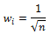

# SynapsysWeightsType

SynapsysWeightsType
-

# SynapsysWeightsType

## Описание

Перечисление SynapsysWeightsType
 используется для определения метода задания весов синапсов для самоорганизующихся
 карт Кохонена.

Используется следующим свойством:

	- [ISmSelfOrganizingMap.SynapsysWeights](../Interface/ISmSelfOrganizingMap/ISmSelfOrganizingMap.SynapsysWeights.htm).

## Допустимые значения

		 Значение
		 Краткое описание

		 
		 0
		 ConvexCombinationalgorithm.
		 Вектор весов вычисляется по методу выпуклой комбинации.

		 
		 1
		 Manual. Вектор весов
		 задается пользователем.

## Комментарии

Метод выпуклой комбинации состоит в том, что веса приравниваются к одной
 и той же величине:

Где:

n. Число
 компонент каждого весового вектора.

См. также:

[Перечисления
 сборки Stat](StatLib_Enums.htm)

		Справочная
		 система на версию ERROR: Variable (Version_lts) is undefined.
		 от 18/08/2025,
		 © ООО «ФОРСАЙТ»,
