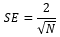

# ISmAutoCorrelation.StandardError

ISmAutoCorrelation.StandardError
-

# ISmAutoCorrelation.StandardError

## Синтаксис

StandardError: Double;

## Описание

Свойство StandardError возвращает
 значение стандартной ошибки.

## Комментарии

Стандартная ошибка рассчитывается по формуле:

Где:

	- SE. Стандартная ошибка;

	- N. Количество наблюдений.

## Пример

Использование свойства приведено в примере для [ISmAutoCorrelation.MissingData](ISmAutoCorrelation.MissingData.htm).

См. также:

[ISmAutoCorrelation](ISmAutoCorrelation.htm)

		Справочная
		 система на версию ERROR: Variable (Version_lts) is undefined.
		 от 18/08/2025,
		 © ООО «ФОРСАЙТ»,
