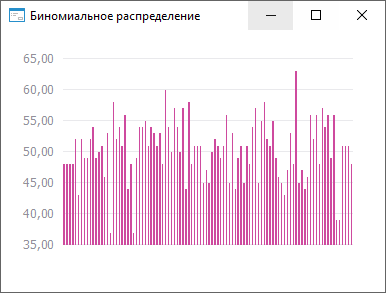

# ISmBinomialDistribution.Probability

ISmBinomialDistribution.Probability
-

# ISmBinomialDistribution.Probability

## Синтаксис

Probability: Double;

## Описание

Свойство Probability определяет
 вероятность положительного исхода

## Комментарии

Значение должно входит в интервал: [0, 1].

## Пример

Для выполнения примера необходимо наличие на форме компонентов ChartBox
 и UiChart, который является источником (Source) для ChartBox.

	Class OBJ16091Form: Form

	    ChartBox1: ChartBox;

	    UiChart1: UiChart;

	    BiNorm: SmBinomialDistribution;

	    Values: Array Of Double;

	    Const Cnt = 100;

	    Sub OBJ18694FormOnCreate(Sender: Object; Args: IEventArgs);

	    Begin

	        BiNorm := New SmBinomialDistribution.Create;

	        Text := BiNorm.DisplayName;

	        Binorm.Probability := 0.5;

	        Binorm.Trials := 70;

	        Values := BiNorm.RandomVector(Cnt);

	        UiChart1.PointCount := cnt;

	        UiChart1.SerieCount := 1;

	    End Sub OBJ18694FormOnCreate;

	    Sub UiChart1OnGetDataValue(Sender: Object; Args: IUiChartGetDataValueEventArgs);

	    Begin

	        If Args.PointIndex < Cnt Then

	            Args.Value := Values[Args.PointIndex];

	            Args.Result := True;

	        End If;

	    End Sub UiChart1OnGetDataValue;

	End Class OBJ16091Form;

После выполнения примера будет построен график биномиального распределения:

См. также:

[ISmBinomialDistribution](ISmBinomialDistribution.htm)

		Справочная
		 система на версию ERROR: Variable (Version_lts) is undefined.
		 от 18/08/2025,
		 © ООО «ФОРСАЙТ»,
