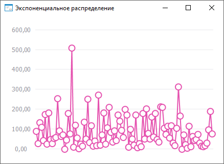

# ISmExponentialDistribution.A

ISmExponentialDistribution.A
-

# ISmExponentialDistribution.A

## Синтаксис

A: Double;

## Описание

Свойство A определяет математическое
 ожидание распределения случайной величины.

## Комментарии

Значение математического ожидания должно быть больше нуля.

## Пример

Для выполнения примера необходимо наличие на форме компонентов ChartBox и UiChart,
 который является источником (Source) для ChartBox.

	Class OBJ18690Form: Form

	    ChartBox1: ChartBox;

	    UiChart1: UiChart;

	    Exp: SmExponentialDistribution;

	    Values: Array Of Double;

	    Const Cnt = 100;

	    Sub OBJ18690FormOnCreate(Sender: Object; Args: IEventArgs);

	    Begin

	        Exp := New SmExponentialDistribution.Create;

	        Text := Exp.DisplayName;

	        Exp.A := 100;

	        Values := Exp.RandomVector(Cnt);

	        UiChart1.PointCount := cnt;

	        UiChart1.SerieCount := 1;

	        UiChart1.Type := ChartType.Lines;

	    End Sub OBJ18690FormOnCreate;

	    Sub UiChart1OnGetDataValue(Sender: Object; Args: IUiChartGetDataValueEventArgs);

	    Begin

	        If Args.PointIndex < Cnt Then

	            Args.Value := Values[Args.PointIndex];

	            Args.Result := True;

	        End If;

	End Sub UiChart1OnGetDataValue;

После выполнения примера будет построен график экспоненциального распределения:

См. также:

[ISmExponentialDistribution](ISmExponentialDistribution.htm)

		Справочная
		 система на версию ERROR: Variable (Version_lts) is undefined.
		 от 18/08/2025,
		 © ООО «ФОРСАЙТ»,
