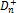

# ISmKolmogorovSmirnovTest.D

ISmKolmogorovSmirnovTest.D
-

# ISmKolmogorovSmirnovTest.D

## Синтаксис

D: Double;

## Описание

Свойство D вычисляет статистику
 Колмогорова-Смирнова , 
 или , согласно значению параметра [Hypothesis](ISmKolmogorovSmirnovTest.Hypothesis.htm).

## Комментарии

Для получения вероятности, связанную с полученным значением D, используйте
 свойство [ISmKolmogorovSmirnovTest.P](ISmKolmogorovSmirnovTest.P.htm).

## Пример

Для выполнения примера добавьте ссылку на системную сборку Stat.

	Sub UserProc;

	Var

	    met: SmKolmogorovSmirnovTest;

	    can: Array[16] Of Double;

	    status: Integer;

	Begin

	    met := New SmKolmogorovSmirnovTest.Create;

	    // рассматриваемый ряд

	    can[00] := 6209;

	    can[01] := 6385;

	    can[02] := 6752;

	    can[03] := 6837;

	    can[04] := Double.Nan;

	    can[05] := 6907;

	    can[06] := 7349;

	    can[07] := 7213;

	    can[08] := Double.Nan;

	    can[09] := 7180;

	    can[10] := 7132;

	    can[11] := 7137;

	    can[12] := 7473;

	    can[13] := 7722;

	    can[14] := 8088;

	    can[15] := 8516;

	    // задаем параметры метода

	    met.Sample1.Value := can;

	    met.MissingData.Method := MissingDataMethod.LinTrend;

	    met.ModelPeriod.FirstPoint := 2;

	    met.ModelPeriod.LastPoint := 10;

	    met.Distribution := KStestDistributionType.Gamma;

	    met.Hypothesis := KStestHypothesisType.NotEqual;

	    met.SuppliedParameters := True;

	    met.Parameter1 := 3;

	    met.Parameter2 := 0.2;

	    // рассчитываем метод и выводим результаты

	    status := met.Execute;

	    If status = 0 Then

	        Debug.WriteLine("Отклонение (D): " + met.D.ToString);

	        Debug.WriteLine("Стандартизованная статистика (Z): " + met.Z.ToString);

	        Debug.WriteLine("Вероятность (P): " + met.P.ToString);

	    Else

	        Debug.WriteLine(met.Errors);

	    End If;

	End Sub UserProc;

Будет произведена проверка гипотезы о том, что выборка имеет гамма-распределение.
 В качестве альтернативной гипотезы выбрана гипотеза H1 о том, что данные
 не могут быть случайной выборкой гамма распределения. После выполнения
 примера в окно консоли будут выведены значения теста:

Отклонение (D): 1

Стандартизованная статистика
 (Z): 3

Вероятность (P): 0

См. также:

[ISmKolmogorovSmirnovTest](ISmKolmogorovSmirnovTest.htm)

		Справочная
		 система на версию ERROR: Variable (Version_lts) is undefined.
		 от 18/08/2025,
		 © ООО «ФОРСАЙТ»,
