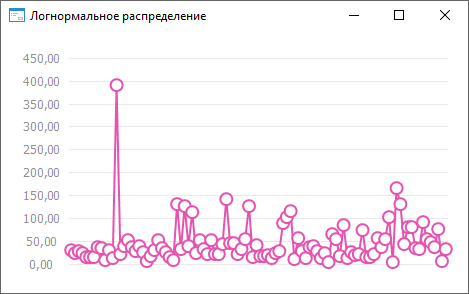

# ISmLogNormalDistribution.Mean

ISmLogNormalDistribution.Mean
-

# ISmLogNormalDistribution.Mean

## Синтаксис

Mean: Double;

## Описание

Свойство Mean определяет математическое
 ожидание.

## Пример

Для выполнения примера необходимо наличие на форме компонентов ChartBox
 и UiChart, который является источником (Source) для ChartBox.

	Class MyDistributionForm: Form

	    ChartBox1: ChartBox;

	    UiChart1: UiChart;

	    LogNorm: SmLogNormalDistribution;

	    Values: Array Of Double;

	    Const Cnt = 100;

	    Sub UiChart1OnGetDataValue(Sender: Object; Args: IUiChartGetDataValueEventArgs);

	    Begin

	        If Args.PointIndex < Cnt Then

	            Args.Value := Values[Args.PointIndex];

	            Args.Result := True;

	        End If;

	    End Sub UiChart1OnGetDataValue;

	    Sub MYDISTRIBUTIONFormOnCreate(Sender: Object; Args: IEventArgs);

	    Begin

	        LogNorm := New SmLogNormalDistribution.Create;

	        Text := LogNorm.DisplayName;

	        LogNorm.Mean := 3.6;

	        LogNorm.Variance := 0.5;

	        Values := LogNorm.RandomVector(Cnt);

	        UiChart1.PointCount := cnt;

	        UiChart1.SerieCount := 1;

	        UiChart1.Type := ChartType.Lines;

	    End Sub MYDISTRIBUTIONFormOnCreate;

	End Class MyDistributionForm;

После выполнения примера будет построен график логнормального распределения:

См. также:

[ISmLogNormalDistribution](ISmLogNormalDistribution.htm)

		Справочная
		 система на версию ERROR: Variable (Version_lts) is undefined.
		 от 18/08/2025,
		 © ООО «ФОРСАЙТ»,
