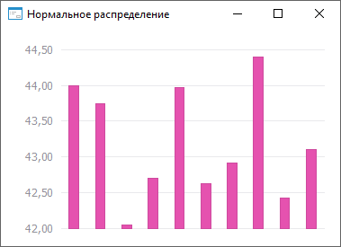

# ISmNormalDistribution.Mean

ISmNormalDistribution.Mean
-

# ISmNormalDistribution.Mean

## Синтаксис

Mean: Double;

## Описание

Свойство Mean определяет математическое
 ожидание.

## Пример

Для выполнения примера необходимо наличие на форме компонентов ChartBox
 и UiChart, который является источником (Source) для ChartBox.

	Class OBJ18688Form: Form

	    ChartBox1: ChartBox;

	    UiChart1: UiChart;

	    Norm: SmNormalDistribution;

	    Values: Array Of Double;

	    Const Cnt = 10;

	    Sub OBJ18688FormOnCreate(Sender: Object; Args: IEventArgs);

	    Begin

	        Norm := New SmNormalDistribution.Create;

	        Text := Norm.DisplayName;

	        Norm.Mean := 43;

	        Norm.Variance := 0.5;

	        Values := Norm.RandomVector(Cnt);

	        UiChart1.PointCount := cnt;

	        UiChart1.SerieCount := 1;

	    End Sub OBJ18688FormOnCreate;

	    Sub UiChart1OnGetDataValue(Sender: Object; Args: IUiChartGetDataValueEventArgs);

	    Begin

	        If Args.PointIndex < Cnt Then

	        Args.Value := Values[Args.PointIndex];

	        Args.Result := True;

	        End If;

	    End Sub UiChart1OnGetDataValue;

	End Class OBJ18688Form;

После выполнения примера будет построен график нормального распределения
 величины:

См. также:

[ISmNormalDistribution](ISmNormalDistribution.htm)

		Справочная
		 система на версию ERROR: Variable (Version_lts) is undefined.
		 от 18/08/2025,
		 © ООО «ФОРСАЙТ»,
