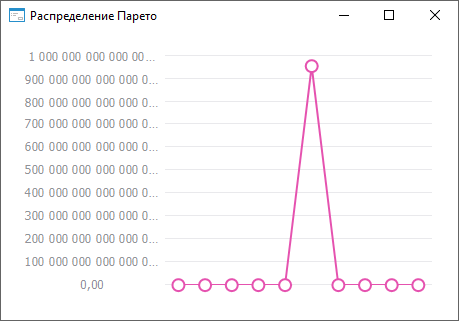

# ISmParetoDistribution.A

ISmParetoDistribution.A
-

# ISmParetoDistribution.A

## Синтаксис

A: Double;

## Описание

Свойство A определяет параметр
 распределения a.

## Комментарии

Значение должно быть больше нуля.

## Пример

Для выполнения примера необходимо наличие на форме компонентов ChartBox
 и UiChart, который является источником (Source) для ChartBox.

	Class OBJ18689Form: Form

	    ChartBox1: ChartBox;

	    UiChart1: UiChart;

	    Pareto: SmParetoDistribution;

	    Values: Array Of Double;

	    Const Cnt = 10;

	    Sub OBJ18689FormOnCreate(Sender: Object; Args: IEventArgs);

	    Begin

	        Pareto := New SmParetoDistribution.Create;

	        Text := Pareto.DisplayName;

	        Pareto.A := 0.1;

	        Pareto.B := 0.8;

	        Values := Pareto.RandomVector(Cnt);

	        UiChart1.PointCount := cnt;

	        UiChart1.SerieCount := 1;

	        UiChart1.Type := ChartType.Lines;

	    End Sub OBJ18689FormOnCreate;

	    Sub UiChart1OnGetDataValue(Sender: Object; Args: IUiChartGetDataValueEventArgs);

	    Begin

	        If Args.PointIndex < Cnt Then

	            Args.Value := Values[Args.PointIndex];

	            Args.Result := True;

	        End If;

	    End Sub UiChart1OnGetDataValue;

	End Class OBJ18689Form;

После выполнения примера будет построен график Парето распределения:

См. также:

[ISmParetoDistribution](ISmParetoDistribution.htm)

		Справочная
		 система на версию ERROR: Variable (Version_lts) is undefined.
		 от 18/08/2025,
		 © ООО «ФОРСАЙТ»,
