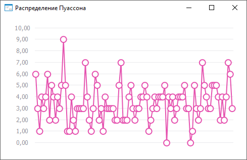

# ISmPoissonDistribution.Lambda

ISmPoissonDistribution.Lambda
-

# ISmPoissonDistribution.Lambda

## Синтаксис

Lambda: Double;

## Описание

Свойство Lambda определяет значение
 интенсивности событий.

## Комментарии

Интенсивность событий - положительное действительное число, равное ожидаемому
 значению количества событий, произошедших в течение определенного интервала.

## Пример

Для выполнения примера необходимо наличие на форме компонентов ChartBox и UiChart,
 который является источником (Source) для ChartBox.

	Class OBJ18691Form: Form

	    ChartBox1: ChartBox;

	    UiChart1: UiChart;

	    Poisson: SmPoissonDistribution;

	    Values: Array Of Double;

	    Const Cnt = 100;

	    Sub OBJ18691FormOnCreate(Sender: Object; Args: IEventArgs);

	    Begin

	        Poisson := New SmPoissonDistribution.Create;

	        Text := Poisson.DisplayName;

	        Poisson.Lambda := 3.2;

	        Values := Poisson.RandomVector(Cnt);

	        UiChart1.PointCount := cnt;

	        UiChart1.SerieCount := 1;

	        UiChart1.Type := ChartType.Lines;

	    End Sub OBJ18691FormOnCreate;

	    Sub UiChart1OnGetDataValue(Sender: Object; Args: IUiChartGetDataValueEventArgs);

	    Begin

	        If Args.PointIndex < Cnt Then

	            Args.Value := Values[Args.PointIndex];

	            Args.Result := True;

	        End If;

	    End Sub UiChart1OnGetDataValue;

	End Class OBJ18691Form;

После выполнения примера будет построен график распределения Пуассона:

См. также:

[ISmPoissonDistribution](ISmPoissonDistribution.htm)

		Справочная
		 система на версию ERROR: Variable (Version_lts) is undefined.
		 от 18/08/2025,
		 © ООО «ФОРСАЙТ»,
