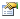
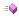

# ISmRamseyRESSETTest

ISmRamseyRESSETTest
-

# ISmRamseyRESSETTest

Сборка: Stat;

## Описание

Интерфейс ISmRamseyRESSETTest
 определяет параметры RESET-теста.

## Иерархия наследования

           [IStatMethod](../IStatMethod/IStatMethod.htm)

           ISmRamseyRESSETTest

## Комментарии

RESET-тест - это тест на наличие следующих ошибок спецификации модели
 линейной регрессии:

	- Наличие пропущенных переменных. Регрессия содержит не все объясняющие
	 переменные;

	- Неверная функциональная форма. Некоторые или все переменные
	 должны быть преобразованы с помощью логарифмической, степенной, обратной
	 или какой-то другой функции;

	- Корреляция между факторами Х и случайной составляющей модели,
	 которая может быть вызвана ошибками измерения факторов, рассмотрением
	 систем уравнений или другими причинами.

Показано, что ошибки такого рода приводят к смещению среднего остатков
 регрессионной модели.

Функция возвращает статистику Фишера, статистику хи-квадрат (отношение
 правдоподобия - LR-отношение) и соответствующие им значения вероятностей.

## Свойства

		 Имя свойства
		 Краткое описание

		 
		 [ARMA](ISmRamseyRESSETTest.ARMA.htm)

		 Свойство ARMA определяет
		 параметры авторегрессии и скользящего среднего.

		 
		 [ChiTest](ISmRamseyRESSETTest.ChiTest.htm)

		 Свойство ChiTest возвращает
		 значения статистики хи-квадрат.

		 
		 [Explained](ISmRamseyRESSETTest.Explained.htm)

		 Свойство Explained
		 определяет объясняемый ряд.

		 
		 [Explanatories](ISmRamseyRESSETTest.Explanatories.htm)

		 Свойство Explanatories
		 определяет объясняющие ряды.

		 
		 [Fitted](ISmRamseyRESSETTest.Fitted.htm)

		 Свойство Fitted возвращает
		 модельный ряд.

		 
		 [FTest](ISmRamseyRESSETTest.FTest.htm)

		 Свойство FTest возвращает
		 значения статистики Фишера.

		 
		 [MissingData](ISmRamseyRESSETTest.MissingData.htm)

		 Свойство MissingData
		 определяет метод обработки пропусков.

		 
		 [ModelCoefficients](ISmRamseyRESSETTest.ModelCoefficients.htm)

		 Свойство ModelCoefficients
		 возвращает параметры коэффициентов модели.

		 
		 [ModelPeriod](ISmRamseyRESSETTest.ModelPeriod.htm)

		 Свойство ModelPeriod
		 определяет параметры периода идентификации.

		 
		 [Power](ISmRamseyRESSETTest.Power.htm)

		 Свойство Power определяет
		 число дополнительных регрессоров, входящих в тестовую регрессию.

		 
		 [Residuals](ISmRamseyRESSETTest.Residuals.htm)

		 Свойство Residuals
		 возвращает ряд остатков.

		 
		 [SummaryStatistics](ISmRamseyRESSETTest.SummaryStatistics.htm)

		 Свойство SummaryStatistics
		 возвращает статистические характеристики.

## Свойства, унаследованные от [IStatMethod](../IStatMethod/IStatMethod.htm)

		 Имя свойства
		 Краткое описание

		 
		 [DisplayName](../IStatMethod/IStatMethod.DisplayName.htm)
		 Свойство DisplayName
		 возвращает внешнее наименование метода.

		 
		 [ErrorByStatus](../IStatMethod/IStatMethod.ErrorByStatus.htm)
		 Свойство ErrorByStatus
		 возвращает сообщение об ошибке по ее номеру.

		 
		 [Errors](../IStatMethod/IStatMethod.Errors.htm)
		 Свойство Errors возвращает
		 сообщение обо всех ошибках и предупреждениях.

		 
		 [Name](../IStatMethod/IStatMethod.Name.htm)
		 Свойство Name возвращает
		 внутреннее наименование метода.

		 
		 [PerformanceTime](../IStatMethod/IStatMethod.PerformanceTime.htm)
		 Свойство PerformanceTime
		 возвращает время выполнения метода.

		 
		 [Status](../IStatMethod/IStatMethod.Status.htm)
		 Свойство Status возвращает
		 статус выполнения метода.

		 
		 [SupportsR](../IStatMethod/IStatMethod.SupportsR.htm)
		 Свойство SupportsR
		 возвращает признак поддержки расчета статистического метода через
		 пакет R.

		 
		 [UseR](../IStatMethod/IStatMethod.UseR.htm)
		 Свойство UseR определяет,
		 будет ли расчет статистического метода производиться через
		 пакет R.

		 
		 [WarningByStatus](../IStatMethod/IStatMethod.WarningByStatus.htm)
		 Свойство WarningByStatus
		 возвращает текст предупреждения по его номеру.

		 
		 [Warnings](../IStatMethod/IStatMethod.Warnings.htm)
		 Свойство Warnings возвращает предупреждения, возникшие при расчёте метода.

		 
		 [WarningsCount](../IStatMethod/IStatMethod.WarningsCount.htm)
		 Свойство WarningsCount
		 возвращает число предупреждений, возникших при расчёте метода.

		 
		 [WarningsNumbers](../IStatMethod/IStatMethod.WarningsNumbers.htm)
		 Свойство WarningsNumbers возвращает номера предупреждений, возникших при расчёте метода.

## Методы, унаследованные от [IStatMethod](../IStatMethod/IStatMethod.htm)

		 Имя метода
		 Краткое описание

		 
		 [Clone](../IStatMethod/IStatMethod.Clone.htm)
		 Метод Clone клонирует
		 объект статистического метода.

		 
		 [Execute](../IStatMethod/IStatMethod.Execute.htm)
		 Метод Execute осуществляет
		 выполнение статистического метода.

		 
		 [LoadFromXML](../IStatMethod/IStatMethod.LoadFromXML.htm)
		 Метод LoadFromXML осуществляет
		 загрузку настроек статистического метода из XML-кода.

		 
		 [SaveToXML](../IStatMethod/IStatMethod.SaveToXML.htm)
		 Метод SaveToXML осуществляет
		 выгрузку настроек статистического метода в XML-код.

См. также:

[Интерфейсы сборки Stat](../Interfaces.htm)

		Справочная
		 система на версию ERROR: Variable (Version_lts) is undefined.
		 от 18/08/2025,
		 © ООО «ФОРСАЙТ»,
