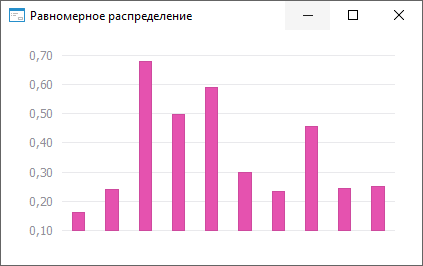

# ISmUniformDistribution.A

ISmUniformDistribution.A
-

# ISmUniformDistribution.A

## Синтаксис

A: Double;

## Описание

Свойство A определяет границу
 отрезка [A, B].

## Пример

Для выполнения примера создайте форму, расположите на ней компонент
 ChartBox с наименованием ChartBox1 и компонент UiChart с наименованием
 UiChart1. Укажите UiChart1 в качестве источника компонента ChartBox. Процедура
 MyFormOnCreate является обработчиком события OnCreate для формы. Процедура
 UiChart1OnGetDataValue является обработчиком события OnGetDataValue для
 компонента UiChart. Добавьте ссылки на системные сборки: Stat, UI.

	Class MyForm: Form

	    UiChart1: UiChart;

	    ChartBox1: ChartBox;

	    Uniform: SmUniformDistribution;

	    Values: Array Of Double;

	    Const Cnt = 10;

	    Sub MyFormOnCreate(Sender: Object; Args: IEventArgs);

	    Begin

	        Uniform := New SmUniformDistribution.Create;

	        Text := Uniform.DisplayName;
	 // В панели заголовка формы будет отображено название распределения

	        Uniform.A := 0.1;

	        Uniform.B := 0.8;

	        Values := Uniform.RandomVector(Cnt);

	        If Uniform.Status <> 0 Then

	            WinApplication.InformationBox(Uniform.Errors);

	        End If;

	        UiChart1.PointCount := Cnt;

	        UiChart1.SerieCount := 1

	    End Sub MyFormOnCreate;

	    Sub UiChart1OnGetDataValue(Sender: Object; Args: IUiChartGetDataValueEventArgs);

	    Begin

	        Args.Result := True;

	        If Args.PointIndex < Cnt Then

	            Args.Value := Values[Args.PointIndex];

	            Args.Result := True;

	        End If;

	    End Sub UiChart1OnGetDataValue;

	End Class MyForm;

После выполнения примера будет построен график равномерного распределения
 величины:

См. также:

[ISmUniformDistribution](ISmUniformDistribution.htm)

		Справочная
		 система на версию ERROR: Variable (Version_lts) is undefined.
		 от 18/08/2025,
		 © ООО «ФОРСАЙТ»,
