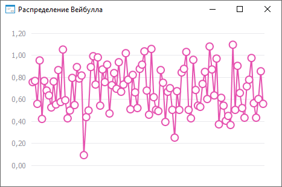

# ISmWeibullDistribution.A

ISmWeibullDistribution.A
-

# ISmWeibullDistribution.A

## Синтаксис

A: Double;

## Описание

Свойство A определяет значение
 параметра формы распределения случайной величины.

## Комментарии

Значение свойства должно быть больше нуля.

## Пример

Для выполнения примера необходимо наличие на форме компонентов ChartBox и UiChart,
 который является источником (Source) для ChartBox.

	Class OBJ18692Form: Form

	    ChartBox1: ChartBox;

	    UiChart1: UiChart;

	    Weibull: SmWeibullDistribution;

	    Values: Array Of Double;

	    Const Cnt = 100;

	    Sub OBJ18692FormOnCreate(Sender: Object; Args: IEventArgs);

	    Begin

	        Weibull := New SmWeibullDistribution.Create;

	        Text := Weibull.DisplayName;

	        Weibull.A := 3.2;

	        Weibull.B := 0.8;

	        Values := Weibull.RandomVector(Cnt);

	        UiChart1.PointCount := cnt;

	        UiChart1.SerieCount :=1;

	        UiChart1.Type := ChartType.Lines;

	    End Sub OBJ18692FormOnCreate;

	    Sub UiChart1OnGetDataValue(Sender: Object; Args: IUiChartGetDataValueEventArgs);

	    Begin

	        If Args.PointIndex < Cnt Then

	            Args.Value := Values[Args.PointIndex];

	            Args.Result := True;

	        End If;

	    End Sub UiChart1OnGetDataValue;

	End Class OBJ18692Form;

После выполнения примера будет построен график распределения Вейбулла:

См. также:

[ISmWeibullDistribution](ISmWeibullDistribution.htm)

		Справочная
		 система на версию ERROR: Variable (Version_lts) is undefined.
		 от 18/08/2025,
		 © ООО «ФОРСАЙТ»,
