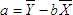
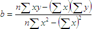

# IStatistics.Intercept

IStatistics.Intercept
-

# IStatistics.Intercept

## Синтаксис

Intercept(KnownYs: Array; KnownXs: Array): Double;

## Параметры

KnownYs. Зависимое множество
 данных;

KnownXs. Независимое множество
 данных.

Примечание.
 KnownYs и KnownXs
 должны быть непусты и содержать одинаковое количество точек данных.

## Описание

Метод Intercept вычисляет точку
 пересечения линии с осью y, используя KnownXs
 и KnownYs.

## Комментарии

Точка пересечения находится на оптимальной линии регрессии, проведенной
 через KnownXs и KnownYs.
 Метод Intercept используется,
 когда нужно определить значение зависимой переменной при значении независимой
 переменной равном нулю.

Уравнение для точки пересечения линии линейной регрессии:

Где наклон вычисляется следующим образом:

## Пример

Для выполнения примера добавьте ссылку на системную сборку Stat.

			Sub UserProc;

Var

    st: Statistics;

    d0: Double;

    y, x, nx: Array Of Double;

Begin

    y := New Double[10];

    x := New Double[10];

    y[00] := 1.6; x[00] := 2;

    y[01] := 1.7; x[01] := 4;

    y[02] := 1.8; x[02] := 2;

    y[03] := 1.9; x[03] := 5;

    y[04] := 2; x[04] := 12;

    y[05] := 2.1; x[05] := 6;

    y[06] := 2.2; x[06] := 15;

    y[07] := 2.3; x[07] := 17;

    y[08] := 2.4; x[08] := 14;

    y[09] := 2.8; x[09] := 3;

    st := New Statistics.Create;

    d0 := st.Intercept(y,x);

    If st.Status <> 0 Then

        Debug.WriteLine(st.Errors);

    Else

        Debug.WriteLine("Точка пересечения: " + d0.ToString);

    End If;

End Sub UserProc;

После выполнения примера в окно консоли будет выведено значение, которое
 указывает на точку пересечения линии с осью y:

Выполнение модуля начато

Точка пересечения: 1.88779220779221

Выполнение модуля завершено

См. также:

[IStatistics](IStatistics.htm)

		Справочная
		 система на версию ERROR: Variable (Version_lts) is undefined.
		 от 18/08/2025,
		 © ООО «ФОРСАЙТ»,
