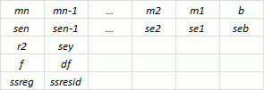

# IStatistics.Logest

IStatistics.Logest
-

# IStatistics.Logest

## Синтаксис

Logest(

    KnownYs: Array;

    KnownXs: Array;

    HasConstant: Boolean;

    ReturnStatistics: Boolean): Array;

## Параметры

KnownYs. Множество известных значений y;

KnownXs. Множество известных значений x;

HasConstant. Определяет, равна ли константа b единице. Допустимые значения:

-
True. Константа вычисляется;

-
False. Считается, что b = 1.

ReturnStatistics. Определяет, возвращать ли дополнительные регрессионные статистики. Допустимые значения:

-
True. Метод возвращает регрессионные статистики;

-
False. Регрессионные статистики не вычисляется.

## Описание

Метод Logest возвращает параметры экспоненциального тренда.

## Комментарии

Метод вычисляет экспоненциальную кривую, аппроксимирующую данные, и возвращает массив значений, описывающий эту кривую.

Уравнение кривой: y = b * mx.

Если существует несколько значений x, где зависимые значения y являются функцией независимых значений x, то уравнение кривой имеет вид: y = b * m1x1 * m2x2.

Значения m являются основанием, возводимым в степень x, а значения b постоянны. y, x и m могут быть векторами.

Метод Logest возвращает массив: {mn;mn-1;…;m1;b}. Если вычисляются дополнительные регрессионные статистики, то Logest возвращает массив: {mn;mn-1;…;m1;b;sen;sen-1;…;se1;seb;r2;sey;F;df;ssreg;ssresid}.

Описание дополнительных регрессионных статистик приведено в разделе [IStatistics.Linest](IStatistics.Linest.htm).

На приведенном ниже рисунке показано, в каком порядке возвращается дополнительные регрессионные статистики:

Особенности работы с параметрами:

-
если массив KnownYs имеет один столбец, то каждый столбец массива KnownXs интерпретируется как отдельная переменная;

-
если массив KnownYs имеет одну строку, то каждая строка массива KnownXs интерпретируется как отдельная переменная;

-
массив KnownXs может содержать одно или несколько множеств переменных. Если используется только одна переменная, то KnownYs и KnownXs могут иметь любую форму, при условии, что они имеют одинаковую размерность. Если используется более одной переменной, то KnownYs должен быть вектором (то есть интервалом высотой в одну строку или шириной в один столбец).

## Пример

Для выполнения примера добавьте ссылку на системную сборку Stat.

			Sub UsesProcLogest;

Var

    st: Statistics;

    i: Integer;

    y, x, res: Array Of Double;

Begin

    // Задаём множество известных значений y
    y := New Double[4];

    y[0] := 0.2; y[2] := 5;

    y[1] := 9; y[3] := 7;

    // Задаём множество известных значений x
    x := New Double[4, 2];

    x[0, 0] := 1; x[0, 1] := 5;

    x[1, 0] := 2; x[1, 1] := 6;

    x[2, 0] := 3; x[2, 1] := 7;

    x[3, 0] := 4; x[3, 1] := 8;

    // Вызываем метод
    st := New Statistics.Create;

    res := st.Logest(y, x, False, True);

    // Выводим результаты в окно консоли
    Debug.WriteLine(st.Errors);

    If st.Status = 0 Then

        For i := 0 To 4 Do

            Debug.Write(res[i, 0].ToString + "; ");

            Debug.WriteLine(res[i, 1]);

        End For;

    End If;

End Sub UsesProcLogest;

После выполнения примера в окно консоли будут выведен массив результатов, содержащий дополнительные регрессионные статистики.

См. также:

[IStatistics](IStatistics.htm)

		Справочная
		 система на версию ERROR: Variable (Version_lts) is undefined.
		 от 18/08/2025,
		 © ООО «ФОРСАЙТ»,
