# TabConditionIconType

TabConditionIconType
-

# TabConditionIconType

## Описание

Перечисление TabConditionIconType
 содержит стили пиктограмм, используемые при условном форматировании ячеек.

Используется следующими свойствами и методами:

	- [ITabFormatValues.IconType](../Interface/ITabFormatValues/ITabFormatValues.IconType.htm);

	- [ITabFormatCondition.AssignPredefinedIcons](../Interface/ITabFormatCondition/ITabFormatCondition.AssignPredefinedIcons.htm);

	- [ITabFormatCondition.AssignPredefinedGrowth](../Interface/ITabFormatCondition/ITabFormatCondition.AssignPredefinedGrowth.htm).

## Допустимые значения

		 Значение
		 Краткое описание

		 0
		 Circles.
		 Светофор.

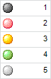

		 1
		 CircleFillB.
		 Круговая заливка (серая).

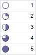

		 2
		 CircleFillC.
		 Круговая заливка (цветная).

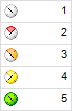

		 3
		 ArrowsB.
		 Стрелки (серые).

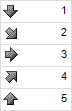

		 4
		 ArrowsC.
		 Стрелки (цветные).

		 5
		 BarFillB.
		 Оценки (серые).

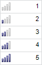

		 6
		 BarFillC.
		 Оценки (цветные).

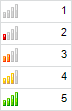

		 7
		 Cylinders.
		 Цилиндры.

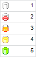

		 8
		 Flags1.
		 Флажки (тип 1).

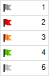

		 9
		 Flags2.
		 Флажки (тип 2).

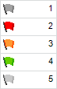

		 10
		 Triangles.
		 Треугольники.

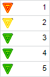

		 11
		 Symbols.
		 Символы.

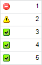

		 12
		 Arrows. Горизонтальные
		 стрелки (тип 1).

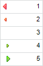

		 13
		 Arrows2. Горизонтальные
		 стрелки (тип 2). Используется при построении [индикатора
		 роста](../Interface/ITabFormatGrowth/ITabFormatGrowth.htm).

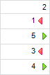

См. также:

[Перечисления сборки Tab](TabSheet_Enums.htm)

		Справочная
		 система на версию 10.9
		 от 18/08/2025,
		 © ООО «ФОРСАЙТ»,
