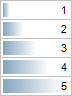
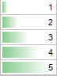
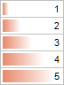
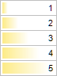
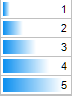
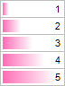

# TabConditionPredefinedDataBarStyle

TabConditionPredefinedDataBarStyle
-

# TabConditionPredefinedDataBarStyle

## Описание

Перечисление TabConditionPredefinedDataBarStyle
 содержит стандартные стили гистограмм, используемые при условном форматировании
 ячеек.

Используется следующим методом:

	- [ITabFormatCondition.AssignPredefinedDataBar](../Interface/ITabFormatCondition/ITabFormatCondition.AssignPredefinedDataBar.htm).

## Допустимые значения

		 Значение
		 Краткое описание

		 0
		 Blue

		 1
		 Green

		 2
		 Red

		 3
		 Yellow

		 4
		 LightBlue

		 5
		 Purple

См. также:

[Перечисления
 сборки Tab](TabSheet_Enums.htm)

		Справочная
		 система на версию 10.9
		 от 18/08/2025,
		 © ООО «ФОРСАЙТ»,
